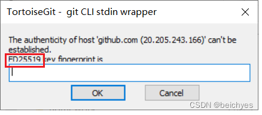
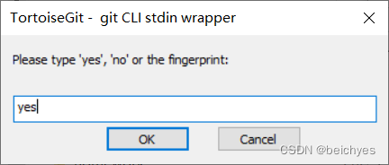

## 原因

有时使用http协议连接不上github，所以可以使用ssh连接。

## 步骤

- 进入目录
	- C:\Users\用户名\ssh
- 生成公钥
	- ssh-keygen -t rsa -C "你的GitHub邮箱" -f id_rsa
- 去github上生成一个ssh公钥
	- 将生成的id_rsa.pub的内容复制进去，名称为电脑名称
- 第一次上传
	- 将框内的key输入到下面的输入栏里面，然后的点ok
	- 
	- 
