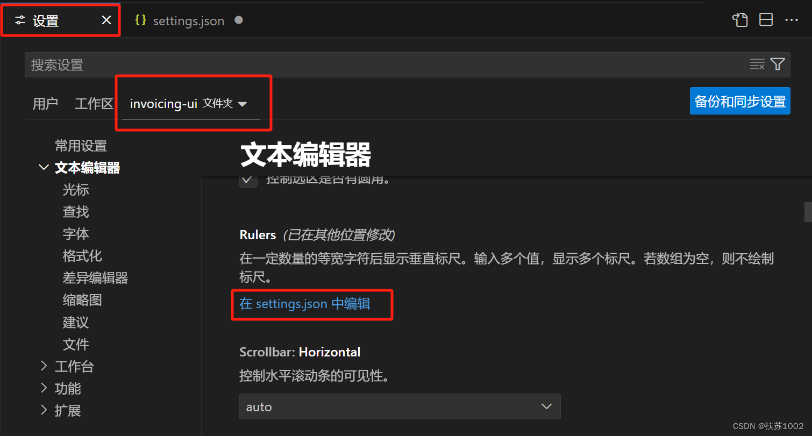
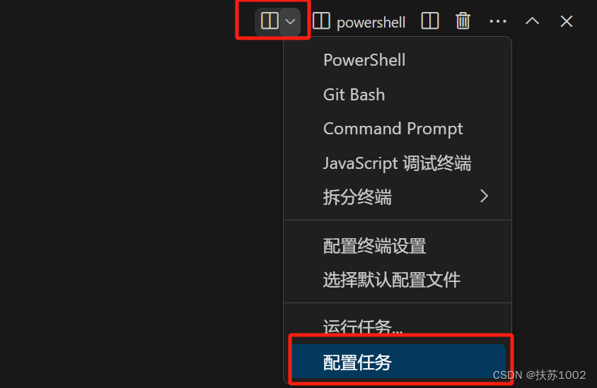
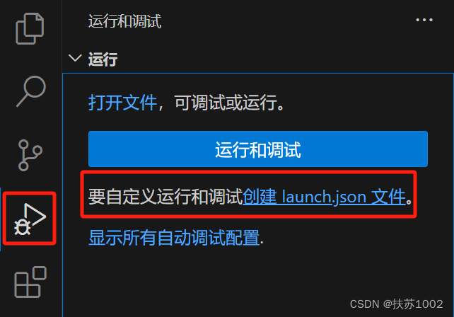
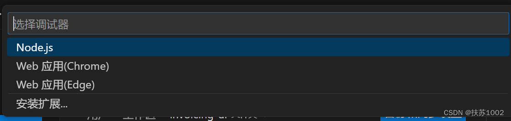

## setting.json

==编辑器和插件的相关配置==



==可用于设置不同工程的编码==

## tasks.json

[编译器](编译器.md)相关的配置文件。

使用不同的编程语言可能有不同的开发流程，比如 C/C++ 就需要编译（广义编译，包括了链接）、运行、测试、打包等等流程，而 Python 只需要运行即可，为了把各种语言的不同开发流程抽象成同一套流程，于是有了编码（Code）— 构建（build）— 运行/调试（run/debug）— 测试 （test） — 打包（package） 等等，其中每个环节都可以认为是一个 task，所以可以利用 tasks.json来手动完成那些使用 IDE 时被隐藏的开发流程细节。

1、创建任务配置文件



2、

```c
{
  "tasks": [
    {
      "type": "cppbuild",
      "label": "C/C++: g++.exe build active file",
      "command": "C:\\msys64\\ucrt64\\bin\\g.exe", //需要运行的程序，对于C/C++来说， 需要运行gcc来构建，把源代码变成可执行文件，因此源代码是只是运行的输入，可以这么理解
      "args": [ //args数组指定传递给command，也就是g++的命令行参数。这些参数现在需要按照g++编译器期望的特定顺序列在该文件中。注意: 每一个参数里面不要用空格，否则可能输出不是你想要的命令，你可以自己看提示框
        "-fdiagnostics-color=always",
        "-g",
        "${file}",
        "-o",
        "${fileDirname}\\${fileBasenameNoExtension}.exe"
      ],
      "options": {
        "cwd": "${fileDirname}"
      },
      "problemMatcher": ["$gcc"],
      "group": {
        "kind": "build",
        "isDefault": true
      },
      "detail": "Task generated by Debugger."
    }
  ],
  "version": "2.0.0"
}
```

## launch.json

==调试器相关的配置文件==

比如，调试器的路径、编译生成的可执行文件路径。

注：若源文件需要调试，编译生成可执行文件时必须加上-g选项，否则断点无法生效。

1、创建调试配置文件



2、选择调试器



3、选择GDB作为调试器，然后就会生成一个配置为空的launch.json的文件。

```c
"name": "test", // 修改过
"program": "/mnt/hgfs/SharedFolders/WorkSpaceUbuntu/test/test", // 修改过
"miDebuggerPath": "arm-linux-gnueabi-gdb", // 修改过
"miDebuggerServerAddress": "开发板IP:1234", // 修改过
```

## c_cpp_properties.json

[编译器](编译器.md)路径和智能代码提示相关的配置文件。

使用快捷键Ctrl+Shift+P，输入C/C++:Edit Configuration

```c
"name": "Linux",
"includePath": [
"${workspaceFolder}/**",
"/home/tronlong/T113/T113-i_v1.0/kernel/linux-5.4/**"
],
"compilerPath": "arm-linux-gnueabi-gcc",
"cStandard": "c11"
```

C/C++使用COMPILE_COMMANDS

```c
"compileCommands": "${workspaceFolder}/cmake-build-debug-mingw-vscode/compile_commands.json"
```
