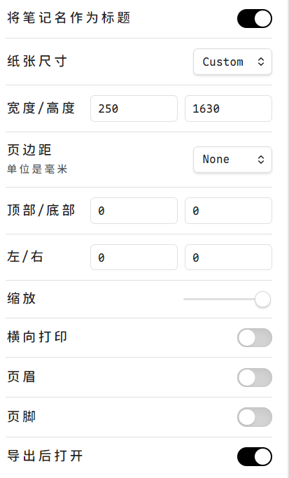

## 工具使用

docx转换Markdown
pandoc D:\WorkSpace\Project\XSJ-T3\project1\T3PROX4000平台调试指导书_V1.07-20251225.docx -t gfm --extract-media=D:\WorkSpace\Project\XSJ-T3\project1 -o D:\WorkSpace\Project\XSJ-T3\project1\output.md

pandoc input.docx -t gfm --extract-media=./media -o output.md
#import/pf

Bat脚本ansi编码才能正常运行

Py比Bat等好用

强烈建议使用标准的 UTF-8 编码，所有语言使用同一种编码，既没有冲突，又被所有平台所支持 #import/pf

vscode登录不上，不能同步设置：有其他登录插件占用了

- Excel 表格中如何将上下两行内容互换位置？
    - 选中下面的行→按下 SHIFT 键→将鼠标放到目标行上边框（或下边框）处（此时光标会变成 “上下左右” 的箭头标志）→点下左键→将目标行拖动到上面那一行的上面（此时鼠标处会有一条横线，移动鼠标将这条横线放到上面那一行的上边框处）→松开左键→松开 SHIFT 键→操作完成。
    - 不止是单行，多行、多列以及多行多列的矩阵区域都可以用这种方法交换位置。

OneDrive远程发生变动本地不一定检测得到，但是本地变动以后就会触发同步

## 软件开发

版本备份非常重要
代码版本管理：git
编译环境版本管理：快照
串口历史记录
尽量少改动代码-控制稳定

## 其他

