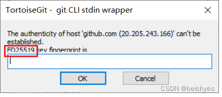
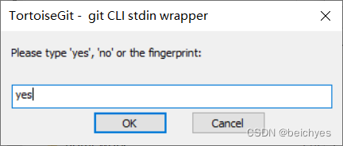

- 进入目录
    - C:\Users\XSJ\ssh
- 生成公钥
    - ssh-keygen -t rsa -C "luhao200@foxmail.com" -f id_rsa_ubuntu
- 去github上生成一个ssh公钥
    - 将生成的id_rsa.pub的内容复制进去，名称为电脑名称
- git init
- git add.
- 第一次上传
    - git config --global user.name "luhao"
    - git config --global user.email "luhao200@foxmail.com"
- git commit -m "first commit"
- git branch -M main
- git remote add origin git@github.com:luhao200/T113.git
- git push -u origin main
- 第一次上传
    - 将框内的key输入到下面的输入栏里面，然后的点ok
    - 
    - 
