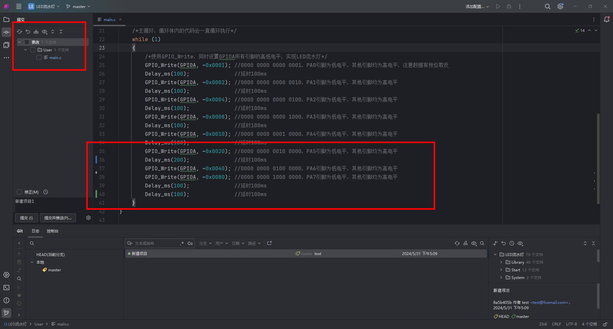

## 一、Git概述

### 何为版本控制

- 版本控制软件功能：
    - **版本管理**：回退到历史上的任何版本
    - **共享代码**：团队之间共享代码
    - 团队合作开发-代码整合：
- 版本控制是一种记录文件内容变化， 以便将来查阅特定版本修订情况的系统。

Git是一个开源的[分布式](https://baike.baidu.com/item/%E5%88%86%E5%B8%83%E5%BC%8F/19276232?fromModule=lemma_inlink)版本控制系统，可以有效、高速地处理从很小到非常大的项目[版本管理](https://baike.baidu.com/item/%E7%89%88%E6%9C%AC%E7%AE%A1%E7%90%86/2511538?fromModule=lemma_inlink)。也是[Linus Torvalds](https://baike.baidu.com/item/Linus%20Torvalds/9336769?fromModule=lemma_inlink)为了帮助管理[Linux内核](https://baike.baidu.com/item/Linux%E5%86%85%E6%A0%B8/10142820?fromModule=lemma_inlink)开发而开发的一个开放源码的[版本控制软件](https://baike.baidu.com/item/%E7%89%88%E6%9C%AC%E6%8E%A7%E5%88%B6%E8%BD%AF%E4%BB%B6/2617766?fromModule=lemma_inlink)。

当前热门的开源网站Github也是基于此。

### 为什么需要版本控制

在项目开发中，团队协作管理代码和文件是每天必须要做的事情。大家一定会碰到如下几个场景和问题？

1. 协同修改，多人并行开发修改服务器的文件
2. 数据备份
3. 版本管理，权限控制
4. 如果文件和工程误删了还能找回来吗？
5. 分支管理 1.0 2.0
6. 遇到了文件冲突如何解决？
7. 如何把一些我临时保存的文件不要提交?


同时，版本管理也很方便的对比版本之间的差异。

### git与svn的区别及优缺点

**svn:** 只有一个单一的集中管理的服务器，保存所有文件的修订版本，而协同工作的人们都通过客户端连接到这台服务器，去除最新的文件或者提交更新。


**集中式版本控制系统：**

> 版本库是集中存放在中央服务器的，而干活的时候，用的都是自己的电脑，所以要先从中央服务器取得最新的版本，然后开始干活，干完活了，再把自己的活推送给中央服务器。中央服务器就好比是一个图书馆，你要改一本书，必须先从图书馆借出来，然后回到家自己改，改完了，再放回图书馆。

**SVN的特点**

- 提交必须有网络连接（非本地版本库）；
- 提交并非每次都能够成功。如果有其他人先于你提交，会提示“改动基于过时的版本，先更新再提交”… 诸如此类；
- 冲突解决是一个提交速度的竞赛：手快者，先提交，平安无事；手慢者，后提交，可能遇到麻烦的冲突解决。
- 中央服务器的单点故障。  
    若是宕机一小时，那么在这一小时内，谁都无法提交更新、还原、对比等，也就无法协同工作。如果中央服务器的磁盘发生故障，并且没做过备份或者备份得不够及时的话，还会有丢失数据的风险。最坏的情况是彻底丢失整个项目的所有历史更改记录。

**git:** 每个终端都是一个仓库，客户端并不只是提取最新版本的文件快照，而是把原始的代码仓库完整地镜像下来。每一次提取操作，实际上都是一次对代码仓库的完整备份。


**分布式版本能控制系统**：

> 首先，分布式版本控制系统根本没有“中央服务器”，每个人的电脑上都是一个完整的版本库，这样，你工作的时候，就不需要联网了，因为版本库就在你自己的电脑上。
> 和集中式版本控制系统相比，分布式版本控制系统的安全性要高很多，因为每个人电脑里都有完整的版本库，某一个人的电脑坏掉了不要紧，随便从其他人那里复制一个就可以了。而集中式版本控制系统的中央服务器要是出了问题，所有人都没法干活了。

**Git特点**：

- Git的提交不会被打断，直到你的工作完全满意了，PUSH给他人或者他人PULL你的版本库，合并会发生在PULL和PUSH过程中，不能自动解决的冲突会提示您手工完成。
- 冲突解决不再像是SVN一样的提交竞赛，而是在需要的时候才进行合并和冲突解决。

**区别：**

- Git把内容按元数据方式存储，而SVN是按文件
    因为git目录是处于你的机器上的一个克隆版的版本库，它拥有中心版本库上所有的东西，例如标签，分支，版本记录等。.git目录的体积大小跟.svn比较，你会发现它们差距很大。
- Git的内容的完整性要优于SVN
    GIT的内容存储使用的是SHA-1哈希算法。这能确保代码内容的完整性，确保在遇到磁盘故障和网络问题时降低对版本库的破坏。
- 分支（Branch）不同

### Git有三个分区

- 工作区：就是你在电脑里能看到的目录（代码编辑区）。
- 暂存区：一般存放在 ".git目录下" 下的index文件中（过渡层，避免误操作）。
- 版本库：工作区有一个隐藏目录.git （本地仓库，专门控制版本）。

另外还有一个**远程仓库**：比如GitHub、Gitee、GitLab上的库。

他们之间的关系如下：


在工具内是如下分布：


### Git命令行

Git默认使用命令行操作，以下是常用命令行。

| 命令名称                     | 作用      |
| ------------------------ | ------- |
| git init                 | 初始化本地库  |
| git status               | 查看本地库状态 |
| git add 文件名              | 添加到暂存区  |
| git commit -m “日志信息” 文件名 | 提交到本地库  |
| git reflog               | 查看历史记录  |
| git reset --hard 版本号     | 版本硬回溯   |
| git reset --soft 版本号     | 版本软回溯   |

## 二、Git工具

Git可视化工具很多，很多集成开发环境内部也集成了Git功能，根据自己的开发环境进行选择。各种Git可视化工具本质上都是执行Git命令，所以在A工具编辑的版本库放到B工具打开是一样的。如果你使用的代码编辑器比如sourceinsight没有Git功能，可以选择使用TortoiseGit或者Writerside。本次演示使用Writerside进行Git版本管理。

| 名称            | 简述                                                         | 图标                                                                             | 链接                           | 教程                                                                                                                                                                                                                                                                                                                                                                                                                                                              |
| ------------- | ---------------------------------------------------------- | ------------------------------------------------------------------------------ | ---------------------------- | --------------------------------------------------------------------------------------------------------------------------------------------------------------------------------------------------------------------------------------------------------------------------------------------------------------------------------------------------------------------------------------------------------------------------------------------------------------- |
| Git Bash      | 最原始的操作，通过命令行进行版本管理。                                        |                                       |  | https://learngitbranching.js.org/                                                                                                                                                                                                                                                                                                                                                                                                                               |
| TortoiseGit   | TortoiseSVN同一家公司出品，在文件管理器内使用右键进行操作。                        |                                                    |     | [TortoiseGit](https://blog.csdn.net/u011029104/article/details/131856831?ops_request_misc=&request_id=&biz_id=102&utm_term=GIT%E7%8E%AF%E5%A2%83%E6%90%AD%E5%BB%BA&utm_medium=distribute.pc_search_result.none-task-blog-2~all~sobaiduweb~default-4-131856831.nonecase&spm=1018.2226.3001.4187)                                                                                                                                                                 |
| Visual Studio | Visual Studio内集成                                           |                                      |     |                                                                                                                                                                                                                                                                                                                                                                                                                                                                 |
| VScode        | VScode内集成，加上GitGraph等插件                                    |                                      |     | [VScode](https://blog.csdn.net/weixin_48024605/article/details/136037857?ops_request_misc=%257B%2522request%255Fid%2522%253A%2522171712740716800182774576%2522%252C%2522scm%2522%253A%252220140713.130102334..%2522%257D&request_id=171712740716800182774576&biz_id=0&utm_medium=distribute.pc_search_result.none-task-blog-2~all~baidu_landing_v2~default-6-136037857-null-null.142^v100^pc_search_result_base8&utm_term=GIT%20VScode&spm=1018.2226.3001.4187) |
| Jetbrains     | CLion、PyCharm、IDEA等系列集成开发环境。而Writerside为Jetbrains开发的文档编辑器。 |  |     | 软件内部学习教程。                                                                                                                                                                                                                                                                                                                                                                                                                                                       |
| 其他            | 一些可视化工具，例如sourceTree等                                      |                                                                                |                              |                                                                                                                                                                                                                                                                                                                                                                                                                                                                 |

## 三、基础使用示例

### 安装Git

1.从 [Git官网](https://git-scm.com/) 下载安装包，双击安装包然后一直点击Next安装。


2.安装完毕后，右击空白处会有Git命令行工具。


3.打开Git命令行工具配置个人的用户名称和电子邮件地址：

```
git config --global user.name "test"
git config --global user.email test@foxmail.com
```

如下图所示：


### 安装Writerside

1.从 [Writerside官网](https://www.jetbrains.com/zh-cn/writerside/) 下载安装包，双击安装包然后一直点击下一步安装。

安装的时候注意将这两项选上：


2.双击安装好的Writerside桌面快捷方式，安装中文语言包：


### 使用示例

#### 使用Writerside打开工程

1.在工程目录下面右击空白处，使用Writerside打开：


2.信任项目


3.界面布局


#### 1.创建.gitignore

在本项目文件夹下面创建纯文本文件，并重命名为.gitignore。里面的内容即是忽略提交到项目库的文件夹或者文件。


#### 2.创建Git库：git init


创建完成后本文件目录下会出现一个.git的隐藏文件夹，即版本库。


#### 3.添加文件：git add

点击所示按钮，红框即是相对于前一个版本有更改的文件，因为是新建仓库，所以所有文件都显示在此（除了.gitignore里面包含的内容）。


点击小眼睛，再点击目录，更改文件目录则以文件夹形式展现。


选择此次需要添加进版本库的文件。


#### 4.提交文件：git commit -m "新建项目"

编辑提交消息，点击提交：


#### 5.一次版本提交完成，观察现在的界面

1. 更改文件目录下面的文件消失了（因为此时工作区文件与版本库文件相同）。
2. 版本库信息展示在此处。
3. 这一个版本相对于前一个版本的所有变化的文件。
4. 版本的相关信息：提交者，时间，哈希值等。


#### 6.编辑代码

缓存区和工作区均会显示与已提交版本差异。



#### 7.查看差异：git diff

双击缓存区文件即可对比工作区文件与版本库文件差异。


#### 8.提交

#### 9.回溯版本

1.回溯到已提交版本库。


2.回溯到指定版本。


软回退：文件不会更改，差异将暂存以进行提交。（git reset --soft 版本号

硬回退：文件将还原为所选提交的状态。（git reset --hard 版本号


3.与现有版本进行比较修改。

右击指定版本，选择与本地进行比较，即可显示指定版本与当前文件的差异。


1.双击差异文件即可显示具体差异。

2.点击红框2标出的按钮来选择接受指定版本文件与当前文件的差异。


至此，基础使用讲完，足够个人进行版本管理了。

## 四、Git远程与分支

**分支就相当于地址。**

点击左上角按钮即可显示推送拉取和新建分支等按钮。


### 新建分支

点击新建分支即可在此节点新建分支。


HEAD即当前位置的指针。

### 开发D口

新增关于D的代码并提交。


### 切换分支

右击分支所在版本，点击签出，选择签出的具体分支。


可从图中看出，左上角变到对应分支，而图中的代码也恢复到对应版本。


### 开发B口

1.用切换分支操作，切换到开发GPIOB分支。

2.修改代码，进行提交，此处提交了两个版本。


### 合并分支

假设D口和B口都已经开发完了，我们需要将开发GPIOB分支、开发GPIOD分支合并到master主分支上面。

1.首先切换到master分支。

2.右击开发GPIOB分支，选择将‘开发GPIOB分支’合并到‘master’中。


结果如下：


对开发GPIOD分支做同样操作，因为开发D和B时是在文件同一处修改，所以有冲突。


点击合并，则打开冲突窗口，左窗口为master分支内容，右窗口开发D分支内容，通过点击红框按钮来选择接受哪边的内容。


此处我们两边的代码都需要，我们先点击上图红框按钮，变成如下图。


再点击右边红框按钮，接受开发D分支的代码，变成下图。


点击应用就结束合并了。

由下图可看出，代码都已合并。


## 五、Git使用注意

1.从以备份为目的提交版本到逐渐养成以开发功能提交版本。

2.规范提交信息。

## 六、拓展

[天天用Git，分支开发你怎么弄的？](https://mp.weixin.qq.com/s/touo-rygtz0tG6y8NKw65A)
