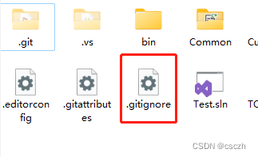
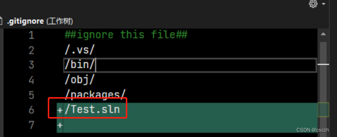

很多时候某些本地生成的文件如编译器生成的文件，不想让 git 跟踪变更并提交 有两种情况：

## 1. 未被 Git 系统追踪的文件 (UntrackedFile, 例如未被 git add 的文件)

可通过 [gitignore](gitignore.md) 忽略；
例如忽略项目目录下 Test.sln 文件。打开.gitignore文件并输入 /Test.sln：

这样就能忽略掉未追踪文件。

## 2. 在. gitignore 规则提交后的文件

由于已经被 Git 追踪，除了在. gitignore 添加该目录 / 文件，还要删除远程仓库中的文件。
**git rm -r --cached** 【目录或文件】 // 如：git rm -r --cached Test.sln  
**git commit -m 忽略文件**  
**git push** // 推送到远程，从远程仓库中删除掉

## 参数解析

**git rm** 是删除文件，加 **--cached** 参数表示从索引中删除，不再跟踪该文件或目录，但本地不会进行删除。
对于文件，可以不需要 **-r** 参数，**-r** 是递归删除；如果输入的是目录，则会递归删除整个目录中的所有子目录和文件：  
**注意**：**git rm -r --cached** 是高危操作，在命令后一定要指定目录或文件 ，否则  会删除所有缓存。
