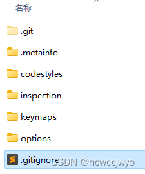

## 问题

在某次未知操作后，我的设置同步无法正常工作，按照网上的方法禁用同步设置并移除数据也行不通，一直报 checkout returned unexpected result LOCK_FAILURE  


## 解决

通过查看日志得知：  
idea 会不定时地把本地的配置 copy 到 settingsSync

```
Copying existing settings from C:\Users\xxx\AppData\Roaming\JetBrains\IdeaIC2023.2 to
C:\Users\xxx\AppData\Roaming\JetBrains\IdeaIC2023.2\settingsSync
```

查看 settingsSync 文件目录可知，他是使用 [GIT](../GIT/GIT.md) 来进行同步设置的，可能我的某次操作导致了冲突 (不解)，所以一直无法更新。  

从上面的日志我猜 IDEA 开启设置同步时都会检查文件完整性，如果没有会自动创建，所以我把 settingsSync 目录删除了 (删除前已备份)，然后启动 IDEA，打开设置同步 - 启用设置同步 -> 从账户获取设置(如果是主力机也可以将推送到账户，其他电脑下次更新时可能被这台电脑的设置覆盖)。它就自动创建了。
查看日志得，又初始化了一份仓库：

```
Initializing new Git repository for Settings Sync at C:\Users\xxx\AppData\Roaming\JetBrains\IdeaIC2023.2\settingsSync
```

至此，我的这台电脑的 idea 配置到了最新版本，这样我的其他电脑的更改也能同步到这台电脑了。  

