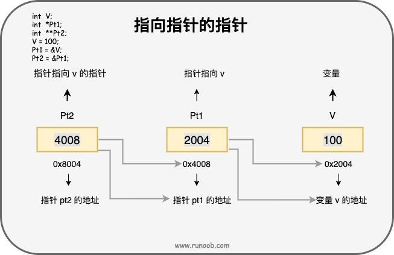

<table>
<colgroup>
<col style="width: 100%" />
</colgroup>
<thead>
<tr class="header">
<th>
int var_runoob = 10;

int *p; // 定义指针变量

p = &amp;var_runoob;

printf("var_runoob 变量的地址： %p\n", p);
</th>
</tr>
</thead>
<tbody>
</tbody>
</table>
结果：var_runoob 变量的地址： 0x7ffeeaae08d8

什么是指针？
指针也就是内存地址，指针变量是用来存放内存地址的变量。就像其他变量或常量一样，您必须在使用指针存储其他变量地址之前，对其进行声明。指针变量声明的一般形式为：

type \*var_name;

type 是指针的基类型，它必须是一个有效的 C 数据类型。

int \*ip; /\* 一个整型的指针 \*/

double \*dp; /\* 一个 double 型的指针 \*/

float \*fp; /\* 一个浮点型的指针 \*/

char \*ch; /\* 一个字符型的指针 \*/

所有实际数据类型，不管是整型、浮点型、字符型，还是其他的数据类型，对应指针的值的类型都是一样的，==都是==一个代表内存地址的长的==十六进制数==。
如何使用指针？
int var = 20; /\* 实际变量的声明 \*/

int \*ip; /\* 指针变量的声明 \*/

ip = &var; /\* 在指针变量中存储 var 的地址 \*/

printf("var 变量的地址: %p\n", &var );

/\* 在指针变量中存储的地址 \*/

printf("ip 变量存储的地址: %p\n", ip );

/\* 使用指针访问值 \*/

printf("\*ip 变量的值: %d\n", \*ip );

结果：

var 变量的地址: 0x7ffeeef168d8

ip 变量存储的地址: 0x7ffeeef168d8

\*ip 变量的值: 20
NULL 指针
在变量声明的时候，如果没有确切的地址可以赋值，==为指针变量赋一个 NULL 值是一个良好的编程习惯，避免出现野指针==。赋为 NULL 值的指针被称为空指针。

NULL 指针是一个定义在标准库中的值为零的常量。

| 概念           | 描述                                                     |
|----------------|----------------------------------------------------------|
| 指针的算术运算 | 可以对指针进行四种算术运算：++、--、+、-                 |
| 指针数组       | 可以定义用来存储指针的数组。                             |
| 指向指针的指针 | C 允许指向指针的指针。                                   |
| 传递指针给函数 | 通过引用或地址传递参数，使传递的参数在调用函数中被改变。 |
| 从函数返回指针 | C 允许函数返回指针到局部变量、静态变量和动态内存分配。   |

指针的算术运算
指针的每一次递增，它其实会指向==下一个元素的存储单元==。

指针的每一次递减，它都会指向前一个元素的存储单元。

指针在递增和递减时跳跃的字节数取决于指针所==指向变量数据类型长度==，比如 int 就是 4 个字节。

假设 ptr 是一个指向地址 1000 的整型指针，是一个 32 位的整数，让我们对该指针执行下列的算术运算：ptr++

在执行完上述的运算之后，ptr 将指向位置 1004，因为 ptr 每增加一次，它都将指向下一个整数位置，即当前位置往后移 4 字节。

递增一个指针

我们喜欢在程序中==使用指针代替数组==，因为变量指针可以递增，而数组不能递增，==数组可以看成一个指针常量==。
指针数组
指针数组：

int \*p1\[3\];

中括号\[\]的优先级高，因此与 p1 先结合，表示一个数组，这个数组中有 3 个元素，这 3 个元素都是指针，它们指向的是 int 型数据。

数组指针：

int (\*p2)\[3\];

小括号让 p2 与 \* 结合，表示 p2 是一个指针，这个指针指向了一个数组，数组中有 3 个元素，每一个元素的类型是 int 型。

用一个指向字符的指针数组来存储一个字符串列表，如下：

const int MAX = 4;

const char \*names\[\] = {

"Zara Ali",

"Hina Ali",

"Nuha Ali",

"Sara Ali",

};

int i = 0;

for ( i = 0; i \< MAX; i++)

{

printf("Value of names\[%d\] = %s\n", i, names\[i\] );

}

当上面的代码被编译和执行时，它会产生下列结果：

Value of names\[0\] = Zara Ali

Value of names\[1\] = Hina Ali

Value of names\[2\] = Nuha Ali

Value of names\[3\] = Sara Ali
指向指针的指针

一个指向指针的指针变量必须如下声明，即在变量名前放置两个星号。例如，下面声明了一个指向 int 类型指针的指针：

**int \*\***var**;**

当一个目标值被一个指针间接指向到另一个指针时，访问这个值需要使用两个星号运算符

实例

int V = 100;

int \*Pt1;

int \*\*Pt2;

/\* 获取 V 的地址 \*/

Pt1 = &V;

/\* 使用运算符 & 获取 Pt1 的地址 \*/

Pt2 = &Pt1;

/\* 使用 pptr 获取值 \*/

printf("var = %d\n", V );

printf("Pt1 = %p\n", Pt1 );

printf("\*Pt1 = %d\n", \*Pt1 );

printf("Pt2 = %p\n", Pt2 );

printf("\*\*Pt2 = %d\n", \*\*Pt2);

当上面的代码被编译和执行时，它会产生下列结果：

var = 100

Pt1 = 0x7ffee2d5e8d8

\*Pt1 = 100

Pt2 = 0x7ffee2d5e8d0

\*\*Pt2 = 100
传递指针给函数
实例

void getSeconds(unsigned long \*par)

{

 /\* 获取当前的秒数 \*/

 \*par = time( NULL );

 return;

}

int main ()

{

 unsigned long sec;

 getSeconds( &sec );

 /\* 输出实际值 \*/

 printf("Number of seconds: %ld\n", sec );

 return 0;

}

能接受指针作为参数的函数，也能接受数组作为参数
函数指针
函数指针是指向函数的指针变量。

通常我们说的指针变量是指向一个整型、字符型或数组等变量，而函数指针是指向函数。

函数指针可以像一般函数一样，用于调用函数、传递参数。

函数指针变量的声明：

typedef int (\*fun_ptr)(int,int); // 声明一个指向同样参数、返回值的函数指针类型

实例

int max(int x, int y)

{

return x \> y ? x : y;

}

int main(void)

{

/\* p 是函数指针 \*/

int (\* p)(int, int) = & max; // &可以省略

int a, b, c, d;

printf("请输入三个数字:");

scanf("%d %d %d", & a, & b, & c);

/\* 与直接调用函数等价，d = max(max(a, b), c) \*/

d = p(p(a, b), c);

printf("最大的数字是: %d\n", d);

return 0;

}
只读指针变量和只读变量指针
我们看const左面的值，修饰\*的指针

只读指针变量

//可以改变间接引用变量的值，但是不可以重新绑定新的地址

int \* const p2 &a;

\*p2 = 200;

// p2=&b;

只读变量指针

//可以重新绑定地址，但是不可以改变间接引用的变量值

int const \* p3 =&a;

// \*p3=300:

p3=&b;

第三种

//不可以重新绑定新的地址，也不可以改变间接引用变量的值

int const \* const p4 &a;

// \*p4=400;

// p4=&b;

对于数组，相当于第一种

int arr\[\]={1,2};

arr\[0\]=100;

int arr2\[\]={3,4};

//arr=arr2;
