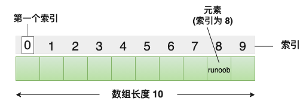

存储一个==固定大小==的==相同类型==元素的==顺序集合==。
所有的数组都是由连续的内存位置组成。最低的地址对应第一个元素，最高的地址对应最后一个元素。

声明数组
type arrayName \[ arraySize \];

这叫做一维数组。arraySize 必须是一个大于零的整数常量，type 可以是任意有效的 C 数据类型。
初始化数组
如果您省略掉了数组的大小，数组的大小则为初始化时元素的个数。

double balance\[\] = {1000.0, 2.0, 3.4, 7.0, 50.0};
获取数组长度
数组长度可以使用 ==sizeof 运算符来获取数组的长度==

int numbers\[\] = {1, 2, 3, 4, 5};

int length = sizeof(numbers) / sizeof(numbers\[0\]);

| 概念                                                                                                                                                                                                                                                            | 描述                                                                         |
|-----------------------------------------------------------------------------------------------------------------------------------------------------------------------------------------------------------------------------------------------------------------|------------------------------------------------------------------------------|
| [多维数组](onenote:#C%20数组&section-id={CFF18FC1-E8B4-4B47-B124-02C19DB5FA64}&page-id={915155A5-FE52-416C-A094-5FCAF83A1962}&object-id={DD9EFDBB-C229-0DB6-239C-60096768EBFC}&6D&base-path=https://d.docs.live.net/9a24641e4a3808cb/文档/专业/C语言.one)       | C 支持多维数组。多维数组最简单的形式是二维数组。                             |
| [传递数组给函数](onenote:#C%20数组&section-id={CFF18FC1-E8B4-4B47-B124-02C19DB5FA64}&page-id={915155A5-FE52-416C-A094-5FCAF83A1962}&object-id={B12C2DD7-BACC-09EC-0299-D8DFE528F95F}&31&base-path=https://d.docs.live.net/9a24641e4a3808cb/文档/专业/C语言.one) | 您可以通过指定不带索引的数组名称来给函数传递一个指向数组的指针。             |
| [从函数返回数组](onenote:#C%20数组&section-id={CFF18FC1-E8B4-4B47-B124-02C19DB5FA64}&page-id={915155A5-FE52-416C-A094-5FCAF83A1962}&object-id={36D9AAC6-6A26-0EB0-13EC-CD899402D2E8}&48&base-path=https://d.docs.live.net/9a24641e4a3808cb/文档/专业/C语言.one) | C 允许从函数返回数组。                                                       |
| 指向数组的指针                                                                                                                                                                                                                                                  | 您可以通过指定不带索引的数组名称来生成一个指向数组中第一个元素的指针。       |
| 静态数组与动态数组                                                                                                                                                                                                                                              | 态数组在编译时分配内存，大小固定，而动态数组在运行时手动分配内存，大小可变。 |

多维数组
多维数组最简单的形式是二维数组。一个二维数组，在本质上，是一个一维数组的列表。声明一个 x 行 y 列的二维整型数组，形式如下：

type arrayName \[ x \]\[ y \];

初始化二维数组

二维数组在==定义的时候初始化==，否则只能用循环初始化

多维数组可以通过在括号内为每行指定值来进行初始化。下面是一个带有 3 行 4 列的数组。

int a\[3\]\[4\] = {

{0, 1, 2, 3} , /\* 初始化索引号为 0 的行 \*/

{4, 5, 6, 7} , /\* 初始化索引号为 1 的行 \*/

{8, 9, 10, 11} /\* 初始化索引号为 2 的行 \*/

};

内部嵌套的括号是可选的，下面的初始化==与上面是等同==的：

int a\[3\]\[4\] = {0,1,2,3,4,5,6,7,8,9,10,11};
传递数组给函数
方式 1

形式参数是==一个指针==：

void myFunction(int \*param)

{

…

}

方式 2

形式参数是一个==已定义大小的数组==：

void myFunction(int param\[10\])

{

…

}

方式 3

形式参数是一个==未定义大小的数组==：

void myFunction(int param\[\])

{

…

}

二维数组传递给函数

方法1:

void print_a(int a\[n\]\[m\], int n, int m)

方法2: 指向一个有5个元素一维数组的指针：

void print_b(int (\*a)\[5\], int n, int m)

方法3: 利用数组是顺序存储的特性,通过降维来访问原数组!

void print_c(int \*a, int n, int m)

如果知道二维数组的长度，当然选择第一或者第二种方式，但是==长度不确定时==，只能传入数组大小来遍历元素啦。

[例子](https://www.runoob.com/cprogramming/c-passing-arrays-to-functions.html#:~:text=75-,%E4%BA%8C%E7%BB%B4%E6%95%B0%E7%BB%84%E4%BC%A0%E9%80%92%E7%BB%99%E5%87%BD%E6%95%B0,-%E5%88%97%E4%B8%BE%20C%20%E8%AF%AD%E8%A8%80)
从函数返回数组
如果您想要从函数返回一个一维数组，您必须声明一个返回指针的函数，如下：

int \* myFunction()

{

...

}
