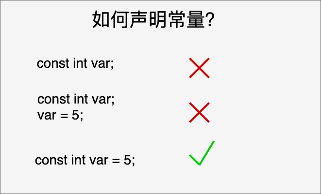

## 定义常量

在 C 中，有两种简单的定义常量的方式：

1. 使用 `#define` [预处理器](../预处理器.md)： `#define` 可以在程序中定义一个常量，它在编译时会被替换为其对应的值。
2. 使用 **const** 关键字：const 关键字用于声明一个只读变量，即该变量的值不能在程序运行时修改。

### const 关键字

您可以使用 **const** 前缀声明指定类型的常量，如下所示：

const 数据类型 常量名 = 常量值;

在程序中使用该常量时，其值将始终为常量值，并且不能被修改。

const 声明常量要在一个语句内完成：

把**常量定义为大写字母**形式，是一个很好的[编程习惯](../其他/编程习惯.md)。

### `#define` 与 const 区别

`#define` 与 const 这两种方式都可以用来定义常量，选择哪种方式取决于具体的需求和编程习惯。

**建议使用 const 关键字来定义常量**，因为它具有类型检查和作用域的优势，而 `#define` 仅进行简单的文本替换，可能会导致一些意外的问题。

- 替换机制：`#define` 是进行简单的文本替换，而 `const` 是声明一个具有类型的常量。`#define` 定义的常量在编译时会被直接替换为其对应的值，而 `const` 定义的常量在程序运行时会分配内存，并且具有类型信息。
- 类型检查：`#define` 不进行类型检查，因为它只是进行简单的文本替换。而 `const` 定义的常量具有类型信息，[编译器](../../../01工具使用/编译原理/编译器.md)可以对其进行类型检查。这可以帮助捕获一些潜在的类型错误。
- 作用域：`#define` 定义的常量没有作用域限制，它在定义之后的整个代码中都有效。而 **`const` 定义的常量具有块级作用域**，只在其定义所在的作用域内有效。
- 调试和符号表：使用 `#define` 定义的常量在符号表中不会有相应的条目，因为它只是进行文本替换。而使用 `const` 定义的常量会在符号表中有相应的条目，有助于调试和可读性。
