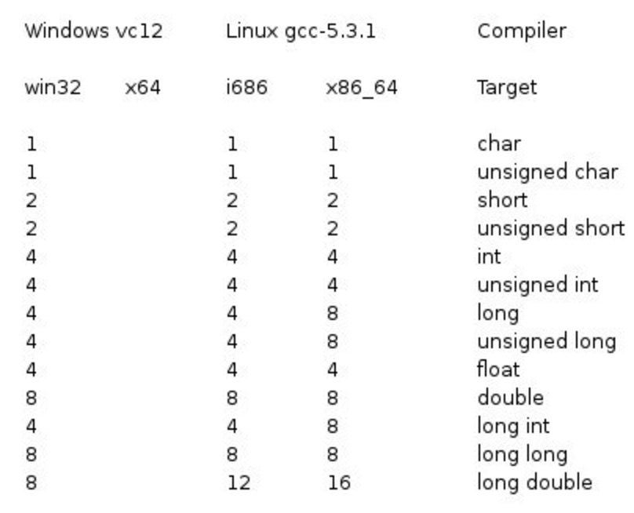

| 序号  | 类型与描述                                                                  |
| --- | ---------------------------------------------------------------------- |
| 1   | **基本数据类型**  <br>它们是算术类型，包括整型（int）、字符型（char）、浮点型（float）和双精度浮点型（double）。 |
| 2   | **[枚举](枚举.md)类型：**  <br>它们也是算术类型，被用来定义在程序中只能赋予其一定的离散整数值的变量。            |
| 3   | **void 类型：**  <br>类型说明符 void 表示没有值的数据类型，通常用于函数返回值。                     |
| 4   | **派生类型：**  <br>包括[数组](数组.md)类型、[指针](指针.md)类型和[结构体](结构体.md)类型。          |

## 整数类型

| 类型                 | 存储大小 | 位数  | 值范围                            | stdint关键字 |
| ------------------ | ---- | --- | ------------------------------ | --------- |
| **char**           | 1 字节 | 8   | -128 到 127                     | int8_t    |
| unsigned char      | 1 字节 | 8   | 0 到 255                        | uint8_t   |
| short              | 2 字节 | 16  | -32,768 到 32,767               | int16_t   |
| unsigned short     | 2 字节 | 16  | 0 到 65,535                     | uint16_t  |
| **int**            | 4 字节 | 32  | -2,147,483,648 到 2,147,483,647 | int32_t   |
| unsigned int       | 4 字节 | 32  | 0 到 4,294,967,295              | uint32_t  |
| long               | 4 字节 | 32  | -2,147,483,648 到 2,147,483,647 |           |
| unsigned long      | 4 字节 | 32  | 0 到 4,294,967,295              |           |
| long long          | 8 字节 | 64  | -(2^64)/2 ~ (2^64)/2-1         | int64_t   |
| unsigned long long | 8 字节 | 64  | 0 ~ (2^64)-1                   | uint64_t  |

注意，各种**类型的存储大小**与**系统位数**有关，但目前通用的以64位系统为主。

以下列出了32位系统与64位系统的存储大小的差别（windows 相同）：



在 64 位系统上，`long` 通常占用 **8 字节**（64 位），但在某些平台上，它可能依旧是 **4 字节**。

为了得到某个类型或某个变量在特定平台上的准确大小，您可以使用 **sizeof** 运算符。表达式 sizeof(type) 得到对象或类型的存储字节大小

每次到新的系统时，可以使用 **sizeof** 运算符确认一下。 #import/pf

### 整数常量

整数常量可以是十进制、八进制或十六进制的常量。

前缀指定基数：**0x 或 0X 表示十六进制，0 表示八进制，不带前缀则默认表示十进制**。

整数常量也可以带一个后缀，**后缀是 U 和 L 的组合，U 表示无符号整数（unsigned），L 表示长整数（long）。后缀可以是大写，也可以是小写，U 和 L 的顺序任意**。

## 浮点类型

浮点常量由整数部分、小数点、小数部分和指数部分组成。

您可以使用小数形式或者指数形式来表示浮点常量。

```c
3.14159       /* 合法的 */
314159E-5L    /* 合法的 */
```

| 类型          | 存储大小  | 位数  | 正值范围（负值范围取反）          | 精度      |
| ----------- | ----- | --- | --------------------- | ------- |
| **float**   | 4 字节  | 32  | 1.2E-38 到 3.4E+38     | 6 位有效位  |
| **double**  | 8 字节  | 64  | 2.3E-308 到 1.7E+308   | 15 位有效位 |
| long double | 16 字节 |     | 3.4E-4932 到 1.1E+4932 | 19 位有效位 |

**非规范化数（Denormalized Numbers）**：C 语言的浮点数表示中，**`float`** 和 **`double`** 类型可以表示极小的数，但在绝对值小于它们的最小正数（例如 `1.2E-38` 对于 `float` 类型）的范围内，它们会进入一种称为**非规范化数**（denormalized numbers）的状态，或称为**次正规数**（subnormal numbers）。这些数能够表示比标准最小正数更小的数，但精度会有所降低。

单精度浮点值。单精度是这样的格式，1位符号，8位指数，23位小数。

**有效位数**: 大约可以精确到 **6-7 位**小数。

由于精度限制，`float` 只能表示一定范围内的小数，且**在表示非常大的或非常小的数字时会有舍入误差**。


双精度浮点值。双精度是1位符号，11位指数，52位小数。

**有效位数**: 大约可以精确到 **15-16 位**小数。

相比于 `float`，`double` 能表示更大范围的数值，并且精度更高，适合需要高精度和大范围数值的场景。


#import/pf 使用浮点时，要考虑精度问题。

## 字符常量

字符常量是括在单引号中，例如，'x' 可以存储在 **char** 类型的简单变量中。

字符常量可以是一个普通的字符（例如 'x'）、一个转义序列（例如 `\t`），或一个通用的字符（例如 `\u02C0`）。

在 C 中，有一些特定的字符，当它们前面有反斜杠时，它们就具有特殊的含义，被用来表示如换行符（`\n`）或制表符（`\t`）等。下表列出了一些这样的转义序列码：

| 转义序列       | 含义            |
| ---------- | ------------- |
| `\\`       | \ 字符          |
| `\'`       | ' 字符          |
| `\"`       | " 字符          |
| `\?`       | ? 字符          |
| \a         | 警报铃声          |
| \b         | 退格键           |
| \f         | 换页符           |
| \n         | 换行符           |
| \r         | 回车            |
| \t         | 水平制表符         |
| \v         | 垂直制表符         |
| \ooo       | 一到三位的八进制数     |
| \xhh . . . | 一个或多个数字的十六进制数 |

```c title:字符常量的ASCII值可以通过强制类型转换转换为整数值。
char myChar = 'a';  
int myAsciiValue = (int) myChar; // 将 myChar 转换为 ASCII 值 97
```

我们的每一个字符都可以使用字符类型来保存：

- char - 占用1个字节（-128~127），可以表示所有的ASCII码字符，每一个数字对应的是编码表中的一个字符：


编码表中包含了所有我们常见的字符，包括运算符号、数字、大小写字母等（注意只有英文相关的，没有中文和其他语言字符，包括中文的标点符号也没有）

## void 类型

| 序号  | 类型与描述                                                                                                               |
| --- | ------------------------------------------------------------------------------------------------------------------- |
| 1   | **函数返回为空**  <br>C 中有各种函数都不返回值，或者您可以说它们返回空。不返回值的函数的返回类型为空。例如 **void exit (int status);**                             |
| 2   | **函数参数为空**  <br>C 中有各种函数不接受任何参数。不带参数的函数可以接受一个 void。例如 **int rand(void);**                                           |
| 3   | **指针指向 void**  <br>类型为 void * 的指针代表对象的地址，而不是类型。例如，内存分配函数 **void malloc( size_t size )**; 返回指向 void 的指针，可以转换为任何数据类型。 |

## 类型转换

C 语言中有两种类型转换：

- 隐式类型转换：隐式类型转换是在表达式中自动发生的，无需进行任何明确的指令或函数调用。它通常是将一种**较小的类型自动转换为较大的类型**，例如，将int类型转换为long类型或float类型转换为double类型。隐式类型转换也可能会导致数据精度丢失或数据截断。
- 显式类型转换：显式类型转换需要使用强制类型转换运算符（type casting operator），它可以将一个数据类型的值强制转换为另一种数据类型的值。强制类型转换可以使程序员在必要时对数据类型进行更精确的控制，但也可能会导致数据丢失或截断。
- 若两种类型的字节数相同，且一种有符号，一种无符号，则转换成无符号类型。

```c title:显式类型转换实例
double d = 3.14159;  
int i = (int)d; // 显式将double类型转换为int类型
```

## 整数提升

整数提升是指把小于 **int** 或 **unsigned int** 的整数类型转换为 **int** 或 **unsigned int** 的过程。请看下面的实例，在 int 中添加一个字符：

```c
#include <stdio.h>
 
int main()
{
   int  i = 17;
   char c = 'c'; /* ascii 值是 99 */
   int sum;
 
   sum = i + c;
   printf("Value of sum : %d\n", sum );
 
}
```

在这里，sum 的值为 116，因为编译器进行了整数提升，在执行实际加法运算时，把 'c' 的值转换为对应的 ascii 值。

## 常用的算术转换

**常用的算术转换**是隐式地把值强制转换为相同的类型。编译器首先执行**整数提升**，如果操作数类型不同，则它们会被转换为下列层次中出现的最高层次的类型：

