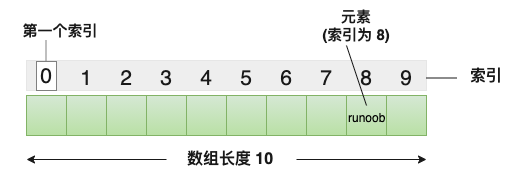

C 语言支持**数组**数据结构，它可以存储一个**固定大小的相同类型元素**的顺序集合。
数组是用来存储一系列数据，但它往往被认为是一系列相同类型的变量。
所有的**数组都是由连续的内存位置组成**。最低的地址对应第一个元素，最高的地址对应最后一个元素。

数组中的特定元素可以通过索引访问，第一个索引值为 0。
C 语言还允许我们使用[指针](指针.md)来处理数组，这使得对数组的操作更加灵活和高效。


## 获取数组长度

数组长度可以使用 **sizeof** 运算符来获取数组的长度，例如：

```c
#include <stdio.h>
int main() {
    int array[] = {1, 2, 3, 4, 5};
    int length = sizeof(array) / sizeof(array[0]);
    printf("数组长度为: %d\n", length);
    return 0;
}
```

使用宏定义：

```c
#include <stdio.h>
#define LENGTH(array) (sizeof(array) / sizeof(array[0]))
int main() {
    int array[] = {1, 2, 3, 4, 5};
    int length = LENGTH(array);
    printf("数组长度为: %d\n", length);
    return 0;
}
```

## 数组名

在 C 语言中，**数组名表示数组的地址，即数组首元素的地址。**
当我们在声明和定义一个数组时，该数组名就代表着该数组的地址。

例如，在以下代码中：
```c
int myArray\[5] = {10, 20, 30, 40, 50};
```
在这里，myArray 是**数组名**，它表示整数类型的数组，包含 5 个元素。**myArray** 也代表着**数组的地址**，即**第一个元素的地址**。
**数组名本身是一个常量指针，意味着它的值是不能被改变的**，一旦确定，就不能再指向其他地方。

```c
void printArray(int arr[], int size) {
    for (int i = 0; i < size; i++) {
        printf("%d ", arr[i]); // 数组名arr被当作指针使用
    }
}
int main() {
    int myArray[5] = {10, 20, 30, 40, 50};
    printArray(myArray, 5); // 将数组名传递给函数
    return 0;
}
```

## 多维数组

### 二维数组

多维数组最简单的形式是二维数组。一个二维数组，在本质上，是一个一维数组的列表。声明一个 x 行 y 列的二维整型数组，形式如下：

```c
type arrayName [ x ][ y ];
```

其中，**type** 可以是任意有效的 C 数据类型，**arrayName** 是一个有效的 C 标识符。一个二维数组可以被认为是一个带有 x 行和 y 列的表格。下面是一个二维数组，包含 3 行和 4 列：

```c
int x[3][4];
```

因此，数组中的每个元素是使用形式为 a[ i , j ] 的元素名称来标识的，其中 a 是数组名称，i 和 j 是唯一标识 a 中每个元素的下标。

#### 初始化二维数组

多维数组可以通过在括号内为每行指定值来进行初始化。下面是一个带有 3 行 4 列的数组。

```c
int a[3][4] = {  
 {0, 1, 2, 3} ,   /*  初始化索引号为 0 的行 */
 {4, 5, 6, 7} ,   /*  初始化索引号为 1 的行 */
 {8, 9, 10, 11}   /*  初始化索引号为 2 的行 */
};
```

内部嵌套的括号是可选的，下面的初始化与上面是等同的：

```c
int a[3][4] = {0,1,2,3,4,5,6,7,8,9,10,11};
```
