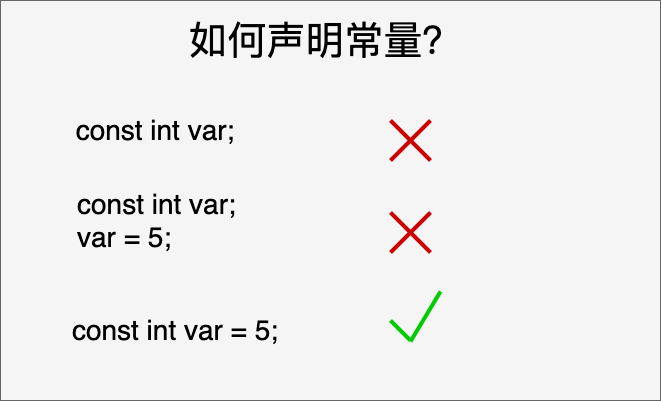

**C 预处理器**不是编译器的组成部分，但是它是**编译过程中一个单独的步骤**。
简言之，**C 预处理器只不过是一个文本替换工具而已**，它们会指示编译器在实际编译之前完成所需的预处理。

所有的预处理器命令都是以井号（#）开头。它必须是第一个非空字符，为了增强可读性，预处理器指令应从第一列开始。下面列出了所有重要的预处理器指令：

| 指令        | 描述                                |
| --------- | --------------------------------- |
| \#define  | 定义宏                               |
| \#include | 包含一个源代码文件                         |
| \#undef   | 取消已定义的宏                           |
| \#ifdef   | 如果宏已经定义，则返回真                      |
| \#ifndef  | 如果宏没有定义，则返回真                      |
| \#if      | 如果给定条件为真，则编译下面代码                  |
| \#else    | \#if 的替代方案                        |
| \#elif    | 如果前面的 \#if 给定条件不为真，当前条件为真，则编译下面代码 |
| \#endif   | 结束一个 \#if……#else 条件编译块            |
| \#error   | 当遇到标准错误时，输出错误消息                   |
| \#pragma  | 使用标准化方法，向编译器发布特殊的命令到编译器中          |

```c
#undef  FILE_SIZE
#define FILE_SIZE 42
```

这个指令告诉 CPP 取消已定义的 FILE_SIZE，并定义它为 42。

```c
#ifndef MESSAGE
#define MESSAGE "You wish!"
#endif
```

这个指令告诉 CPP 只有当 MESSAGE 未定义时，才定义 MESSAGE。

```c
#ifdef DEBUG
/* Your debugging statements here */
#endif
```

这个指令告诉 CPP 如果定义了 DEBUG，则执行处理语句。在编译时，如果您向 gcc 编译器传递了 _-DDEBUG_ 开关量，这个指令就非常有用。它定义了 DEBUG，您可以**在编译期间随时开启或关闭调试**。

## 预定义宏

ANSI C 定义了许多宏。在编程中您可以使用这些宏，但是不能直接修改这些预定义的宏。

| 宏          | 描述                                |
| ---------- | --------------------------------- |
| \_\_DATE__ | 当前日期，一个以 "MMM DD YYYY" 格式表示的字符常量。 |
| \_\_TIME__ | 当前时间，一个以 "HH:MM:SS" 格式表示的字符常量。    |
| \_\_FILE__ | 这会包含当前文件名，一个字符串常量。                |
| \_\_LINE__ | 这会包含当前行号，一个十进制常量。                 |
| \_\_STDC__ | 当编译器以 ANSI 标准编译时，则定义为 1。          |

## 预处理器运算符

C 预处理器提供了下列的运算符来帮助您创建宏：

### 宏延续运算符（\\）

一个宏通常写在一个单行上。但是如果宏太长，一个单行容纳不下，则使用宏延续运算符（\\）。例如：

```c
#define  message_for(a, b)  \
    printf(#a " and " #b ": We love you!\n")
```

### 字符串常量化运算符（#）

在宏定义中，当需要把一个宏的参数转换为字符串常量时，则使用字符串常量化运算符（#）。在宏中使用的该运算符有一个特定的参数或参数列表。例如：
```c
#include <stdio.h>
#define  message_for(a, b)  \
    printf(#a " and " #b ": We love you!\n")
int main(void)
{
   message_for(Carole, Debra);
   return 0;
}
```
当上面的代码被编译和执行时，它会产生下列结果：
Carole and Debra: We love you!

### 标记粘贴运算符（##）

宏定义内的标记粘贴运算符（##）会**合并两个参数**。它允许在宏定义中两个独立的标记被合并为一个标记。例如：
```c
#include <stdio.h>
#define tokenpaster(n) printf ("token" #n " = %d", token##n)
int main(void)
{
   int token34 = 40;
   tokenpaster(34);
   return 0;
}
```
当上面的代码被编译和执行时，它会产生下列结果：
token34 = 40
这是怎么发生的，因为这个实例会从编译器产生下列的实际输出：
printf ("token34 = %d", token34);

### defined() 运算符

预处理器 **defined** 运算符是用在常量表达式中的，用来确定一个标识符是否已经使用 \#define 定义过。如果指定的标识符已定义，则值为真（非零）。如果指定的标识符未定义，则值为假（零）。

## 参数化的宏

可以使用参数化的宏来模拟函数。例如，下面的代码是计算一个数的平方：

```c
int square(int x) {
   return x * x;
}
```

我们可以使用宏重写上面的代码，如下：

```c
#define square(x) ((x) * (x))
```

在使用带有参数的宏之前，必须使用 **#\define** 指令定义。**参数列表是括在圆括号内**，且必须紧跟在宏名称的后边。**宏名称和左圆括号之间不允许有空格**。

## 定义常量

在 C 中，有两种简单的定义常量的方式：
1. 使用 **\#define** [预处理器](预处理器.md)： \#define 可以在程序中定义一个常量，它在编译时会被替换为其对应的值。
2. 使用 **const** 关键字：const 关键字用于声明一个只读变量，即该变量的值不能在程序运行时修改。

### const 关键字

您可以使用 **const** 前缀声明指定类型的常量，如下所示：
const 数据类型 常量名 = 常量值;

在程序中使用该常量时，其值将始终为常量值，并且不能被修改。

const 声明常量要在一个语句内完成：


把**常量定义为大写字母**形式，是一个很好的[编程习惯](编程习惯.md)。

### \#define 与 const 区别

\#define 与 const 这两种方式都可以用来定义常量，选择哪种方式取决于具体的需求和编程习惯。
**建议使用 const 关键字来定义常量**，因为它具有类型检查和作用域的优势，而 \#define 仅进行简单的文本替换，可能会导致一些意外的问题。

- 替换机制：`#define` 是进行简单的文本替换，而 `const` 是声明一个具有类型的常量。`#define` 定义的常量在编译时会被直接替换为其对应的值，而 `const` 定义的常量在程序运行时会分配内存，并且具有类型信息。
- 类型检查：`#define` 不进行类型检查，因为它只是进行简单的文本替换。而 `const` 定义的常量具有类型信息，[编译器](../../01数字生活/编译环境/编译器.md)可以对其进行类型检查。这可以帮助捕获一些潜在的类型错误。
- 作用域：`#define` 定义的常量没有作用域限制，它在定义之后的整个代码中都有效。而 **`const` 定义的常量具有块级作用域**，只在其定义所在的作用域内有效。
- 调试和符号表：使用 `#define` 定义的常量在符号表中不会有相应的条目，因为它只是进行文本替换。而使用 `const` 定义的常量会在符号表中有相应的条目，有助于调试和可读性。
