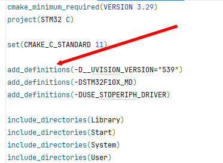

**C 预处理器**不是[编译器](../../01工具使用/编译原理/编译器.md)的组成部分，但是它是**编译过程中一个单独的步骤**。
简言之，**C 预处理器只不过是一个文本替换工具而已**，它们会指示[编译器](../../01工具使用/编译原理/编译器.md)在实际编译之前完成所需的预处理。

所有的预处理器命令都是以井号（#）开头。它必须是第一个非空字符，为了增强可读性，预处理器指令应从第一列开始。下面列出了所有重要的预处理器指令：

| 指令         | 描述                                                                               |
| ---------- | -------------------------------------------------------------------------------- |
| `#define`  | 定义宏                                                                              |
| `#include` | 包含一个源代码文件                                                                        |
| `#undef`   | 取消已定义的宏                                                                          |
| `#ifdef`   | 如果宏已经定义，则返回真                                                                     |
| `#ifndef`  | 如果宏没有定义，则返回真                                                                     |
| `#if`      | 如果给定条件为真，则编译下面代码                                                                 |
| `#else`    | `#if` 的替代方案                                                                      |
| `#elif`    | 如果前面的 `#if` 给定条件不为真，当前条件为真，则编译下面代码                                               |
| `#endif`   | 结束一个 `#if……#else` 条件编译块                                                          |
| `#error`   | 当遇到标准错误时，输出错误消息                                                                  |
| `#pragma`  | 使用标准化方法，向[编译器](../../01工具使用/编译原理/编译器.md)发布特殊的命令到[编译器](../../01工具使用/编译原理/编译器.md)中 |

## 预处理器实例

分析下面的实例来理解不同的指令。

```c
#define MAX_ARRAY_LENGTH 20
```

这个指令告诉 CPP 把所有的 MAX_ARRAY_LENGTH 定义为 20。使用 `#define` 定义常量来增强可读性。

```c
#include <stdio.h>
#include "myheader.h"
```

这些指令告诉 CPP 从**系统库**中获取 stdio.h，并添加文本到当前的源文件中。下一行告诉 CPP 从本地目录中获取 **myheader.h**，并添加内容到当前的源文件中。

```c
#undef  FILE_SIZE
#define FILE_SIZE 42
```

这个指令告诉 CPP 取消已定义的 FILE_SIZE，并定义它为 42。

```c
#ifndef MESSAGE
#define MESSAGE "You wish!"
#endif
```

这个指令告诉 CPP 只有当 MESSAGE 未定义时，才定义 MESSAGE。

## GCC命令行中添加预处理宏

1.在命令行中预定义宏
使用-D选项可以在命令行中预定义一个宏，比如：  `$ gcc -D DEBUG macro.c`
中间可以没有空格：  `$ gcc -DDEBUG macro.c`
2.在命令行中取消宏定义  
类似于-D选项，你可以使用-U选项在命令行中取消一个宏的定义，比如：`$ gcc -U DEBUG macro.c`
中间可以没有空格：  `$ gcc -UDEBUG macro.c`

### 实现Debug版本和Release版本

```c
#ifdef DEBUG
    /* Your debugging statements here */
#endif
```

这个指令告诉 CPP 如果定义了 DEBUG，则执行处理语句。

在编译时，如果您向 **GCC [编译器](../../01工具使用/编译原理/编译器.md)传递了`-DDEBUG`**，这个指令就非常有用。它定义了 DEBUG，您可以**在编译期间随时开启或关闭调试**。

### Keil里的宏定义设置


### CMake里的命令行宏定义



## 预定义宏

ANSI C 定义了许多宏。在编程中您可以使用这些宏，但是不能直接修改这些预定义的宏。

| 宏          | 描述                                |
| ---------- | --------------------------------- |
| `__DATE__` | 当前日期，一个以 "MMM DD YYYY" 格式表示的字符常量。 |
| `__TIME__` | 当前时间，一个以 "HH:MM:SS" 格式表示的字符常量。    |
| `__FILE__` | 这会包含当前文件名，一个字符串常量。                |
| `__LINE__` | 这会包含当前行号，一个十进制常量。                 |
| `__STDC__` | 当编译器以 ANSI 标准编译时，则定义为 1。          |

## 预处理器运算符

C 预处理器提供了下列的运算符来帮助您创建宏：

### 宏延续运算符（\）

一个宏通常写在一个单行上。但是如果宏太长，一个单行容纳不下，则使用宏延续运算符`\`。例如：

```c
#define  message_for(a, b)  \
    printf(#a " and " #b ": We love you!\n")
```

### 字符串常量化运算符（#）

在宏定义中，当需要把一个宏的参数转换为[字符串](字符串.md)常量时，则使用[字符串](字符串.md)常量化运算符（#）。在宏中使用的该运算符有一个特定的参数或参数列表。例如：

```c
#include <stdio.h>
#define  message_for(a, b)  \
    printf(#a " and " #b ": We love you!\n")
int main(void)
{
   message_for(Carole, Debra);
   return 0;
}
```

当上面的代码被编译和执行时，它会产生下列结果：

Carole and Debra: We love you!

### 标记粘贴运算符（##）

宏定义内的标记粘贴运算符（##）会**合并两个参数**。它允许在宏定义中两个独立的标记被合并为一个标记。例如：

```c
#include <stdio.h>
#define tokenpaster(n) printf ("token" #n " = %d", token##n)
int main(void)
{
   int token34 = 40;
   tokenpaster(34);
   return 0;
}
```

当上面的代码被编译和执行时，它会产生下列结果：

token34 = 40

这是怎么发生的，因为这个实例会从[编译器](../../01工具使用/编译原理/编译器.md)产生下列的实际输出：

printf ("token34 = %d", token34);

### defined() 运算符

预处理器 **defined** 运算符是用在常量表达式中的，用来确定一个标识符是否已经使用 `#define` 定义过。如果指定的标识符已定义，则值为真（非零）。如果指定的标识符未定义，则值为假（零）。

## 参数化的宏

可以使用参数化的宏来模拟[函数](函数.md)。例如，下面的代码是计算一个数的平方：

```c
int square(int x) {
   return x * x;
}
```

我们可以使用宏重写上面的代码，如下：

```c
#define square(x) ((x) * (x))
```

在使用带有参数的宏之前，必须使用 `#define` 指令定义。**参数列表是括在圆括号内**，且必须紧跟在宏名称的后边。**宏名称和左圆括号之间不允许有空格**。

|        | 宏函数                                                                               | [函数](函数.md) |
| ------ | --------------------------------------------------------------------------------- | ----------- |
| 执行效率   | 快                                                                                 |             |
| 空间占用   | 大                                                                                 |             |
| 参数类型   | 无关                                                                                |             |
| 操作符优先级 | `#define max(a,b) a>b ? a : b` //可能会出问题<br>`#define max(a,b) (a)>(b) ? (a) : (b)` |             |
