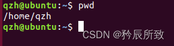

- Linux 中，Shell 是一个应用程序 ，他是用户与 Linux 内核沟通的桥梁
- 默认 Shell 是 /bin/bash
- Linux 命令的提示符
- 
- Linux 常用命令
    - 目录与文件操作命令
        - pwd
            - 显打印当前工作目录的绝对路径，不需要任何参数
            - 
        - ls
            - 显示指定目录下的内容，可带参数可不带参数
            - ==-a 显示所有的文件以及子目录，包括以“.”开头的隐藏文件。==
            - ==-l 显示文件的详细信息，比如文件的形态、权限、所有者、大小等信息。==
            - ==-R 递归列出所有文件，包括子目录中的文件。==
            - -t 将文件按照创建时间排序列出。
            - Shell命令里面的参数是==可以组合在一起用的==，比如组合“-al”就是显示所有文件的详细信息，包括以“.”开头的隐藏文件。
        - cd
            - ==短横杠(-)上一次用户所在的路径。==
            - ==点号(.)当前目录。==
            - ==双点号(..)当前目录的上一级目录。==
            - ==" / " 根目录==
            - ==" ~ " 当前用户主目录（超级用户为/root，普通用户为/home==
        - touch
            - 修改文件时间，如果文件不存在则创建空文件。
            - -a 只更改存取时间。
            - -c 不建立任何文件。
        - rm
            - 删除文件或目录。
            - 此命令可以完成删除一个文件或者多个文件及文件夹，它可以实现递归删除。对于链接文件，只删除链接，原文件保持不变。链接文件其实就类似 Windows 下的快捷方式文件。
            - ==-r 递归删除，指定文件夹(目录)下的所有文件和子文件夹全部删除掉。==
            - ==-f 强制删除文件和文件夹(目录)。==
            - rmdir: failed to remove ‘tmp’: Directory not empty
                - rm -rf 目录名
                - sudo rm -rf 目录名
        - cp
            - 复制文件或目录。
            - cp \[参数\] \[源地址\] \[目的地址\]
            - ==-r或-R 递归处理，将指定目录下的文件及子目录一并处理==
            - ==-f 强行复制文件，不管要复制的文件是否已经存在于目标目录。==
            - ==-I 覆盖现有文件之前询问用户。==
        - mv
            - 文件移动命令。
            - mv \[参数\] \[源地址\] \[目的地址\]
            - -b 如果要覆盖文件的话覆盖前先进行备份。
            - -f 若目标文件或目录与现在的文件重复，直接覆盖目的文件或目录。
            - -I 在覆盖之前询问用户。
        - cat
            - 串联文件的内容并打印出来。
            - 一般使用就把他当成==文本查看器==就行了。
        - find
            - 用于在目录结构中查找文件。
            - find \[路径\] \[参数\] \[查找条件\]
            - ==-name “filename” 按照文件名称查找，查找与 filename匹配的文件，可使用通配符。==
            - ==如果没有指定查找目录，则为当前目录。==
        - mkdir
        - rmdir
        - grep
    - 压缩与解压缩
        - zip
            - 用于将一个或者多个文件压缩成一个.zip 结尾的文件
            - zip \[参数\] \[压缩文件名.zip\] \[被压缩的文件\]
            - -r 递归压缩，将指定目录下的所有文件和子目录一起压缩。
        - unzip
            - 用于对 .zip压缩文件进行解压。
            - unzip \[参数\] \[压缩文件名.zip\]
        - tar
            - 将压缩和解压缩集合在一起。
            - Linux下最常用的.bz2和.gz这两种压缩格式
            - tar \[参数\] \[压缩文件名\] \[被压缩文件名\]
            - 
            - 解压：
            - 
    - 网络命令
        - ifconfig
            - 查看网络、设置IP。
            - -a ：显示所有网卡接口
            - up：激活网卡接口
            - down：关闭网卡接口
        - ping
    - 其他一些命令
        - echo
            - 用于字符串的输出，在终端上打印一段文字，也可以把终端的变量内容打印出来。
        - clear
            - 清除屏幕。
        - reboot
            - 重启系统。
        - poweroff
            - 切断电源，关机。
        - uname
            - 显示操作系统类型
            - 
        - source
            - 用于重新执行刚修改的初始化文件，使之立即生效，而不必注销并重新登录
            - source filename# filename必须是可执行的脚本文件
            - . filename# 注意“.”号后面还有一个空格
            - 比较sh filename、./filename、source filename执行文件
                - （1）当shell脚本具有可执行权限时，用sh filename与./filename是没有区别的。./filename是因为当前目录没有在PATH中，所以"."是用来表示当前目录的。
                - （2）sh filename会重新建立一个子shell，在子shell中执行脚本里面的语句，该子shell继承父shell的环境变量，但子shell是新建的，其改变的变量不会被带回父shell，除非使用export。
                - （3）source filename读取脚本里面的语句依次在当前shell里面执行，没有建立新的子shell。那么脚本里面所有新建、改变变量的语句都会保存在当前shell里面。
- 自动补全功能
    - 自动补全功能就是，只需要输入命令的前面一部分字母，然后按下 Tab 键，如果只有一个命令匹配的话就会自动补全这个命令剩下的字母。
    - 如果按一下 Tab 键没有反应，说明有多个命令匹配，需要再按一下 Tab 键，系统会把所有匹配的命令列举出来。
- 重复输入功能
    - 
    - 有一种方式，可以重复上一次的指令，但是也只能重复上一次的指令，就是用==两个感叹号命令 “!!”==
    - 
