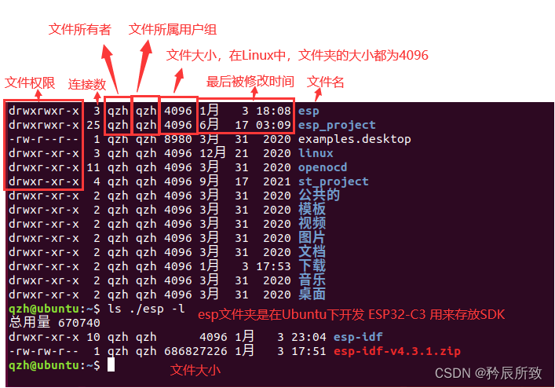
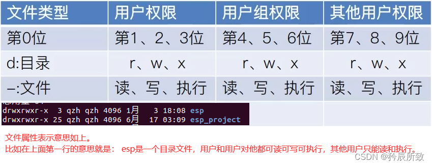
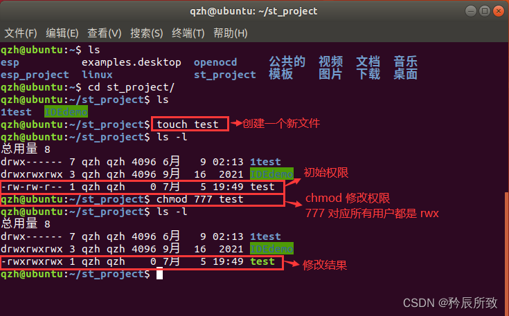

- Linux 文件属性
    - 使用==ls -l==（查看该目录下所有文件的详细信息）命令
    - 
    - 文件权限
        - 文件类型后面的9个字符以3个为一组，第一组表示“文件所有者的权限”，第二组表示“用户组的权限”，第三组表示“其他非本用户组的权限”。
        - 每组都是 rwx 的组合，其中 r 代表可读，w 代表可写，x 代表可执行，- 代表没有这个权限。
        - 
        - 使用命令“==chmod”修改一个文件的权限==
            - chmod 777 xxxx（文件名字），意思就是把这个文件的权限全面开放（系统本身的文件，千万不要瞎修改
            - 
            - 遇到==权限不够==的问题，我们一般都会在命令前加上一个 ==sudo==
- Linux 文件类型 #Obsidian 表格嵌套进大纲
    - 
    | 字母 | 类型         | 说明                                                                                                   |
    |------|--------------|--------------------------------------------------------------------------------------------------------|
    | \-   | 普通文件     | 普通文件包括 文档图片音乐等；纯文本文件(ASCII)、二进制文件(binary)、数据格式的文件(data)、各种压缩文件 |
    | d    | 目录文件     | 目录，可用 cd 命令进入                                                                                 |
    | c    | 字符设备文件 | linux 驱动里面的字符设备驱动，比如 串行设备，音频设备，键盘、鼠标等等                                  |
    | b    | 块设备文件   | 存储设备驱动，比如硬盘，U盘等                                                                          |
    | p    | 管道文件     | FIFO也是一种特殊的文件类型，它主要目的是解决多个程序同时存取一个文件所造成的错误                       |
    | l    | 链接文件     | 类似Windows下面的快捷方式                                                                              |
    | s    | 套接字文件   | 这类文件通常用在网络数据连接。可以启动一个程序来监听客户端的要求，客户端就可以通过套接字来进行数据通信 |

- Linux 用户系统
