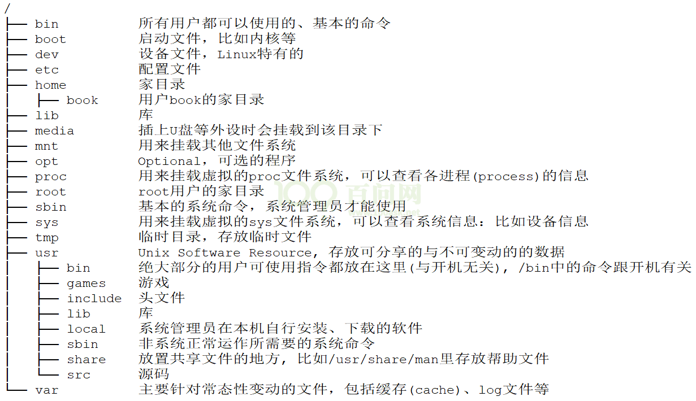
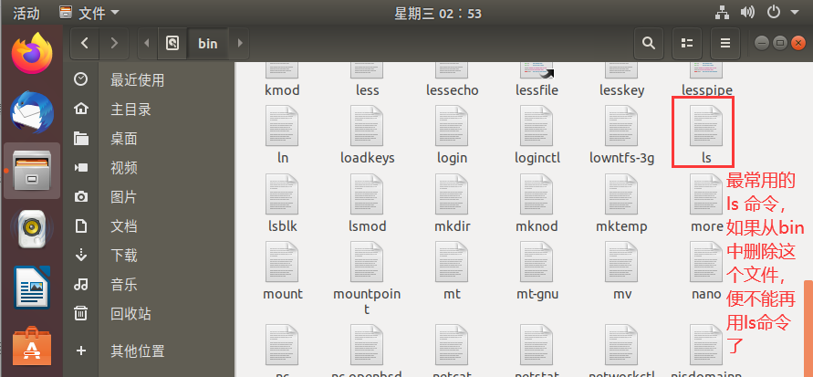

- FHS\_3.0：Filesystem Hierarchy Standard
    - 可以在下面这个网址中下载 PDF 文档：https://refspecs.linuxfoundation.org/FHS\_3.0
    - 
- /bin
    - bin 是 Binaries (二进制文件) 的缩写, 这个目录存放着最==经常使用的命令==。任何人都可以使用的命令。
    - 
- /boot
    - 启动相关的文件，包括一些连接文件以及镜像文件。在有些发行版中还包括grub，grub是一种通用的启动引导程序（linux 里面的 uboot）。
- /dev
    - dev 是 Device(设备) 的缩写, 该目录下存放的是 Linux 的外部设备，在 Linux 中访问设备的方式和访问文件的方式是相同的。
    - 在以后学习 Linux 应用编程的时候，对外设的操作，就是通过dev 中的这些文件操作来进行的。（Linux下一切皆文件
- /etc
    - etc 是 Etcetera(等等) 的缩写,这个目录用来存放所有的系统管理所需要的配置文件和子目录。
    - 系统和应用程序的配置文件。
- /home
    - 用户的主目录，在 Linux 中，每个用户都有一个自己的目录，一般该目录名是以用户的账号命名的。
- /lib 、/lib32、/lib64
    - lib 是 Library(库) 的缩写这个目录里存放着系统最基本的动态连接共享库，其作用类似于 Windows 里的 DLL 文件。几乎所有的应用程序都需要用到这些共享库。
    - /lib32 和 /lib64 属于备用格式基本共享库（可选），提供对32位和 64 位不同程序的库。
- /media
    - 自动挂载一些多媒体设备，linux 系统会自动识别一些设备，例如U盘、光驱等等，当识别后，Linux 会把识别的设备挂载到这个目录下。
- /mnt
    - 手动系统提供该目录是为了让用户临时挂载别的文件系统的，我们可以将光驱挂载在 /mnt/ 上，然后进入该目录就可以查看光驱里的内容了。（ShareFolders）
- /opt
    - opt 是 optional (可选) 的缩写，可以做软件测试 或者 安装额外软件的目录。
- /proc
    - proc 是 Processes(进程) 的缩写，存放的都是程序相关的信息。
    - /proc 是一种伪文件系统（也即虚拟文件系统），存储的是当前内核运行状态的一系列特殊文件，这个目录是一个虚拟的目录，它是系统内存的映射，我们可以通过直接访问这个目录来获取系统信息。
- /root
    - 系统管理员主目录，也称作超级权限者的用户主目录。
- /srv
    - 该目录存放一些网络服务相关的信息，一些网路服务启动之后，这些服务所需要取用的资料目录。
- /sys
    - 存放了一些硬件操作的接口，这个目录使得我们可以使用控制终端控制外设变得简单。
- /usr（unix software resource）
    - 存放了我们整个系统大部分的软件，是我们整个文件系统中最大的一个目录。
    - usr 是 unix shared resources(共享资源) 的缩写，这是一个非常重要的目录，用户的很多应用程序和文件都放在这个目录下，类似于 windows 下的 program files 目录。
- /var
    - var 是 variable(变量) 的缩写，这个目录中存放这一些易变的文件，一些不断扩充着的东西，我们习惯将那些经常被修改的目录放在这个目录下。包括各种日志文件。
