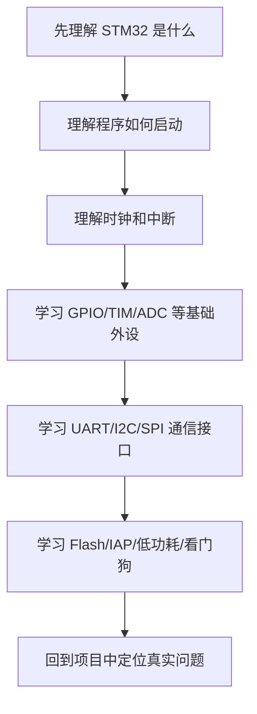

# STM32 应该怎么学

## 简明解释

学习 STM32 不应该从“今天点灯、明天串口、后天 ADC”开始乱冲。外设很多，但底层结构是重复的：先开时钟，再配置寄存器或库参数，再让外设通过引脚、中断、DMA 或总线和系统协作。

真正要学的是一套模型：

> STM32 = Cortex-M 内核 + 总线 + 存储器 + 外设 + 时钟 + 中断 + 引脚复用。

只要这套模型稳了，换芯片、换库、换外设时都不容易迷路。

## 它在 STM32 系统中的位置

STM32 学习可以分成四层：

| 层级 | 你要理解什么 | 典型主题 |
|---|---|---|
| 系统层 | 程序为什么能跑起来 | 启动流程、向量表、内存映射 |
| 支撑层 | 外设为什么能工作 | RCC、NVIC、SysTick、总线 |
| 外设层 | 某个硬件模块怎么完成任务 | GPIO、TIM、ADC、UART、I2C、SPI |
| 工程层 | 怎么让系统长期可靠运行 | DMA、Flash、IAP、低功耗、看门狗 |

## 关键概念

| 概念 | 直白理解 |
|---|---|
| 内核 | 真正执行指令的 CPU 部分 |
| 外设 | 芯片里专门完成某类任务的硬件模块 |
| 寄存器 | CPU 控制外设的配置开关和状态窗口 |
| 时钟 | 硬件运行的节拍，没有时钟大多数外设不会动 |
| 中断 | 外设主动通知 CPU：“我这里有事” |
| DMA | 外设和内存之间搬数据，不必每个字节都让 CPU 搬 |

## 工作过程

## 常见误区

| 误区 | 更好的理解 |
|---|---|
| 背 HAL 函数就是学 STM32 | HAL 只是封装，核心是硬件模块的工作模型 |
| 先学寄存器才算底层 | 寄存器有价值，但初学更重要的是系统结构 |
| 每个外设都完全不同 | 很多外设都遵循“时钟、配置、数据、中断/DMA”的套路 |
| F1、F4、H7 必须分开学 | 基础模型相通，差异主要在资源规模、总线、时钟树和外设增强 |

## 复习问题

1. 为什么大多数外设配置前要先打开 RCC 时钟？
2. 中断和轮询的本质区别是什么？
3. 如果换一颗 STM32 芯片，哪些知识可以复用，哪些必须查手册？

