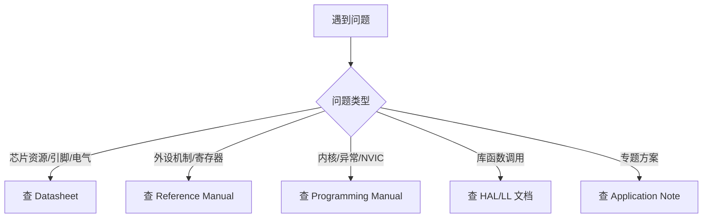

# 如何看手册

## 简明解释

STM32 的资料不是一本书解决所有问题，而是几类手册分工协作。看错手册，就会出现“我想知道寄存器位含义，却在数据手册里翻半天”的感觉。

## 它在 STM32 系统中的位置

| 资料 | 主要回答的问题 | 什么时候看 |
|---|---|---|
| 数据手册 Datasheet | 这颗芯片有什么资源、引脚、电气参数 | 选型、查引脚、查 Flash/RAM 容量 |
| 参考手册 Reference Manual | 每个外设怎么工作、寄存器怎么配置 | 学外设原理、排查寄存器配置 |
| 编程手册 Programming Manual | Cortex-M 内核、NVIC、SysTick、指令相关 | 学内核、中断、异常、系统控制 |
| 应用笔记 Application Note | 某类场景的官方解释和实践建议 | 做低功耗、IAP、USB、Flash 擦写等专题 |
| HAL/LL 文档 | 库函数怎么用 | 查 API 参数和调用顺序 |

## 关键概念

| 要查什么 | 优先资料 |
|---|---|
| 某个引脚能不能用作 USART_TX | 数据手册的引脚复用表 |
| 定时器有哪些模式 | 参考手册 TIM 章节 |
| 中断优先级怎么分组 | 编程手册 + 参考手册 NVIC 相关部分 |
| Flash 擦除一次最小单位 | 参考手册 Flash 章节 |
| 某个 HAL 函数参数含义 | HAL 文档或头文件注释 |

## 工作过程

## 常见误区

| 误区 | 说明 |
|---|---|
| 数据手册里有所有外设细节 | 数据手册偏选型和电气参数，外设细节在参考手册 |
| HAL 文档能替代参考手册 | HAL 只说明怎么调函数，不一定解释硬件为什么这样工作 |
| 网上教程比手册可靠 | 教程适合理解入口，最终边界条件要回到官方手册确认 |

## 复习问题

1. 查某个引脚的复用功能时，应该先看哪类资料？
2. 查 ADC 采样时间和转换模式时，应该看哪类资料？
3. 为什么库函数用不明白时，最好回到外设框图和寄存器说明？

