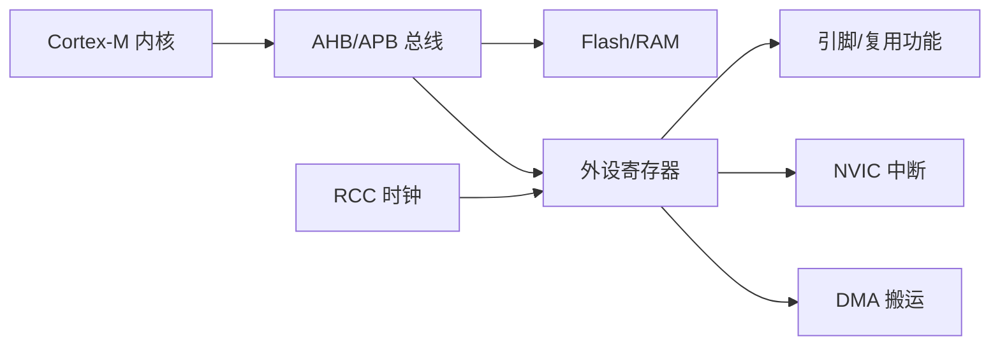
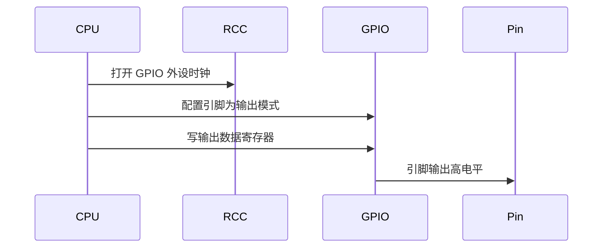

# 常见概念总览

## 简明解释

STM32 入门最大的困难不是某个外设特别难，而是概念同时出现得太多：内核、总线、寄存器、时钟、中断、GPIO、DMA。先把这些词放到同一张地图里，后面学任何外设都会轻松很多。

## 它在 STM32 系统中的位置

## 关键概念

| 概念       | 一句话理解                | 典型例子                |
| -------- | -------------------- | ------------------- |
| MCU      | 把 CPU、存储器、外设集成到一颗芯片里 | STM32F103、STM32F407 |
| Cortex-M | ARM 提供的内核架构          | M0、M3、M4、M7         |
| Flash    | 掉电不丢，放程序和常量          | 固件代码                |
| RAM      | 掉电丢，放运行时变量           | 全局变量、栈、堆            |
| 总线       | CPU 访问存储器和外设的通道      | AHB、APB             |
| 寄存器      | 控制硬件的特殊内存地址          | GPIOx_MODER、RCC_CR  |
| RCC      | 管理时钟和复位              | 开 GPIO 时钟           |
| NVIC     | 管理中断优先级和响应           | USART 中断、EXTI 中断    |
| DMA      | 自动搬数据                | ADC 多通道采样到数组        |

## 工作过程

以“让一个引脚输出高电平”为例：

## 常见误区

| 误区 | 更准确的理解 |
|---|---|
| 外设就是软件模块 | 外设是芯片里的硬件，软件只是配置和驱动它 |
| 寄存器是普通变量 | 寄存器地址背后连接硬件电路，读写有副作用 |
| 时钟只影响 CPU 速度 | 时钟也决定外设是否运行、运行多快 |
| 中断越多越高级 | 中断要短、快、可控，否则会让系统更难预测 |

## 复习问题

1. 为什么说“配置外设”本质上是在“读写寄存器”？
2. RCC、NVIC、DMA 分别解决什么问题？
3. Flash 和 RAM 在程序运行中分别承担什么角色？

