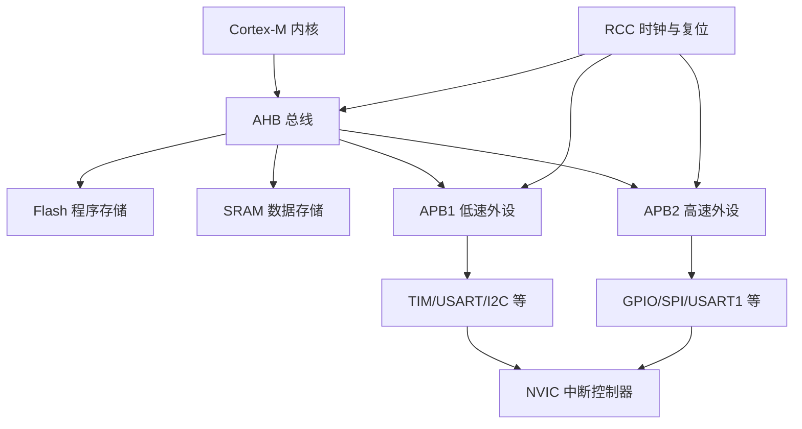
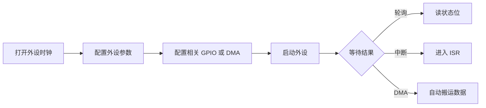

# STM32 整体模型

## 简明解释

可以把 STM32 想成一个小型城市：

- Cortex-M 内核是“办事的人”。
- Flash/RAM 是“资料室和工作台”。
- AHB/APB 总线是“道路”。
- GPIO、USART、TIM、ADC 等外设是“专用部门”。
- RCC 是“供电和节拍管理”。
- NVIC 是“紧急事件调度中心”。

学 STM32 的重点，就是理解这些部分如何配合。

## 它在 STM32 系统中的位置

## 关键概念

| 部分 | 作用 | 学习时要问的问题 |
|---|---|---|
| 内核 | 执行指令、响应异常 | 它怎么取指令、怎么处理中断？ |
| 存储器 | 保存程序和数据 | 代码、常量、变量分别放哪里？ |
| 总线 | 连接内核、存储器、外设 | 外设挂在哪条总线上？ |
| 外设 | 完成专门硬件任务 | 它需要什么时钟、引脚、中断或 DMA？ |
| 时钟 | 提供运行节拍 | 它的源头和分频路径是什么？ |
| 中断 | 外设通知内核 | 优先级怎么定，什么时候触发？ |

## 工作过程

任何外设使用大多遵循这个顺序：

## 常见误区

| 误区 | 更好的理解 |
|---|---|
| 外设能独立工作，不需要 CPU | 外设可以自动做一部分事，但启动、配置、异常处理仍由软件负责 |
| 开了 GPIO 就等于引脚功能正确 | 还要考虑模式、上下拉、复用、速度、电气连接 |
| 中断属于某个外设内部 | 外设产生请求，NVIC 负责统一管理 CPU 响应 |

## 复习问题

1. 一个 USART 外设要正常工作，至少依赖哪些系统资源？
2. 为什么定时器、串口、ADC 都绕不开 RCC？
3. 外设挂在 APB1 或 APB2 上，对学习和排查有什么意义？

