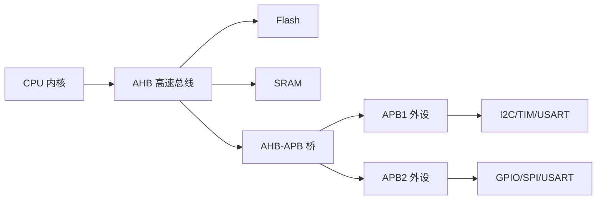
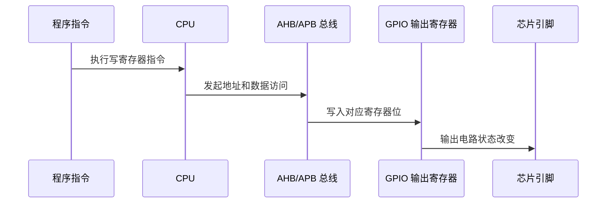

# 内核总线外设

## 简明解释

CPU 不会直接“伸手”控制引脚、串口或 ADC。它通过总线访问某些固定地址，这些地址背后接着外设寄存器。写这些寄存器，就等于给硬件发命令。

## 它在 STM32 系统中的位置

## 关键概念

| 概念 | 解释 |
|---|---|
| AHB | 较高速的系统总线，常连接内核、Flash、SRAM、DMA 等 |
| APB | 面向外设的总线，常分 APB1 和 APB2 |
| 总线桥 | 连接不同总线域的桥梁 |
| 外设基地址 | 某个外设寄存器组在地址空间中的起点 |
| 存储器映射外设 | 外设寄存器像内存一样被编址，CPU 用读写地址的方式控制外设 |

## 工作过程

当程序写 `GPIOx->ODR` 时，本质过程是：

## 常见误区

| 误区                  | 更好的理解                      |
| ------------------- | -------------------------- |
| 外设地址只是软件定义          | 地址来自芯片硬件设计，头文件只是把地址命名出来    |
| APB1 一定慢、APB2 一定快很多 | 它们是不同外设域，具体频率取决于时钟树配置      |
| 所有 STM32 外设挂载都一样    | 系列不同，总线结构和外设挂载可能不同，具体查参考手册 |

## 复习问题

1. 为什么 CPU 可以像访问内存一样访问 GPIO 寄存器？
2. APB1/APB2 对外设时钟配置有什么影响？
3. 总线、寄存器、外设三者之间是什么关系？

