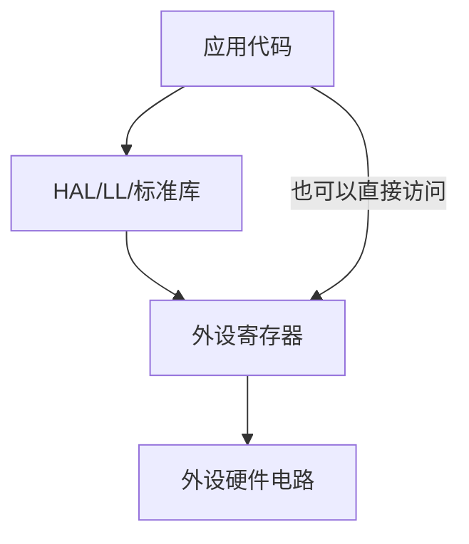

# 寄存器与外设配置

## 简明解释

寄存器是 CPU 和硬件外设之间的“控制面板”。你写一个位，可能是在打开外设；读一个位，可能是在查看外设是否完成任务。

HAL、LL、标准库和寄存器裸写，本质上都绕不开寄存器，只是抽象层级不同。

## 它在 STM32 系统中的位置

## 关键概念

| 概念 | 解释 |
|---|---|
| 控制寄存器 | 配置外设模式、开关、功能 |
| 状态寄存器 | 反映外设当前状态或事件标志 |
| 数据寄存器 | 存放要发送、接收或转换的数据 |
| 标志位 | 某个事件是否发生，如接收完成、转换完成 |
| 清标志 | 有些标志位需要按手册规定方式清除，不是随便写 0 |

## 工作过程

一个外设常见寄存器使用节奏：

## 常见误区

| 误区          | 更好的理解                      |
| ----------- | -------------------------- |
| 寄存器就是变量     | 它背后连接硬件，读写可能触发动作           |
| 状态位清除都写 0   | 不同外设规则不同，有些写 1 清除，有些读写组合清除 |
| HAL 能隐藏所有细节 | 一旦遇到异常，还是要懂底层状态位和配置路径      |
| 只要配置一次就永远正确 | 时钟、复位、低功耗、错误状态都可能改变外设状态    |

## 复习问题

1. 控制寄存器、状态寄存器、数据寄存器分别承担什么角色？
2. 为什么有些中断一直进，可能是标志位没有正确清除？
3. HAL 调不通时，为什么应该看外设寄存器状态？

