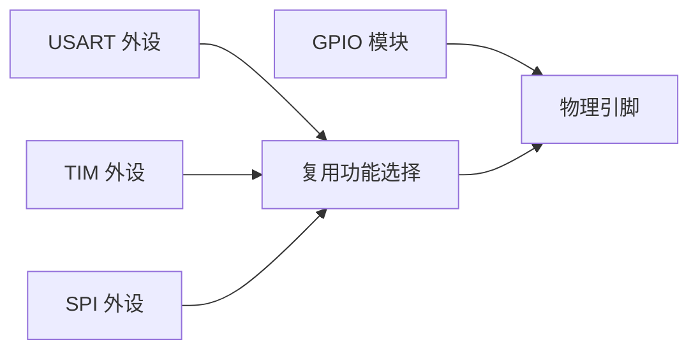
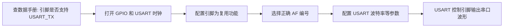

# 引脚复用

## 简明解释

STM32 的一个物理引脚通常不只会做 GPIO。它可能同时支持 USART_TX、SPI_SCK、TIM_CH1、ADC_IN 等功能。所谓引脚复用，就是把这个引脚交给某个片上外设控制。

## 它在 STM32 系统中的位置

## 关键概念

| 概念 | 解释 |
|---|---|
| 普通 GPIO | 软件直接控制输入输出 |
| 复用功能 AF | 引脚由某个外设接管 |
| 模拟功能 | 引脚连接 ADC/DAC 等模拟通道，数字输入输出通常关闭 |
| 上下拉 | 给输入引脚提供默认电平 |
| 输出类型 | 推挽或开漏 |
| 输出速度 | 引脚翻转边沿速度，不等于软件循环速度 |

## 工作过程

以 USART_TX 为例：

## 常见误区

| 误区 | 更好的理解 |
|---|---|
| 引脚写了高低电平就能发串口 | 串口发送时引脚应交给 USART 外设，不是普通 GPIO 输出 |
| 一个引脚可以同时开多个复用功能 | 同一时刻通常只能选择一个实际功能 |
| 所有系列 AF 配置方法相同 | F1 常见 AFIO/重映射概念，F4 等常见 AF 编号选择 |
| ADC 引脚也要配置成普通输入 | ADC 通常配置为模拟模式，避免数字电路干扰 |

## 复习问题

1. 普通 GPIO 输出和复用推挽输出有什么区别？
2. 为什么同一个 USART 功能可能出现在多个引脚上？
3. 使用 ADC 时，为什么引脚要进入模拟模式？

