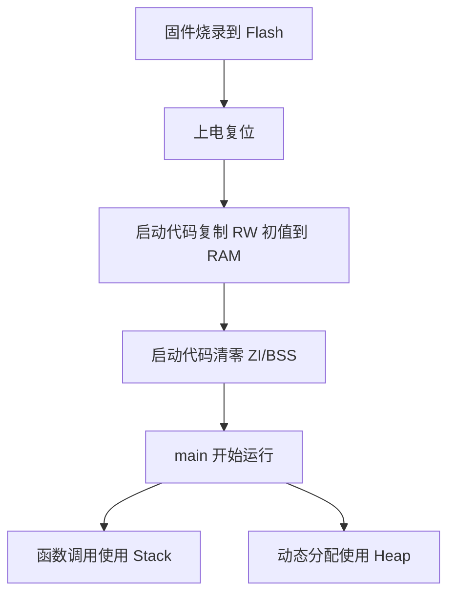

# Flash RAM Stack Heap

## 简明解释

Flash 像“硬盘”，掉电后程序还在；RAM 像“工作台”，程序运行时使用，掉电就丢。Stack 和 Heap 都在 RAM 里，只是分配方式不同。

## 它在 STM32 系统中的位置

```text
Flash:
  Code      程序指令
  RO Data   只读常量
  RW 初值    已初始化变量的初始值

RAM:
  RW Data   已初始化全局/静态变量
  ZI/BSS    未初始化或 0 初始化全局/静态变量
  Heap      动态分配区
  Stack     函数调用和中断压栈
```

## 关键概念

| 概念 | 放在哪里 | 说明 |
|---|---|---|
| Code | Flash | CPU 执行的指令 |
| RO Data | Flash | `const` 常量、字符串常量等 |
| RW Data | Flash + RAM | Flash 存初值，启动时复制到 RAM |
| ZI/BSS | RAM | 启动时清零 |
| Stack | RAM | 局部变量、函数调用现场、中断现场 |
| Heap | RAM | `malloc`/`free` 等动态分配 |

## 工作过程



## 常见误区

| 误区 | 更好的理解 |
|---|---|
| `const` 一定不占 RAM | 正确使用通常放 Flash，但要看工具链和写法 |
| 局部数组越大越好 | 大局部数组容易导致栈溢出 |
| Heap 和 Stack 会自动共享所有剩余 RAM | 很多裸机工程中堆栈大小由启动文件或链接脚本预留 |
| RAM 够大就不会崩 | 栈溢出、DMA 不可访问区域、越界写都会导致异常 |

## 复习问题

1. 为什么已初始化全局变量会同时消耗 Flash 和 RAM？
2. 大数组应该优先放栈、全局区还是堆？为什么？
3. 如何从 MAP 文件判断 RAM 是否紧张？

