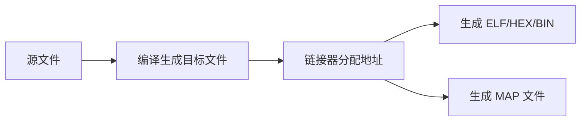
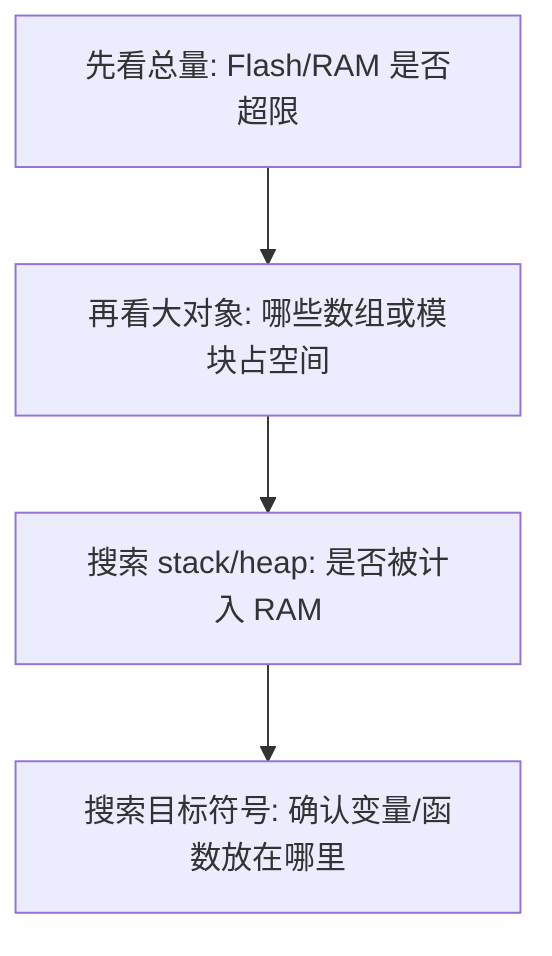

# MAP 文件

## 简明解释

MAP 文件是链接器生成的“空间账本”。它告诉你代码、常量、全局变量、堆栈等最终放到了哪里，占了多少空间。

## 它在 STM32 系统中的位置

当工程编译链接后：

## 关键概念

| 项目        | 含义                                 |
| --------- | ---------------------------------- |
| Code      | 程序指令大小                             |
| RO Data   | 只读数据大小                             |
| RW Data   | 已初始化可读写数据大小                        |
| ZI Data   | 零初始化数据大小                           |
| Total RO  | Code + RO Data                     |
| Total RW  | RW Data + ZI Data，是否含堆栈取决于工具链和链接脚本 |
| Total ROM | Code + RO Data + RW Data 初始值       |

## 工作过程

看 MAP 文件建议按这个顺序：

## 常见误区

| 误区              | 更好的理解                       |
| --------------- | --------------------------- |
| 只看编译器最后的百分比     | 要进一步看哪个对象占空间                |
| Total RW 一定不含堆栈 | 不同工具链统计方式不同，要搜索段名确认         |
| Flash 占用低就安全    | RAM 更容易成为 STM32 裸机工程的瓶颈     |
| MAP 文件只在超空间时有用  | 排查变量位置、常量是否进 Flash、栈堆预留都很有用 |

## 复习问题

1. `RW Data` 为什么会影响 Flash 和 RAM？
2. 怎么判断一个大数组是否占用了 RAM？
3. 为什么看 RAM 占用时不能盲目重复加 Stack/Heap？

