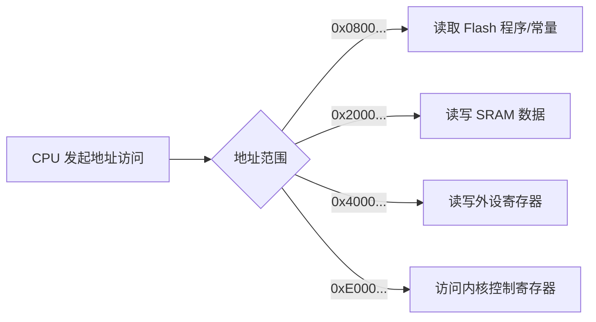

# 内存映射

## 简明解释

STM32 把 Flash、RAM、外设寄存器都放进同一个地址空间。CPU 访问某个地址时，可能是在读程序，也可能是在访问 RAM，也可能是在控制外设。

## 它在 STM32 系统中的位置

```text
0x0000_0000  启动别名区
0x0800_0000  内部 Flash，通常存放程序
0x2000_0000  SRAM，运行时数据
0x4000_0000  外设寄存器区域
0xE000_0000  Cortex-M 内核外设，如 NVIC、SysTick
```

具体地址范围随系列不同而变化，以上是理解模型，不替代芯片手册。

## 关键概念

| 概念     | 解释                                  |
| ------ | ----------------------------------- |
| 地址空间   | CPU 能访问的地址范围                        |
| 存储器映射  | 不同硬件资源被分配到不同地址段                     |
| 外设寄存器区 | GPIO、USART、TIM 等寄存器所在区域             |
| 内核外设区  | NVIC、SysTick、SCB 等 Cortex-M 内核相关寄存器 |
| 别名区    | 某些启动模式下，低地址可映射到 Flash、系统存储器或 SRAM   |

## 工作过程



## 常见误区

| 误区               | 更好的理解                  |
| ---------------- | ---------------------- |
| 内存映射只和 RAM 有关    | 它描述整个地址空间，包括 Flash 和外设 |
| 外设寄存器是编译器造出来的    | 外设寄存器地址由芯片硬件定义         |
| 所有 STM32 地址都完全一样 | 大框架相似，具体容量和外设基地址要查手册   |

## 复习问题

1. 为什么写某个 `0x4000...` 地址可能会改变外设状态？
2. Flash 和 SRAM 在地址空间中有什么本质区别？
3. IAP 为什么常常要重新设置向量表偏移？

