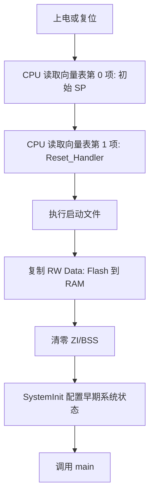

# 启动流程

## 简明解释

STM32 上电后不是直接跳到 `main()`。它先从固定位置取出初始栈指针和复位处理函数地址，然后执行启动代码，完成数据初始化，最后才进入 C 程序的 `main()`。

## 它在 STM32 系统中的位置

启动流程连接了三个世界：

| 世界 | 内容 |
|---|---|
| 硬件复位 | CPU 从向量表取初始 SP 和 Reset_Handler |
| 启动文件 | 设置栈、复制数据、清零 BSS、调用系统初始化 |
| C 程序 | 进入 `main()`，开始应用逻辑 |

## 关键概念

| 概念 | 解释 |
|---|---|
| 向量表 | 存放初始 SP、复位入口和各中断入口地址 |
| Reset_Handler | 复位后执行的第一段软件入口 |
| SystemInit | 常用于设置系统时钟等早期硬件状态 |
| RW Data | 已初始化的全局/静态变量，需要从 Flash 复制到 RAM |
| ZI/BSS | 未初始化或初始化为 0 的全局/静态变量，启动时清零 |

## 工作过程

## 常见误区

| 误区                 | 更好的理解                         |
| ------------------ | ----------------------------- |
| 程序从 `main()` 开始    | C 代码从 `main()` 开始，芯片运行不是从这里开始 |
| 全局变量天生就在 RAM 里初始化好 | 初始化动作由启动代码完成                  |
| 向量表只和中断有关          | 它还决定复位入口和初始栈指针                |
| 启动文件不用理解           | 出现栈、堆、向量表、IAP 跳转问题时必须理解       |

## 复习问题

1. 向量表前两个表项分别是什么？
2. 为什么已初始化全局变量既占 Flash 又占 RAM？
3. IAP 跳转应用程序时，为什么要关心向量表和 MSP？

