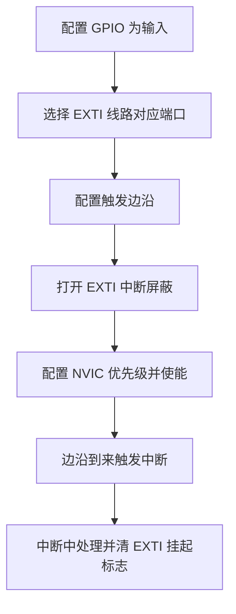

# EXTI

## 简明解释

EXTI 是外部中断/事件控制器。它把引脚上的边沿变化变成中断请求，让 CPU 能在按键、传感器电平变化等事件发生时立即响应。

## 它在 STM32 系统中的位置

## 关键概念

| 概念 | 解释 |
|---|---|
| EXTI Line | 外部中断线路，常与引脚编号对应 |
| 上升沿 | 电平从低变高 |
| 下降沿 | 电平从高变低 |
| 双边沿 | 上升沿和下降沿都触发 |
| 挂起标志 | EXTI 记录某条线是否触发 |
| 引脚映射 | 选择 PA0/PB0/PC0 等哪个端口连接到 EXTI0 |

## 工作过程

## 常见误区

| 误区                    | 更好的理解                 |
| --------------------- | --------------------- |
| PA0 和 PB0 可以同时接 EXTI0 | 同编号线路通常需要选择一个端口映射     |
| 按键中断不需要消抖             | 机械按键会抖动，可能短时间触发多次     |
| EXTI 只用于按键            | 也可用于传感器告警、模块中断脚、唤醒信号等 |
| 只清 NVIC 不清 EXTI       | EXTI 挂起标志不清可能导致反复进入中断 |

## 复习问题

1. EXTI 和 NVIC 分别负责哪一段工作？
2. 为什么按键外部中断经常需要消抖？
3. PA0、PB0、PC0 与 EXTI0 的关系是什么？

