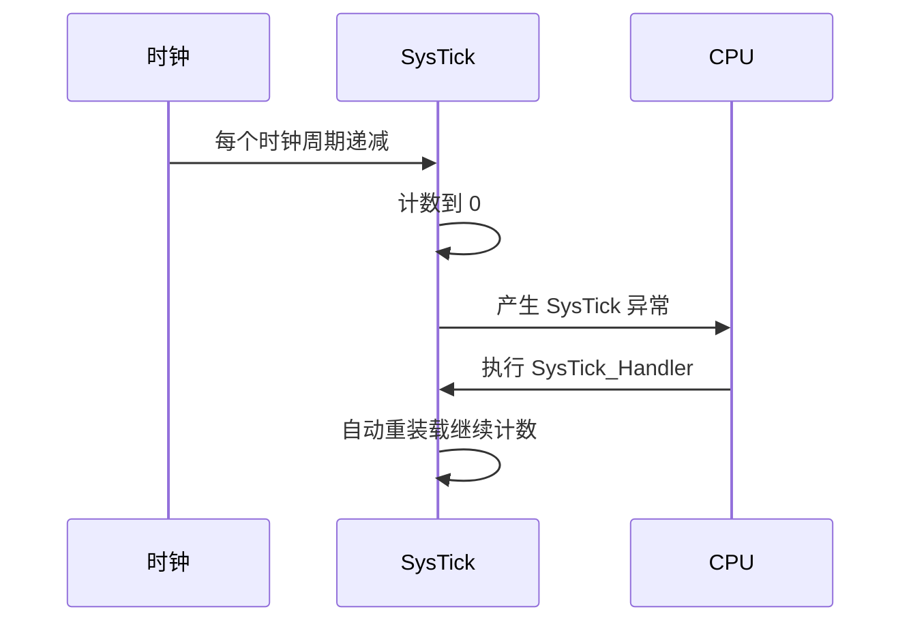

# SysTick

## 简明解释

SysTick 是 Cortex-M 内核自带的 24 位定时器，常用来产生固定周期的系统节拍，比如 1ms 一次，用于延时函数或 RTOS 调度。

## 它在 STM32 系统中的位置

SysTick 属于内核外设，不是某个 STM32 厂商外设。它通常使用内核时钟或内核时钟分频作为计数时钟。

## 关键概念

| 概念   | 解释                         |
| ---- | -------------------------- |
| LOAD | 重装载值，决定计数周期                |
| VAL  | 当前计数值                      |
| CTRL | 控制使能、时钟源、中断开关等             |
| 24 位 | 最大计数值有限，超长周期不适合直接用 SysTick |
| 系统节拍 | 固定频率的周期性中断                 |

## 工作过程

## 常见误区

| 误区                 | 更好的理解                      |
| ------------------ | -------------------------- |
| SysTick 就是系统时钟     | SysTick 是定时器，系统时钟是它的时钟来源之一 |
| `HAL_Delay` 永远可靠   | 如果 SysTick 中断被长时间屏蔽，延时会失准  |
| SysTick 可以随便做重任务   | SysTick 中断应短小，否则影响系统实时性    |
| 低功耗时 SysTick 一定继续走 | 取决于低功耗模式和时钟源是否保持           |

## 复习问题

1. SysTick 和 SYSCLK 的本质区别是什么？
2. 为什么 RTOS 常使用 SysTick 做调度节拍？
3. 为什么不建议在 SysTick 中断里做复杂业务？

