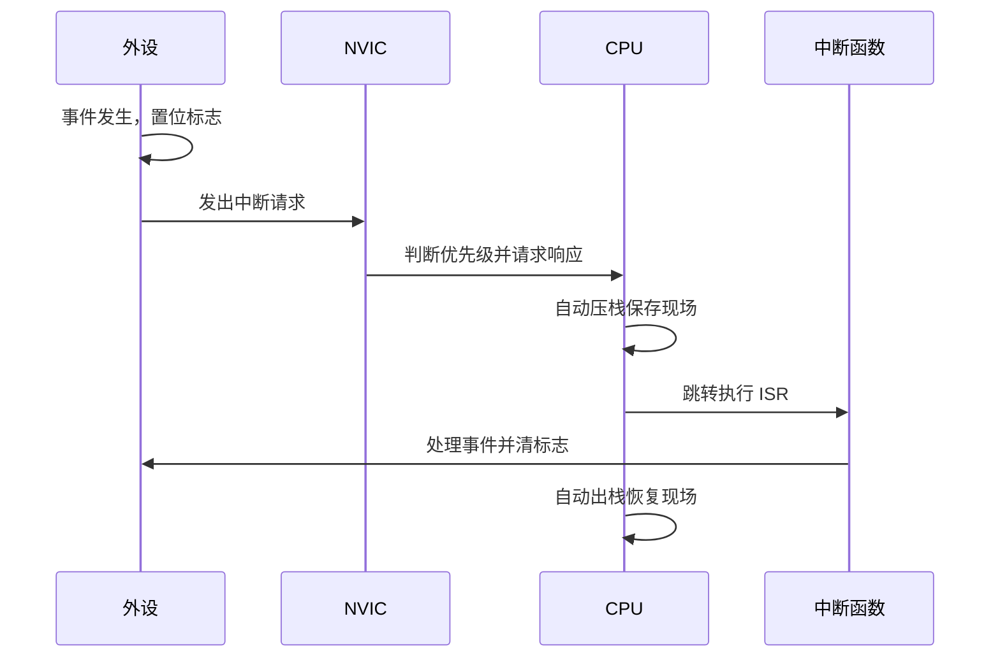

# 中断系统

## 简明解释

中断就是硬件事件打断 CPU 当前流程，让 CPU 先处理更紧急的事情。STM32 中，外设产生中断请求，NVIC 决定 CPU 是否响应、什么时候响应、哪个优先。

## 它在 STM32 系统中的位置

## 关键概念

| 概念    | 解释                |
| ----- | ----------------- |
| IRQ   | 外设中断请求线           |
| ISR   | 中断服务函数            |
| NVIC  | Cortex-M 内核的中断控制器 |
| 抢占优先级 | 决定能否打断正在执行的中断     |
| 响应优先级 | 同时挂起时决定谁先执行       |
| 中断标志位 | 外设内部记录事件是否发生      |

## 工作过程

## 常见误区

| 误区                | 更好的理解                 |
| ----------------- | --------------------- |
| 开了 NVIC 就一定会进中断   | 外设内部中断使能、标志位、全局状态也要正确 |
| 中断里可以做任何事         | 中断应短，复杂任务交给主循环或任务处理   |
| 优先级数字越大越优先        | Cortex-M 中通常数字越小优先级越高 |
| 清 NVIC 挂起就等于清外设事件 | 关键通常是清外设标志位           |

## 复习问题

1. 一个中断真正触发通常需要哪些开关同时满足？
2. 抢占优先级和响应优先级有什么区别？
3. 为什么中断服务函数里必须正确清除外设标志？

