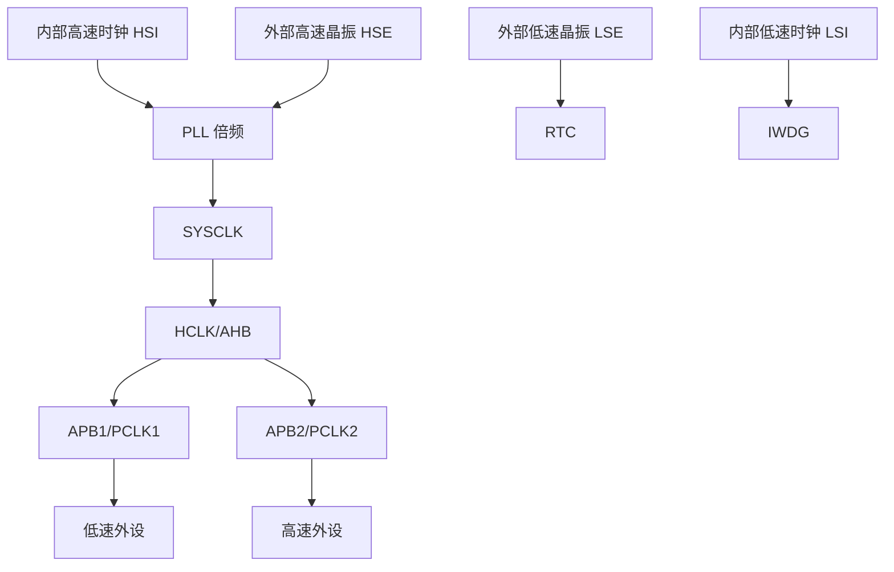

# 时钟系统

## 简明解释

时钟是 STM32 里所有硬件动作的节拍。CPU 执行指令要时钟，外设计数要时钟，串口波特率要时钟，ADC 转换也要时钟。RCC 负责选择时钟源、分频倍频、给各个外设打开时钟。

## 它在 STM32 系统中的位置

## 关键概念

| 概念 | 解释 |
|---|---|
| HSI | 内部 RC 高速时钟，方便但精度一般 |
| HSE | 外部高速晶振，常用于主系统时钟 |
| PLL | 锁相环，把输入时钟倍频到更高频率 |
| SYSCLK | 系统主时钟 |
| HCLK | AHB 总线和内核相关时钟 |
| PCLK1/PCLK2 | APB 外设总线时钟 |
| 外设时钟使能 | 不打开时钟，外设寄存器配置通常不会真正工作 |

## 工作过程

## 常见误区

| 误区 | 更好的理解 |
|---|---|
| 系统时钟只影响 CPU | 它还影响总线、外设、定时器、串口波特率等 |
| 外设寄存器能写就说明外设运行了 | 没有外设时钟时，硬件功能可能并未工作 |
| 所有定时器时钟都等于 PCLK | 一些 STM32 在 APB 分频不为 1 时，定时器时钟可能是 PCLK 的 2 倍 |
| F1/F4 时钟树完全一样 | 主概念相同，PLL 和总线细节要查对应参考手册 |

## 复习问题

1. RCC 在外设初始化中承担哪两个核心职责？
2. SYSCLK、HCLK、PCLK1、PCLK2 是什么关系？
3. 为什么改系统时钟后，串口波特率和定时器周期可能都要重新检查？

