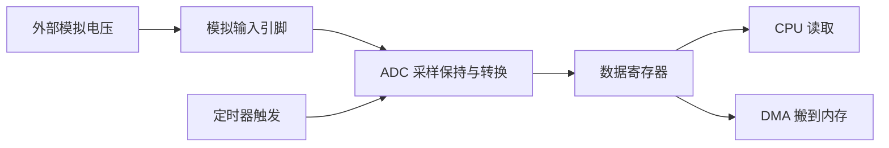
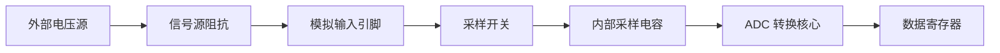
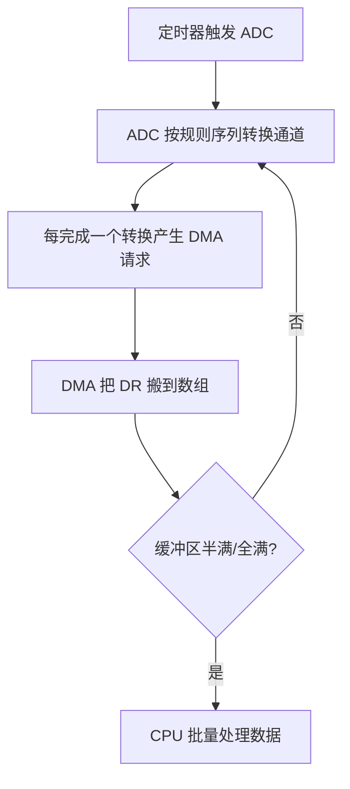
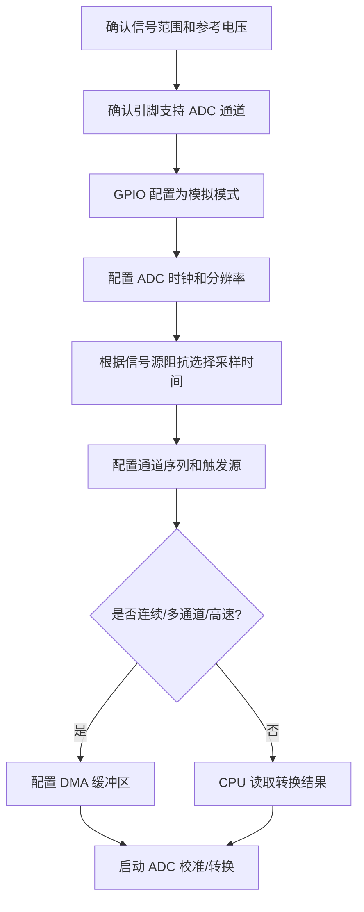

# ADC

## 简明解释

ADC 把连续变化的模拟电压转换成离散的数字值。它看起来只是“读一个电压”，但真正影响结果的东西很多：参考电压、采样时间、信号源阻抗、模拟布线、触发方式、校准、DMA 搬运方式都会影响最终读数。

学习 ADC 的关键不是背“12 位是 0 到 4095”，而是建立一条完整链路：外部电压先进入引脚，再给内部采样电容充电，然后 ADC 比较转换，最后数字结果进入数据寄存器或 DMA 缓冲区。链路上任何一环不合适，读数都会抖、偏、慢或错位。

## 它在 STM32 系统中的位置



## ADC 读数到底代表什么

理想情况下，N 位 ADC 的输出范围是 `0` 到 `2^N - 1`。如果参考电压是 `Vref`，输入电压是 `Vin`，可以粗略理解为：

```text
ADC值 ≈ Vin / Vref * (2^N - 1)
Vin ≈ ADC值 / (2^N - 1) * Vref
```

例如 12 位 ADC、3.3V 参考电压下，2048 大约接近 1.65V。但这只是理想换算。真实电路里，`Vref` 可能不是精确 3.300V，输入信号也可能带噪声，采样电容也可能没有充到目标电压，所以 ADC 值通常不会像整数公式那样稳定。

| 概念 | 直白理解 | 学习重点 |
|---|---|---|
| 分辨率 | 数字结果能分多少格 | 12 位有 4096 个码值，不等于绝对精度就是 1/4096 |
| 参考电压 | 满量程对应的电压基准 | Vref 波动会让所有读数一起漂 |
| 通道 | ADC 输入来源 | 外部引脚、内部温度、内部参考电压等都可能是通道 |
| 采样时间 | 采样电容接到输入信号多久 | 信号源阻抗高时必须更长 |
| 转换时间 | ADC 完成一次量化要多久 | 影响最高采样率 |
| 规则序列 | 常规采样顺序 | 多通道扫描时要关心结果顺序 |
| 触发源 | 谁让 ADC 开始转换 | 软件、定时器、外部事件都可以 |

## 采样不是瞬间读电压

ADC 前端通常有一个采样保持电路。采样阶段，内部小电容通过开关接到外部输入；转换阶段，电容上的电压被保持并转换成数字值。



这解释了一个很常见的问题：为什么采样时间太短会不准？因为内部采样电容需要时间充电。如果外部信号源阻抗很高，或者前面串了较大电阻、滤波电路，电容充电更慢，采样时间太短时它还没充到真实输入电压，转换结果就会偏低或受上一个通道影响。

多通道扫描时尤其要注意：如果前一个通道电压很高、后一个通道电压很低，采样电容残留和充放电时间不足可能导致串扰。解决思路包括延长采样时间、降低信号源阻抗、加缓冲运放、调整通道顺序或丢弃第一次采样。

## 触发方式决定采样时间点

ADC 常见触发方式有三类：

| 触发方式 | 特点 | 适合场景 |
|---|---|---|
| 软件触发 | CPU 写寄存器启动一次转换 | 简单低速测量，比如偶尔读电池电压 |
| 连续转换 | 启动后不断转换 | 简单连续监测，但采样节拍不一定与系统事件对齐 |
| 定时器触发 | TIM 按固定周期触发 ADC | 电机控制、波形采样、稳定周期数据采集 |

如果你需要“每 1ms 采一次”，用 `while` 循环加延时并不可靠，因为 CPU 可能被中断、任务调度、临界区影响。用 TIM 触发 ADC，采样起点由硬件事件决定，时间抖动会小得多。ADC 转换完成后再由 DMA 搬到内存，就是常见的稳定采样链路。

## 单通道、多通道和 DMA

单通道低速采样可以让 CPU 等待转换完成后读取数据寄存器。但多通道或高频采样时，CPU 逐个读很容易漏数据或引入时序不稳定，这时常用 ADC + DMA。



使用 DMA 时要特别在意“结果顺序”。如果规则序列是 CH1、CH2、CH3，DMA 数组里通常就按这个顺序循环出现。你需要让数组长度和通道数量匹配，否则很容易把 CH2 的数据当成 CH1。

## 典型配置思路



## 常见现象和排查入口

| 现象 | 优先排查 |
|---|---|
| 读数一直为 0 或满量程 | 引脚是否接错；GPIO 是否模拟模式；通道号是否选错；输入是否超出范围 |
| 读数抖动大 | Vref 是否稳定；模拟地是否干净；采样时间是否太短；外部信号是否有噪声 |
| 多通道读数串扰 | 信号源阻抗、采样时间、通道顺序、是否需要缓冲或丢弃首样 |
| DMA 数组数据错位 | 通道序列、DMA 长度、循环模式、半满/全满处理是否匹配 |
| 采样频率不稳定 | 是否用软件循环触发；是否应改用 TIM 触发；中断处理是否太重 |
| 温度/内部参考读数不合理 | 内部通道使能、采样时间要求、校准参数和参考手册公式 |

## 常见误区

| 误区 | 更好的理解 |
|---|---|
| ADC 值抖就是程序错 | 模拟前端、参考电压、布线和采样时间都可能是根因 |
| 分辨率越高精度越高 | 分辨率是码值数量，精度还受噪声、误差、参考源影响 |
| 采样时间越短越快越好 | 采样时间太短可能让采样电容没充到真实电压 |
| 多通道扫描只要开 DMA 就行 | 还要保证通道顺序、数组长度和处理节奏一致 |
| 3.3V 供电就等于 3.3V 参考 | 具体参考源要看芯片和板级设计，VDDA/Vref 可能有波动 |

## 复习问题

1. 12 位 ADC、3.3V 参考电压时，2048 约等于多少电压？这个换算有哪些前提？
2. 为什么信号源阻抗高时，需要增加采样时间？
3. 多通道 ADC + DMA 中，如何判断数组第几个元素对应哪个通道？
4. 如果 ADC 读数抖动，你会先从软件、模拟电路还是参考电压哪几条线排查？
