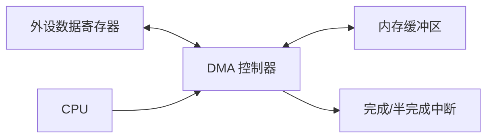
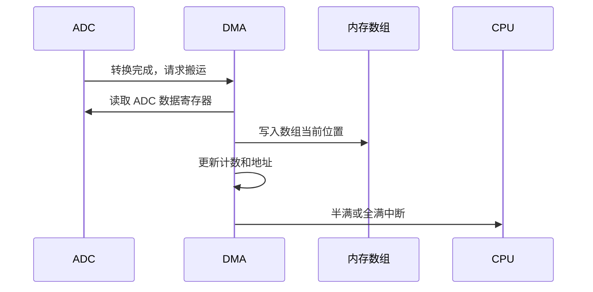
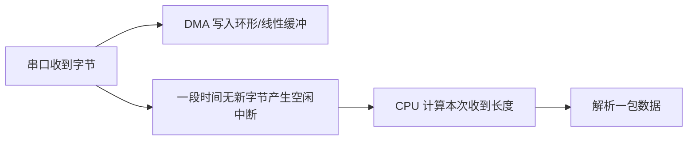
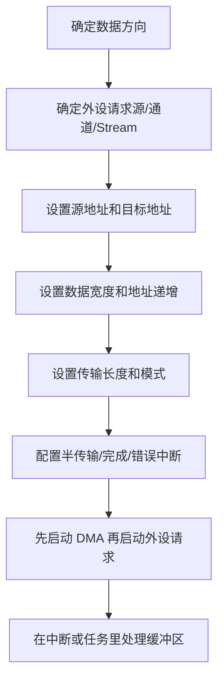

# DMA

## 简明解释

DMA 是 STM32 里的硬件数据搬运器。它能在外设寄存器和内存之间、内存和内存之间自动搬数据，让 CPU 不必每来一个串口字节、每完成一次 ADC 转换、每发一个 SPI 字节都亲自读写寄存器。

但 DMA 不是“开了就自动变快”的魔法。它必须知道从哪里搬、搬到哪里、每次搬多宽、搬多少次、地址是否递增、由谁触发。DMA 学不明白时，常见问题不是“不会启动”，而是数据宽度、地址递增、缓冲区位置、请求映射和缓存一致性这些边界没想清楚。

## 它在 STM32 系统中的位置

## DMA 搬运要回答六个问题

| 问题 | 例子 | 错了会怎样 |
|---|---|---|
| 从哪里搬 | USART 数据寄存器、ADC 数据寄存器、内存数组 | 源地址错，搬到的全是无效数据 |
| 搬到哪里 | 接收缓冲区、SPI 发送寄存器、另一个数组 | 目标地址错，可能覆盖内存或外设异常 |
| 每次搬多宽 | 8 位、16 位、32 位 | 字节错位、半字丢失、数组解释错误 |
| 地址是否递增 | 外设寄存器通常不递增，内存数组通常递增 | 数据全写同一个位置，或外设地址跑飞 |
| 搬多少次 | DMA 传输长度 | 少搬丢数据，多搬越界或覆盖旧数据 |
| 谁触发搬运 | ADC 转换完成、USART 收到字节、SPI 空发送 | 没请求就不搬，请求映射错也不搬 |

最重要的直觉是：**外设寄存器地址通常固定，内存缓冲区地址通常递增**。例如串口接收时，每来一个字节都从同一个 `USART_DR/RDR` 读，但要依次写进数组的不同位置。

## ADC + DMA 典型过程

ADC 连续采样是最适合用 DMA 的场景之一。ADC 每完成一次转换，就产生一个 DMA 请求；DMA 从 ADC 数据寄存器读出结果，写到内存数组；数组半满或全满时再通知 CPU 批量处理。

这样做有两个好处：

1. 采样动作不依赖 CPU 何时进中断，时序更稳定。
2. CPU 不用每个采样点都处理，负担更小。

但代价是你必须管理缓冲区。半传输中断表示前半段可以处理，全传输中断表示后半段或整段完成。处理时不要和 DMA 正在写的区域打架。

## 串口为什么常用 DMA + 空闲中断

串口接收有个典型难题：你不知道一包数据有多长。如果每来一个字节都进中断，波特率高时 CPU 很忙；如果只设固定长度 DMA，又不知道什么时候一包结束。

DMA + 空闲中断的思路是：

这里 DMA 负责连续搬字节，空闲中断负责告诉 CPU“这一段可能结束了”。它适合 Modbus RTU、自定义不定长协议、调试命令等场景。不过仍然要处理缓冲区溢出、半包、粘包和协议自身校验。

## 循环模式、双缓冲和普通模式

| 模式 | 特点 | 适合场景 |
|---|---|---|
| 普通模式 | 搬完指定长度后停止 | 一次性发送、固定长度接收 |
| 循环模式 | 搬完后自动从头开始 | ADC 连续采样、串口持续接收 |
| 双缓冲 | 两个缓冲区交替写 | 高频数据流，一边采集一边处理 |

循环模式很常用，但也容易让人误判数据边界。DMA 不知道你的协议包在哪里，它只知道数组写到哪里了。真正的包边界需要靠空闲中断、定长协议、帧头帧尾、长度字段或校验来判断。

## DMA 不是所有内存都能访问

不同 STM32 系列的总线结构不同，DMA 能访问的内存区域也不同。有些高速内核里的 DTCM、CCM 或特殊 RAM 只能 CPU 访问，DMA 访问不到；带 DCache 的系列还要考虑缓存一致性：CPU 看见的缓存数据可能不是 DMA 刚写进内存的数据。

这类问题非常隐蔽，表现可能是：

- DMA 启动了但数据不变。
- 数据偶尔旧、偶尔新。
- 换一个数组位置或链接脚本区域后突然正常。
- Debug 读外设寄存器看似都对，但内存缓冲区没更新。

排查时要回到芯片的总线矩阵、内存区域说明和启动文件/链接脚本，确认缓冲区放在 DMA 可访问区域。普通基础系列不一定会遇到缓存问题，但要知道这个边界存在。

## 典型配置思路

启动顺序也很重要。接收类场景通常要先准备好 DMA，再打开外设接收请求；否则第一个字节可能已经来了，但 DMA 还没准备好。

## 常见现象和排查入口

| 现象 | 优先排查 |
|---|---|
| DMA 完全不搬 | 外设 DMA 请求是否打开；DMA 通道/Stream 映射是否正确；传输方向是否反了 |
| 只搬一个数据 | 是否普通模式且长度为 1；外设是否只产生一次请求；循环模式是否未开 |
| 数据错位 | 数据宽度、内存元素类型、地址递增设置是否匹配 |
| 缓冲区不更新 | 缓冲区是否在 DMA 可访问内存；是否有 DCache 一致性问题 |
| 串口 DMA 丢包 | 缓冲区太小；处理太慢；空闲中断清除方式不对；协议边界没处理 |
| ADC 多通道顺序乱 | ADC 序列、DMA 长度、数组索引解释是否一致 |

## 常见误区

| 误区 | 更好的理解 |
|---|---|
| DMA 会让 CPU 完全不用管 | CPU 仍要配置、同步和处理缓冲区 |
| DMA 一定比 CPU 快 | 小数据低频操作可能没必要引入 DMA |
| 数据宽度随便配 | 外设寄存器宽度和内存元素宽度必须匹配 |
| 循环 DMA 就等于协议自动分包 | DMA 只搬字节，不理解你的协议 |
| 所有 RAM 都适合放 DMA 缓冲 | 要看具体芯片总线结构和缓存机制 |

## 复习问题

1. ADC + DMA 场景中，源地址、目标地址、地址递增分别应该怎么配置？
2. 为什么串口接收常用 DMA + 空闲中断，而不是每字节中断？
3. 如果 DMA 中断正常进，但缓冲区数据一直不对，你会从哪些方向排查？
4. 循环 DMA 解决了连续搬运问题，但为什么没有解决协议分包问题？

