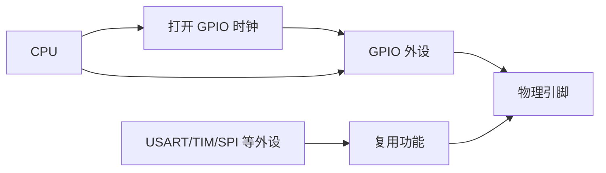
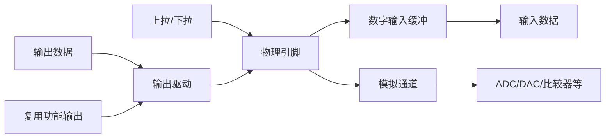
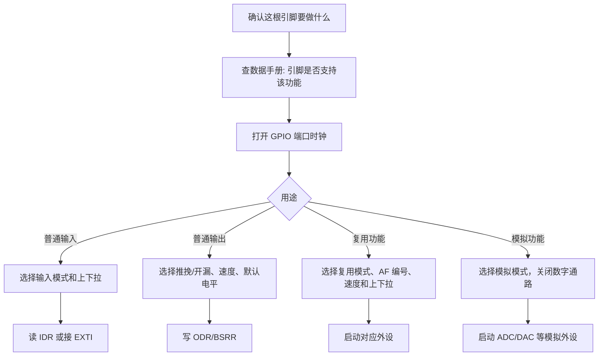

# GPIO

## 简明解释

GPIO 是 STM32 和外部世界接触最直接的一层：一根引脚既可以被 CPU 当作普通输入输出使用，也可以被 USART、SPI、TIM、ADC 等外设接管。学习 GPIO 不能只记“输入、输出、上拉、下拉”，更重要的是理解一根物理引脚内部有哪些开关、谁在驱动它、它什么时候会被外设接管。

可以把 GPIO 想成一座带很多闸门的门厅。外部信号从引脚进来，可能进入数字输入电路，也可能进入 ADC 的模拟通道；CPU 输出的电平可以经过推挽或开漏驱动到引脚；外设功能也可以通过复用通道接到同一根引脚上。配置 GPIO，本质上就是决定这些闸门怎么开。

## 它在 STM32 系统中的位置

## 一根引脚内部大致有什么

不同系列寄存器名字会有差异，但理解模型基本一致：

这里有几个关键点：

- **输入和输出不是互斥的物理概念**：输出模式下仍然可以读输入数据寄存器，读到的是引脚上的实际电平，不一定等于你刚写出去的值。
- **模拟模式不是“另一种数字输入”**：模拟模式通常会关闭数字输入缓冲，减少漏电和噪声，让 ADC 看到更干净的模拟信号。
- **复用功能不是绕过 GPIO**：USART_TX、SPI_SCK、TIM_CHx 仍然要通过引脚复用矩阵接到具体引脚，GPIO 的模式、速度、上下拉仍会影响最终效果。
- **上拉/下拉是弱驱动**：内部上下拉电阻阻值较大，只适合给悬空信号一个默认状态，不能当作强力供电或大电流驱动。

## 输入模式怎么理解

输入模式的核心问题是：**当外部没有明确驱动时，引脚到底算高还是低？**

| 输入模式 | 适合场景                     | 容易踩坑的点                    |
| ---- | ------------------------ | ------------------------- |
| 浮空输入 | 外部电路始终有明确高低驱动，比如推挽输出芯片接入 | 悬空时会被干扰拉来拉去，按键和长线很容易乱跳    |
| 上拉输入 | 按键按下接地、开漏输出信号、需要默认高电平    | 上拉太弱时长线抗干扰差，外部强驱动低电平才可靠   |
| 下拉输入 | 按键按下接电源、需要默认低电平          | 很多板级设计更常用上拉，不能只按习惯选       |
| 模拟输入 | ADC、DAC、比较器等模拟功能         | 如果忘记切模拟模式，ADC 读数可能更抖或偏差更大 |

按键是最典型的例子：按键没按下时，如果引脚浮空，电平不是“没有值”，而是“谁干扰它就跟谁走”。所以按键输入通常要有上拉或下拉，再配合软件消抖。

## 输出模式怎么理解

输出模式的核心问题是：**高电平和低电平分别是谁主动驱动出来的？**

| 输出类型 | 低电平    | 高电平        | 典型用途              |
| ---- | ------ | ---------- | ----------------- |
| 推挽输出 | 芯片主动拉低 | 芯片主动拉高     | LED、普通控制信号、片选 CS  |
| 开漏输出 | 芯片主动拉低 | 释放引脚，靠上拉变高 | I2C、多设备共享中断线、电平兼容 |

推挽像两个人分别负责往下拉和往上推，速度快、驱动能力强，但多个推挽输出不能直接并在一起，否则一个输出高、另一个输出低时会短路对抗。开漏只会主动拉低，不主动拉高，所以多个设备可以共用一根线：只要有一个设备拉低，总线就是低；所有设备都释放，才由上拉电阻拉成高。

这也是 I2C 使用开漏的根本原因：它需要多个设备在同一根 SDA 上轮流说话，还需要 ACK 这种由接收方拉低的应答。如果每个设备都推挽输出，就很容易互相打架。

## 速度、上下拉和复用功能

GPIO 的“输出速度”不是业务频率，而是输出边沿的快慢，也就是电平从低到高或从高到低变化得有多猛。速度设得越高，边沿越陡，越适合高速信号，但也越容易带来过冲、串扰和 EMI。普通 LED、继电器控制不需要高速；SPI 时钟、PWM 边沿则可能需要更高速度。

复用功能要同时满足三件事：

1. 引脚本身支持这个外设功能。
2. GPIO 被配置成对应复用模式，并选择正确 AF 编号。
3. 外设本身的时钟、模式和输出使能也打开。

很多“串口没波形”“PWM 没输出”的问题，不是 USART 或 TIM 本身不会工作，而是引脚还停留在普通 GPIO、AF 选错、或者 RCC 没开。

## 典型配置思路

普通输出建议优先用 `BSRR` 这类原子置位/复位寄存器，而不是读改写 `ODR`。原因是中断或多线程场景下，读改写可能把别人刚改过的位覆盖掉；`BSRR` 可以只影响目标引脚。

## 常见现象和排查入口

| 现象 | 优先排查 |
|---|---|
| 引脚一直没电平变化 | GPIO 端口时钟是否打开；引脚是否配置成输出或复用；是否操作了正确端口和引脚 |
| 输出电平和预期相反 | LED/继电器是否低电平有效；外部电路是否反相；开漏输出是否缺上拉 |
| 输入值乱跳 | 是否浮空；是否需要上下拉；按键是否消抖；线是否太长或靠近干扰源 |
| 复用外设没波形 | AF 编号是否正确；外设时钟是否打开；外设输出功能是否使能；引脚是否被调试口占用 |
| ADC 读数异常 | 引脚是否为模拟模式；是否被数字上拉/下拉影响；信号源阻抗和采样时间是否匹配 |

## 常见误区

| 误区 | 更好的理解 |
|---|---|
| GPIO 会了就是会点灯 | 点灯只是最简单的输出，真正核心是理解引脚归属、电气模式和复用关系 |
| 浮空输入最省事 | 浮空不是默认状态，而是不确定状态 |
| 开漏能输出高电平 | 开漏只能释放引脚，高电平来自上拉 |
| 输出速度越高越专业 | 速度越高副作用越多，够用才是正确 |
| 复用功能由外设全权负责 | GPIO 仍负责把外设信号接到物理引脚上 |

## 复习问题

1. 为什么同一根引脚不能同时当普通 GPIO 输出和 USART_TX 使用？
2. 推挽输出和开漏输出的本质区别是什么？如果两个推挽输出短接会发生什么？
3. 一个按键输入不按时偶尔触发，你会先查上拉/下拉、消抖还是中断优先级？为什么？
4. PWM 没有输出波形时，为什么要同时检查 TIM 配置和 GPIO 复用配置？

