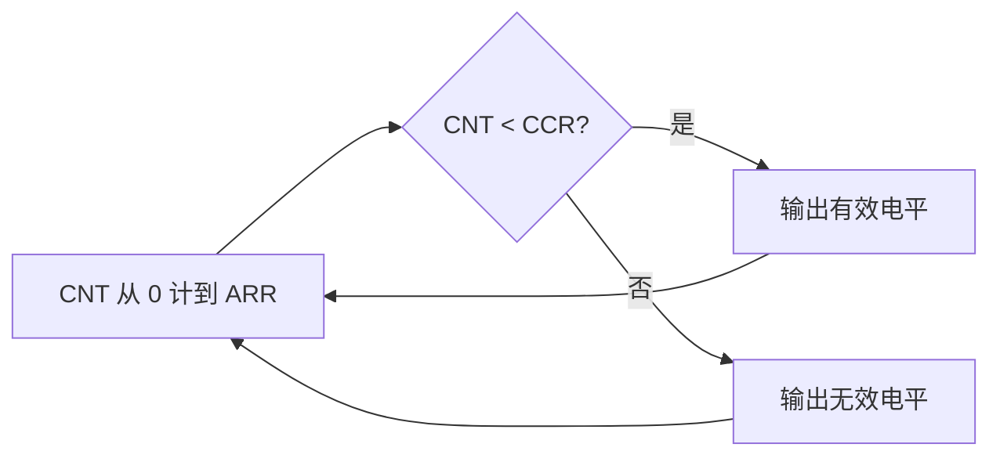
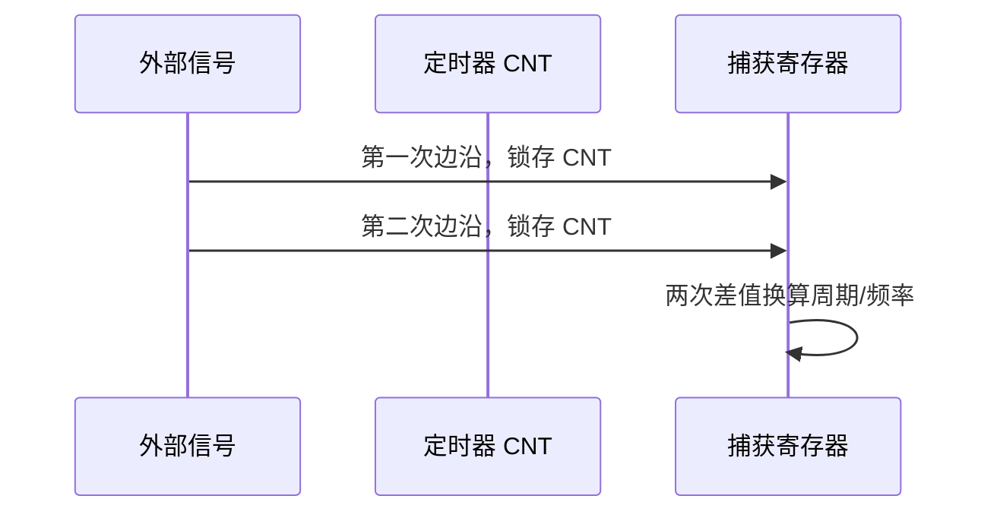
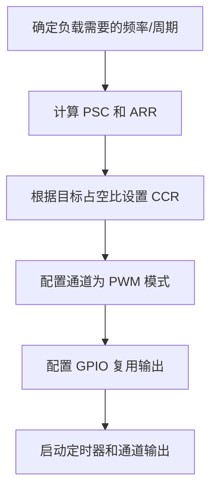
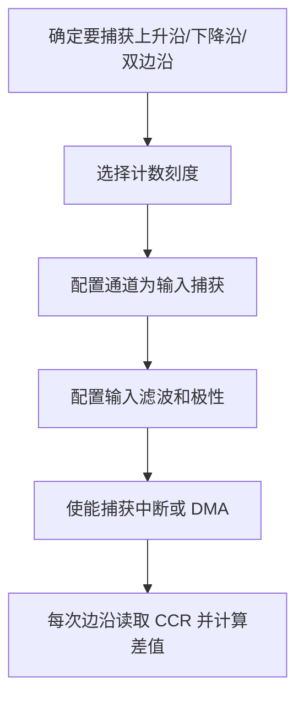

# PWM 与输入捕获

## 简明解释

PWM 和输入捕获是 TIM 通道的两种典型用法。PWM 是“根据计数器位置控制输出电平”，用硬件自动产生周期波形；输入捕获是“外部边沿到来时记录计数器值”，用硬件给外部信号打时间戳。

这两个功能看起来方向相反，一个输出、一个输入，但本质都围绕同一件事：`CNT` 是时间尺，`CCR` 是这把尺上的关键刻度。PWM 用 `CCR` 决定什么时候改变输出，输入捕获用 `CCR` 保存边沿到来的时间。

## 它在 STM32 系统中的位置


## PWM 先分清频率和占空比

PWM 是数字引脚输出的高低电平序列，不是直接输出一个模拟电压。它之所以能调亮度、调速度，是因为很多负载会对高低电平做时间平均，或者后面有电感、电容、机械惯性、软件滤波等低通效果。

| 参数 | 主要由谁决定 | 影响 |
|---|---|---|
| PWM 频率 | TIM 输入时钟、PSC、ARR | 波形重复得多快 |
| 占空比 | CCR 和 ARR 的比例 | 一个周期内有效电平占多少 |
| 分辨率 | ARR 的可用范围 | 占空比能分得多细 |
| 极性 | 通道输出极性配置 | 有效电平是高还是低 |

常见向上计数 PWM 可以粗略理解为：

```text
PWM频率 = TIM输入时钟 / ((PSC + 1) * (ARR + 1))
占空比 = CCR / (ARR + 1)
```

实际不同 PWM 模式、对齐方式、极性会影响边界细节，但这个模型足够帮你建立直觉。

## PWM 产生过程



假设 `ARR = 999`，计数器一个周期有 1000 个刻度。如果 `CCR = 250`，大致就是 25% 占空比；如果 `CCR = 750`，大致就是 75% 占空比。改变 `CCR` 通常改变占空比，改变 `ARR/PSC` 通常改变频率。

但频率和占空比不是完全独立的。频率越高，在固定 TIM 时钟下 `ARR` 往往越小，占空比分辨率也越低。例如 ARR 只有 99 时，占空比大约只能按 1% 级别调整；ARR 有 9999 时，就能更细。

## 舵机、电机、LED 关心的不是同一件事

| 场景 | 更关注什么 | 说明 |
|---|---|---|
| LED 调光 | 平均功率和人眼感受 | 频率太低会闪烁，占空比影响亮度 |
| 直流电机 | 平均电压、电流纹波、驱动损耗 | 频率太低可能啸叫，太高开关损耗增加 |
| 舵机 | 脉宽本身 | 常见舵机看 1ms、1.5ms、2ms 这类脉宽，不只是百分比 |
| 蜂鸣器 | 频率 | 有源/无源蜂鸣器需求不同，无源蜂鸣器要给合适频率 |

舵机是初学者最容易误解的例子：它常用 20ms 左右周期，但角度主要由高电平脉宽决定。1.5ms 在 20ms 周期里是 7.5% 占空比；如果你把周期改成 10ms，仍然给 7.5%，高电平就变成 0.75ms，舵机理解的含义已经变了。

## 输入捕获是在给边沿打时间戳

输入捕获测周期：



输入捕获不是“CPU 看到边沿后读时间”，而是硬件在边沿瞬间把 `CNT` 锁存到 `CCR`。这比软件轮询准确得多，因为软件进入中断可能有延迟，但捕获值已经在硬件里保存下来了。

常见测量方式：

| 目标 | 捕获方法 | 计算思路 |
|---|---|---|
| 测周期/频率 | 连续捕获两个同方向边沿 | 两次捕获差值就是一个周期 |
| 测高电平脉宽 | 捕获上升沿和下降沿 | 下降沿时间减上升沿时间 |
| 测占空比 | 同时测周期和高电平时间 | 高电平时间 / 周期 |
| 测低频信号 | 增大计数周期或处理溢出 | 避免两个边沿之间 CNT 溢出算错 |

如果信号频率很高，要注意输入滤波和中断处理速度；如果信号频率很低，要注意计数器溢出。输入捕获的难点经常不是“能不能捕获”，而是“差值计算是否考虑了溢出和噪声”。

## 典型配置思路

PWM 输出：



输入捕获：



## 常见现象和排查入口

| 现象 | 优先排查 |
|---|---|
| PWM 没有波形 | GPIO AF、通道使能、定时器是否启动、CCR/ARR 是否有效 |
| PWM 频率不对 | TIM 输入时钟、PSC/ARR 加 1、APB 定时器时钟倍频 |
| 占空比反了 | 输出极性、PWM 模式 1/2、外部驱动是否低电平有效 |
| 舵机抖动 | 脉宽是否稳定、周期是否合适、电源是否足够、地线是否共地 |
| 捕获值跳动 | 输入信号抖动、滤波不足、边沿选错、溢出未处理 |
| 频率测量偶尔巨大或为 0 | 两次捕获差值为 0、计数器溢出、变量宽度不够 |

## 常见误区

| 误区 | 更好的理解 |
|---|---|
| PWM 是模拟输出 | PWM 是数字波形，模拟效果来自负载或滤波 |
| 频率越高越好 | 频率、分辨率、损耗、噪声需要折中 |
| 舵机只看占空比 | 舵机更关心高电平脉宽 |
| 输入捕获精度等于中断响应速度 | 边沿时间由硬件锁存，中断延迟主要影响你何时处理 |
| 捕获两个值相减就一定对 | 还要考虑计数器溢出、滤波、边沿极性和时间基准 |

## 复习问题

1. 为什么提高 PWM 频率可能会降低占空比分辨率？
2. 舵机控制中，“1.5ms 脉宽”和“7.5% 占空比”哪个更接近本质？为什么？
3. 输入捕获为什么比软件轮询更适合测频率？
4. 如果输入捕获测得的周期偶尔异常大，你会如何检查溢出和噪声问题？

