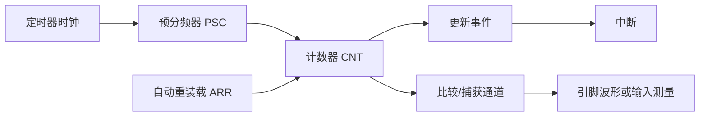
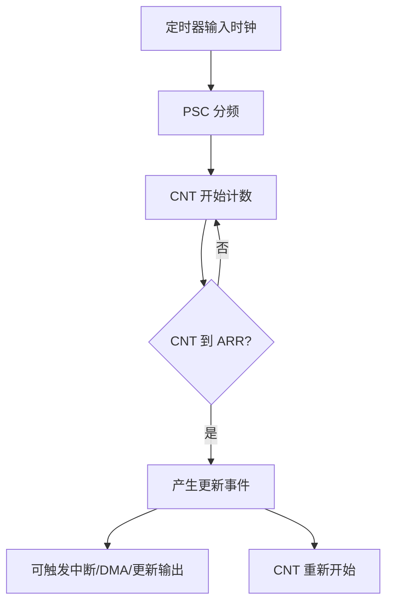
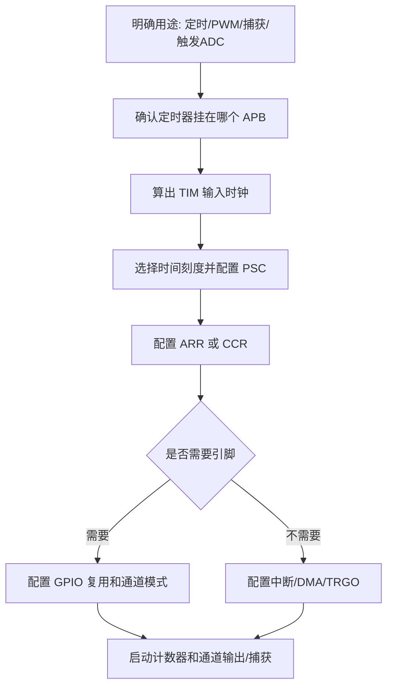

# TIM

## 简明解释

TIM 是 STM32 里最重要的“时间和事件机器”。它不只是用来做延时中断，还能产生 PWM、测量外部脉冲、触发 ADC、驱动 DMA、做编码器接口。很多外设看似互不相关，背后都在借定时器提供一个稳定的节拍或事件边界。

定时器的核心很简单：输入一个时钟，经过预分频后推动计数器 `CNT` 变化；当 `CNT` 和某些寄存器发生关系时，就产生事件。难点在于你要分清楚：哪个时钟在驱动它、计数周期由谁决定、事件会流向哪里。

## 它在 STM32 系统中的位置



## 先把三个数想清楚：时钟、PSC、ARR

定时器周期最常见的计算模型是：

```text
计数频率 = TIM输入时钟 / (PSC + 1)
更新周期 = (ARR + 1) / 计数频率
```

这里最容易错的是“TIM 输入时钟”。它不一定等于系统主频，也不一定简单等于 APB 总线频率。很多 STM32 系列中，当 APB 预分频不为 1 时，挂在该 APB 上的定时器时钟可能是 PCLK 的 2 倍。你如果只看 `SystemCoreClock`，很容易把周期算错一倍。

| 元素 | 作用 | 学习时要抓住的问题 |
|---|---|---|
| TIM 输入时钟 | 定时器被哪个时钟源推动 | 它来自 APB1 还是 APB2？有没有 x2 规则？ |
| PSC | 把输入时钟降频 | 降频后每计一次代表多长时间？ |
| CNT | 当前计数值 | 是向上、向下还是中心对齐计数？ |
| ARR | 自动重装载值 | 数到哪里算一个周期结束？ |
| 更新事件 UEV | 周期结束或重装载产生的事件 | 是否触发中断、DMA、TRGO 或寄存器更新？ |
| CCRx | 通道捕获/比较值 | 用于 PWM 翻转点、输出比较或输入捕获时间戳 |

## 定时中断的工作过程



定时中断只是 TIM 的一种用法。它的本质是：硬件每隔固定计数周期产生一次更新事件，NVIC 收到事件后让 CPU 去执行中断函数。硬件事件的节拍可以非常准，但中断函数真正什么时候执行，会受到中断优先级、关中断时间、其他高优先级中断、函数执行时间的影响。

所以要区分两个概念：

- **定时器事件周期**：硬件产生事件的周期，主要由时钟、PSC、ARR 决定。
- **软件处理周期**：CPU 实际进入回调或中断函数的节奏，可能受系统负载影响。

如果你需要稳定采样 ADC，通常更推荐让 TIM 直接触发 ADC，而不是在定时中断里用软件启动 ADC。前者的采样时间点由硬件链路保证，后者会把中断延迟也带进去。

## PSC 和 ARR 不是随便分配

有时两个配置能得到同样的更新周期，例如：

- 计数频率 1 MHz，ARR = 999，得到 1 ms。
- 计数频率 10 kHz，ARR = 9，也得到 1 ms。

但它们的效果并不完全相同。前者每个计数单位是 1 us，PWM 占空比或输入捕获分辨率更高；后者每个计数单位是 100 us，精度明显粗很多。也就是说，PSC 和 ARR 同时决定“周期”和“时间分辨率”。

选参数时可以按这个顺序想：

1. 先确定需要多细的时间刻度，比如 1 us、10 us、1 ms。
2. 再用 PSC 把定时器时钟分到这个刻度。
3. 最后用 ARR 决定多少个刻度形成一个周期。

## 通道是什么

TIM 的通道 CHx 是计数器和外部引脚之间的接口。一个通道可以有不同工作方式：

| 模式 | `CNT` 和 `CCR` 的关系 | 典型用途 |
|---|---|---|
| 输出比较 | `CNT` 到达 `CCR` 时改变输出或产生事件 | 精确定时翻转、单脉冲 |
| PWM 输出 | 周期由 `ARR` 定，占空比由 `CCR` 定 | LED 调光、电机控制、舵机 |
| 输入捕获 | 外部边沿到来时把 `CNT` 锁存到 `CCR` | 测频率、测周期、测脉宽 |
| 编码器接口 | 两路输入共同驱动计数器增减 | 读取旋转编码器 |

这也是 TIM 难学的地方：同一个 `CCR` 在 PWM 里像“比较门槛”，在输入捕获里像“时间戳保存器”。不要死记寄存器名字，要看当前模式下它和 `CNT` 的关系。

## 高级、通用、基本定时器

不同定时器能力不同，一般可以这样理解：

| 类型 | 常见能力 | 适合理解 |
|---|---|---|
| 基本定时器 | 定时、更新事件、触发 DAC/ADC | 纯节拍源 |
| 通用定时器 | 定时、PWM、输入捕获、输出比较、编码器 | 最常用的时间/波形外设 |
| 高级定时器 | 互补输出、死区、刹车、重复计数器 | 面向电机、电源控制等更复杂波形 |

高级定时器常见坑是主输出使能、互补输出、死区和刹车输入。PWM 配好了但没有波形时，除了 GPIO 复用，还要检查高级定时器是否需要额外打开主输出。

## 典型配置思路



## 常见现象和排查入口

| 现象 | 优先排查 |
|---|---|
| 定时周期不对 | TIM 输入时钟是否算错；APB 定时器 x2 规则；PSC/ARR 是否都要加 1 |
| 中断不进 | TIM 更新中断使能、NVIC 使能、flag 是否清除、计数器是否启动 |
| 中断只进一次 | 中断标志是否没有清；ARR/PSC 是否配置异常；中断函数是否卡住 |
| PWM 没输出 | GPIO AF、通道使能、极性、CCR 是否为 0、高级定时器主输出使能 |
| 捕获值乱 | 输入滤波、边沿极性、信号是否抖动、计数器是否溢出 |

## 常见误区

| 误区 | 更好的理解 |
|---|---|
| TIM 就是定时中断 | 定时中断只是最简单用法，TIM 更像硬件事件调度器 |
| PSC 和 ARR 只要乘积对就行 | 周期可能对，但分辨率、PWM 精度、捕获精度会不同 |
| 中断准就代表任务准 | 硬件事件准，不代表软件处理一定准 |
| 定时器时钟等于系统主频 | 要沿着 RCC/APB 树查到具体 TIM 输入时钟 |

## 复习问题

1. 设置 1 ms 定时中断时，你需要先确认哪些时钟信息？
2. 为什么同样是 1 kHz PWM，ARR 越大通常占空比分辨率越高？
3. 为什么用 TIM 触发 ADC 往往比在 `while` 循环里采样更稳定？
4. PWM 没输出时，如何区分是 TIM 没跑、通道没开，还是 GPIO 复用错了？

