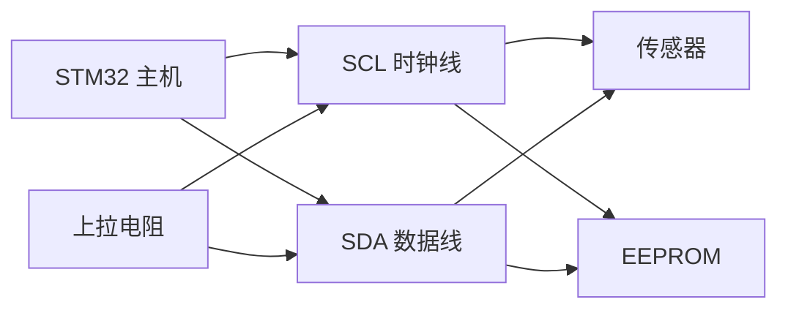
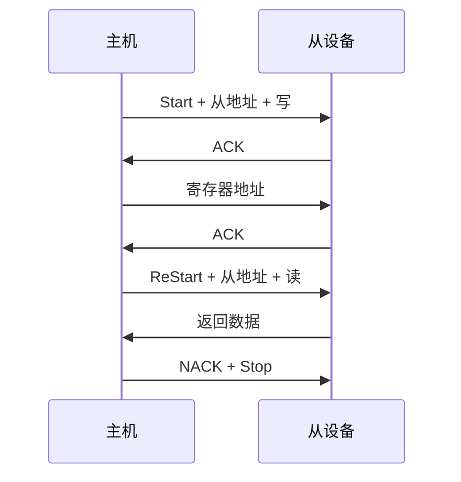
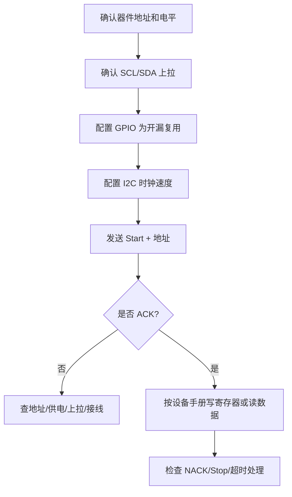

# I2C

## 简明解释

I2C 是两根线的同步总线：SCL 提供时钟，SDA 传输数据。它最大的特点不是“线少”，而是“多设备共享同一组线，并通过地址和 ACK/NACK 管理一次事务”。常见的 EEPROM、RTC、温湿度传感器、电源管理芯片都喜欢用 I2C。

学习 I2C 要抓住三个核心：**开漏上拉形成总线电平、地址决定和谁说话、ACK/NACK 表示对方有没有接住当前字节**。很多 I2C 问题，比如没有 ACK、总线卡死、读寄存器读错，基本都能从这三个核心往外排查。

## 它在 STM32 系统中的位置



## 为什么 I2C 必须理解开漏和上拉

I2C 的 SCL 和 SDA 通常是开漏结构。设备不会主动输出高电平，只会主动拉低或释放总线；高电平由上拉电阻提供。

这样设计有两个好处：

1. 多个设备可以安全共享同一根线。任何设备拉低，总线就是低；没人拉低，总线才是高。
2. 接收方可以在第 9 个时钟拉低 SDA 发送 ACK，主机能看到这个应答。

如果没有上拉电阻，I2C 的高电平就没有可靠来源；如果上拉太弱，线的上升沿太慢，高速时可能采样错误；如果上拉太强，设备拉低时电流变大，也可能超出能力。

| 概念 | 作用 | 常见坑 |
|---|---|---|
| SCL | 主机产生时钟 | 线被从设备拉低时可能 clock stretching |
| SDA | 双向数据线 | 不同阶段由主机或从机驱动 |
| 开漏 | 只主动拉低，不主动拉高 | 忘记配置开漏或缺上拉会通信失败 |
| 上拉电阻 | 提供高电平和上升沿 | 阻值要结合速度、线长、总线电容 |
| 地址 | 选择从设备 | 7 位地址和 8 位地址容易混 |
| ACK/NACK | 接收方对一个字节的回应 | 无 ACK 不一定是程序错，可能设备没供电或地址错 |
| Start/Stop | 事务边界 | 某些读操作需要重复起始 ReStart |

## I2C 一次传输怎么发生

I2C 在 SCL 为高时，SDA 的特殊跳变表示事务边界：

- SCL 高时 SDA 从高到低：Start。
- SCL 高时 SDA 从低到高：Stop。
- 普通数据位通常在 SCL 低时改变，在 SCL 高时保持稳定供采样。

每传 8 位数据后，第 9 个时钟是 ACK/NACK 位。当前接收方如果成功接收，就拉低 SDA 表示 ACK；如果不应答或结束读取，就释放 SDA 表示 NACK。

## 指定寄存器读的常见模型

指定寄存器读的常见模型：



为什么要先写寄存器地址再读？因为很多 I2C 设备内部有寄存器地址指针。你要读某个寄存器，通常先以写方向告诉设备“我要从哪个寄存器开始”，再用重复起始切换到读方向取数据。重复起始的意义是保持同一次事务，不让其他主机插入，也符合很多设备手册定义的时序。

## 7 位地址和 8 位地址

I2C 常用 7 位地址，但在线上发送时，地址后面还会跟 1 位读写位：

```text
线上的地址字节 = 7位地址 << 1 | R/W位
```

所以有些手册会写 `0x68`，表示 7 位地址；有些资料会写 `0xD0/0xD1`，表示已经左移并带读写位的 8 位地址。STM32 HAL 通常要求传入左移后的地址，这一点要看具体 API 文档；寄存器层或其他库可能要求 7 位地址。地址错一位，是 I2C 无 ACK 的高频原因。

## 总线卡死是什么

I2C 总线卡死常见表现是 SDA 或 SCL 一直低。原因可能是：

- 主机在一次传输中复位了，从设备还以为事务没结束。
- 从设备正在 clock stretching，一直拉低 SCL。
- 某个设备异常拉低 SDA。
- GPIO 模式、上拉或外设状态配置异常。

常见恢复思路是把 SCL 临时配置成 GPIO 输出，手动产生几个时钟，让从设备释放 SDA，然后再产生 Stop 条件，最后重新初始化 I2C 外设。具体做法要结合硬件和项目规范，核心是先让总线回到“空闲高电平”的状态。

## 典型配置思路



## 常见现象和排查入口

| 现象 | 优先排查 |
|---|---|
| 地址阶段无 ACK | 7 位/8 位地址是否搞错；设备供电和复位；SCL/SDA 是否接反；上拉是否存在 |
| 读到全 0xFF | SDA 是否一直高；从设备是否根本没响应；读寄存器流程是否缺写寄存器地址 |
| 读到全 0x00 | SDA 是否被拉低；设备状态是否异常；地址或寄存器是否错误 |
| 总线 busy 不释放 | SDA/SCL 是否被拉低；需要总线恢复；上一次传输是否异常中断 |
| 低速正常高速失败 | 上拉阻值、线长、电容负载、波形上升沿、滤波配置 |
| 多设备冲突 | 地址是否重复；是否有多个主机；总线负载是否太大 |

## 常见误区

| 误区 | 更好的理解 |
|---|---|
| I2C 线少所以最简单 | 线少，但上拉、ACK、地址、时序和总线恢复都要理解 |
| I2C 不需要上拉 | 高电平依赖上拉，没有上拉总线不能可靠工作 |
| ACK 一定是主机发的 | ACK 由当前接收方发，写阶段多由从机 ACK，读阶段主机也会 ACK/NACK |
| 手册地址可以直接填 API | 要确认手册给的是 7 位地址还是带读写位的 8 位地址 |
| Start/Stop 只是形式 | 它们定义了设备解析事务的边界，错了就可能读写错寄存器 |

## 复习问题

1. I2C 为什么用开漏加上拉，而不是普通推挽输出？
2. 一个设备手册写地址 `0x68`，另一个例程填 `0xD0`，它们可能是什么关系？
3. 指定寄存器读为什么常用重复起始，而不是直接 Stop 后再 Start？
4. I2C 无 ACK 时，你会如何按供电、接线、地址、上拉、时序逐层排查？
