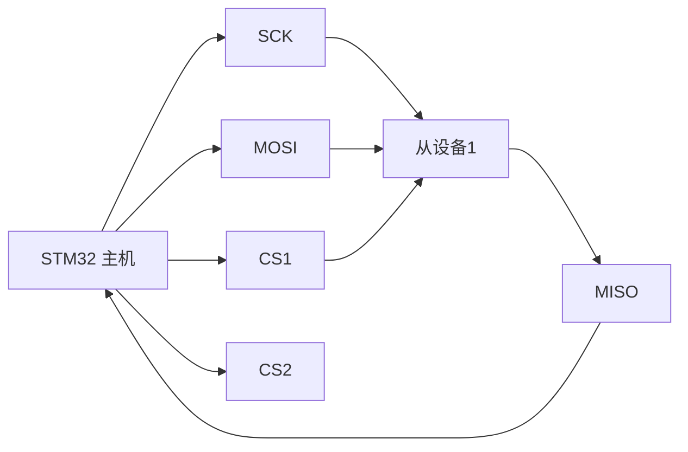
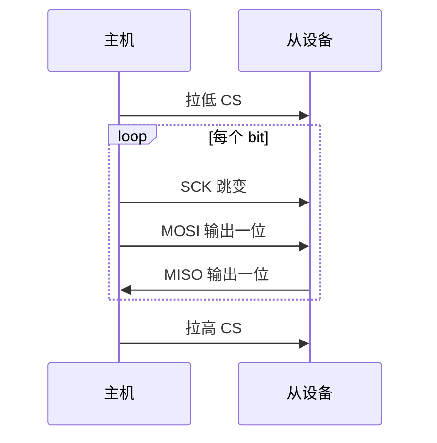
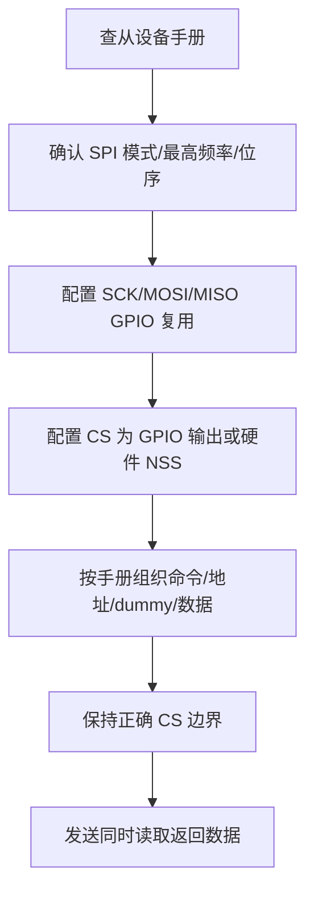

# SPI

## 简明解释

SPI 是同步串行通信。主机用 SCK 提供时钟，用 MOSI 发数据，用 MISO 收数据，用 CS 选择从设备。它速度高、结构直接，常用于外部 Flash、显示屏、ADC/DAC、无线芯片和各种板级高速外设。

SPI 的难点不在“有四根线”，而在三个事实：**主机不发时钟就没有传输、发送和接收总是同时发生、SPI 只定义移位过程而不定义上层命令格式**。所以 SPI 读错数据时，常常要同时检查时钟模式、片选边界、dummy 字节和芯片手册里的命令时序。

## 它在 STM32 系统中的位置



## 四根线分别负责什么

| 概念 | 解释 |
|---|---|
| SCK | 主机输出的同步时钟 |
| MOSI | 主机输出、从机输入 |
| MISO | 主机输入、从机输出 |
| CS/NSS | 片选信号，选择具体从设备 |
| CPOL | 时钟空闲电平 |
| CPHA | 在第几个边沿采样数据 |
| 全双工 | 发送和接收可同时发生 |

SPI 中，主机控制节奏。从设备一般不会主动推着数据出来，必须等主机拉低 CS 并输出 SCK。每来一个时钟，主机和从机各自移出一位，同时也各自采入一位。

这意味着：

- 写数据时，MISO 上可能也有返回值，只是你不关心。
- 读数据时，主机仍要发送 dummy 字节来产生 SCK。
- 收发长度通常是对称的，你发了几个字节，也会同时收到几个字节。

## 一次 SPI 事务怎么发生



CS 不只是“选中设备”的电平，它常常也是一次命令事务的边界。有些芯片要求一条命令期间 CS 一直保持低，命令、地址、dummy、数据连续发送；如果中途拉高，芯片会认为事务结束，后面的数据就变成另一条新命令。

## CPOL 和 CPHA 为什么重要

SPI 有四种常见模式，由 CPOL 和 CPHA 决定：

| 模式 | CPOL | CPHA | 直白理解 |
|---|---:|---:|---|
| Mode 0 | 0 | 0 | 空闲低，第一个边沿采样 |
| Mode 1 | 0 | 1 | 空闲低，第二个边沿采样 |
| Mode 2 | 1 | 0 | 空闲高，第一个边沿采样 |
| Mode 3 | 1 | 1 | 空闲高，第二个边沿采样 |

模式不匹配时，信号线上可能看起来“有波形”，但接收方在错误的边沿采样，读到的数据就会错位。SPI 调试时，第一件事就是查从设备手册要求的 SPI mode，并确认逻辑分析仪也用同样模式解码。

## SPI 协议由芯片自己定义

SPI 只定义 SCK/MOSI/MISO/CS 怎么移位，不规定“第一个字节是不是命令、地址几字节、读写位在哪、dummy 几个周期、数据大小端如何”。这些都由具体芯片手册决定。

例如外部 Flash 的一次读取可能是：

```text
CS 拉低 -> 发送读命令 -> 发送 24/32 位地址 -> 发送 dummy 字节 -> 读取数据 -> CS 拉高
```

显示屏可能是：

```text
CS 拉低 -> DC 选择命令/数据 -> 发送命令 -> 发送参数/像素数据 -> CS 拉高
```

所以 SPI 驱动移植时，不能只看 SPI 初始化，还要认真看目标芯片的命令表、时序图和 CS/DC/RESET 等额外引脚。

## 典型配置思路



在很多项目里，CS 用普通 GPIO 手动控制会更直观，因为不同芯片对 CS 边界要求不同。硬件 NSS 并不是不能用，但要确认它产生的时序符合从设备要求。

## 常见误区

| 误区            | 更好的理解                     |
| ------------- | ------------------------- |
| SPI 读数据时不用发送  | 主机必须提供时钟，常通过发送 dummy 字节来读 |
| CPOL/CPHA 无所谓 | 模式不匹配会导致采样边沿错误            |
| CS 可以一直拉低     | 有些从设备靠 CS 边沿识别命令边界        |
| SPI 有统一高级协议   | SPI 只定义基本传输，命令格式由具体芯片决定   |

## 常见现象和排查入口

| 现象 | 优先排查 |
|---|---|
| 读到全 0xFF | MISO 是否被上拉或悬空；从设备是否未选中；CS 是否没拉低；命令是否不对 |
| 读到全 0x00 | MISO 是否被拉低；设备是否未上电；模式或接线是否错误 |
| 数据整体错位 | CPOL/CPHA、位序 MSB/LSB、dummy 字节数量、地址长度 |
| 低速正常高速失败 | 线长、驱动能力、GPIO 速度、采样边沿、从设备最高频率 |
| 多从设备冲突 | 是否多个 CS 同时有效；未选中设备的 MISO 是否高阻；片选上拉 |
| 第一字节正确后面错 | CS 边界、FIFO/DMA 长度、命令和数据阶段是否连续 |

## SPI 和 DMA

SPI 高速连续传输时常配合 DMA，尤其是刷屏、读写 Flash、大块数据采集。要记住 SPI 是同步全双工，DMA 配置通常也分发送和接收两条路径：

- 只发送显示数据时，可能只开 TX DMA。
- 读取 Flash 时，需要 TX 发送 dummy，同时 RX DMA 接收数据。
- 全双工设备需要同时管理 TX 和 RX 缓冲。

SPI + DMA 的常见错误是只启动接收 DMA，却没有发送 dummy 产生时钟；或者 TX/RX 长度不一致，导致接收数据错位。

## 复习问题

1. SPI 为什么读数据时也需要主机发送时钟？
2. CS 信号在多从设备通信中起什么作用？
3. CPOL 和 CPHA 为什么必须和从设备手册一致？
4. SPI 读外部 Flash ID 返回 `0xFF 0xFF 0xFF` 时，你会优先检查哪些点？

