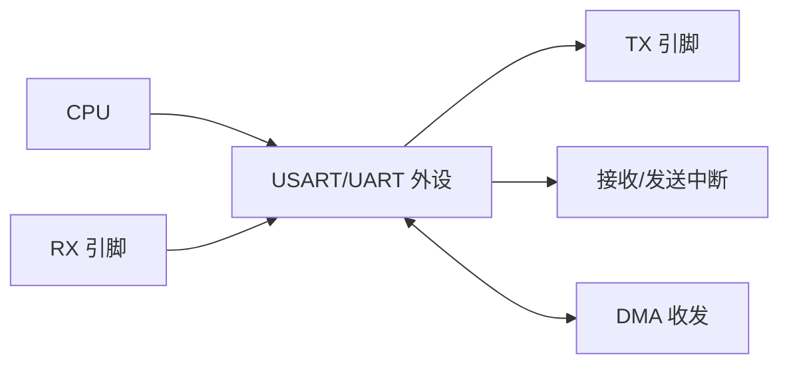
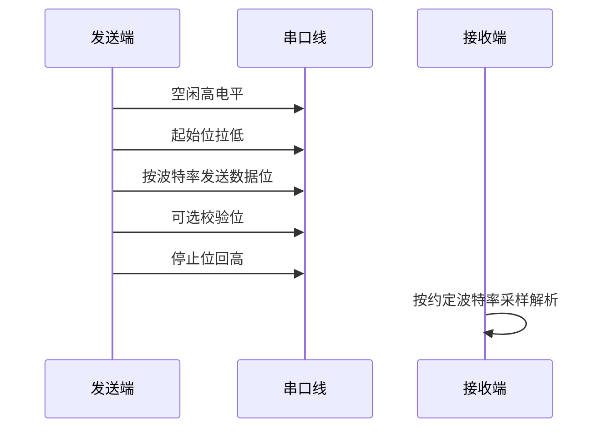
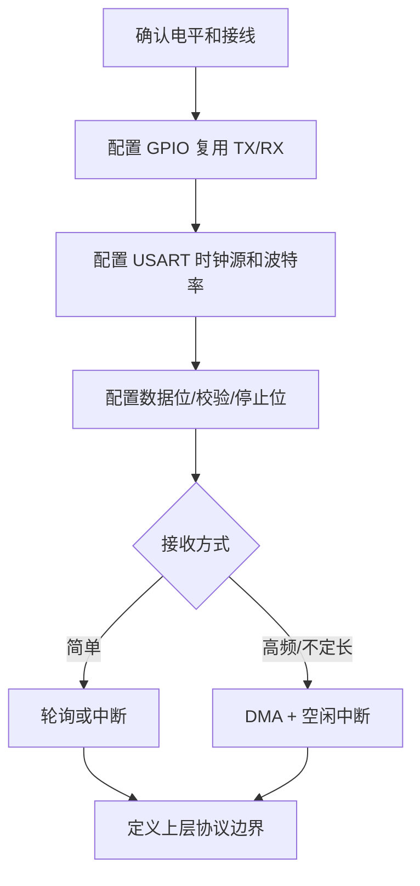

# UART

## 简明解释

UART 是异步串口通信。它没有共享时钟线，发送方和接收方靠相同波特率和帧格式来理解每一个 bit。串口看起来简单，但真实问题常常出在“电平标准、波特率误差、帧边界、接收缓冲和协议分包”这些地方。

可以把 UART 想成两个人用约定语速读数字。没有节拍器，所以每句话开头要有一个明显的起始信号，让对方重新对齐；如果语速差太多，读到后面就会错位。

## 它在 STM32 系统中的位置



## 一帧 UART 数据长什么样

空闲状态下，UART 线通常保持高电平。一帧开始时，发送方先拉低一个起始位；接收方看到下降沿后，按波特率在每个 bit 的中间附近采样。

```text
空闲高电平 -> 起始位低 -> 数据位 -> 可选校验位 -> 停止位高 -> 空闲
```

| 概念 | 作用 | 常见影响 |
|---|---|---|
| 波特率 | 决定每个 bit 持续多久 | 双方不一致会乱码或帧错误 |
| 数据位 | 一帧里有效数据长度 | 常见 8 位，也可能 7/9 位 |
| 校验位 | 简单错误检测 | 双方一边开一边不开会错位 |
| 停止位 | 帧结束和恢复空闲 | 停止位不匹配可能导致帧错误 |
| 过采样 | 接收端在 bit 内多次采样 | 提高抗抖动和容忍误差能力 |
| 空闲中断 | 一段时间无新数据时触发 | 常用来判断不定长数据包结束 |



## 为什么波特率误差会导致乱码

UART 每一帧只有起始位能重新对齐，后面的数据位要靠接收端自己的时钟推算采样点。如果双方波特率差一点，前几个 bit 可能还勉强采对，越往后采样点越偏，最终落到相邻 bit 上。

这也是为什么：

- 晶振不准或系统时钟配置错误会导致串口乱码。
- 高波特率比低波特率更容易暴露时钟误差。
- 帧越长，对累计误差越敏感。
- 逻辑分析仪解码时如果波特率设错，也会显示乱码。

## 电平标准比协议更基础

STM32 引脚上的 UART 通常是 TTL/CMOS 电平，比如 3.3V 高电平、0V 低电平。电脑传统 RS-232 串口不是这个电平体系，可能有正负电压且逻辑极性不同，不能直接相连。常见 USB 转 TTL 串口模块才适合直接接 STM32。

连接时要确认：

| 项目 | 要点 |
|---|---|
| TX/RX | 通常交叉连接：A_TX 接 B_RX，A_RX 接 B_TX |
| GND | 双方必须共地，否则电平没有共同参考 |
| 电平 | 3.3V/5V 是否兼容，是否需要电平转换 |
| 方向 | 只看日志可以只接 STM32_TX 到工具 RX，但仍建议共地 |
| 流控 | 如果启用 RTS/CTS，线和配置都要匹配 |

## 接收方式怎么选

| 方式 | 特点 | 适合场景 |
|---|---|---|
| 轮询 | CPU 主动等数据 | 极简单、低速、临时调试 |
| 每字节中断 | 收到一个字节进一次中断 | 中低速、协议简单，但高频会占 CPU |
| DMA 定长接收 | 到指定长度通知 CPU | 固定长度帧 |
| DMA + 空闲中断 | DMA 连续收，空闲时判断一包结束 | 不定长帧、Modbus RTU、自定义命令 |
| 环形缓冲 | 接收和解析解耦 | 持续数据流 |

UART 本身只定义字节怎么传，不知道一包数据从哪里开始、到哪里结束。上层协议需要自己定义边界，例如：

- 固定长度。
- 帧头 + 长度 + 数据 + 校验。
- 文本行，以 `\r\n` 结束。
- 一段时间无数据作为包结束，例如空闲中断。

## 典型配置思路



## 常见误区

| 误区                | 更好的理解                             |
| ----------------- | --------------------------------- |
| TX 接 TX、RX 接 RX   | 通常交叉连接：A_TX 接 B_RX                |
| 波特率差一点没关系         | 误差过大会采样错位                         |
| UART 电平一定能直接接电脑串口 | STM32 是 TTL/CMOS 电平，RS-232 需要电平转换 |
| 串口收到乱码一定是代码错      | 波特率、晶振、地线、电平标准、编码格式都可能导致乱码        |

## 常见现象和排查入口

| 现象 | 优先排查 |
|---|---|
| 完全收不到 | TX/RX 是否交叉；GPIO AF 是否正确；USART 时钟和使能；工具串口号是否选对 |
| 全是乱码 | 波特率、系统时钟、数据位/校验/停止位、电平标准、逻辑分析仪解码参数 |
| 偶尔丢字节 | 中断处理太慢、缓冲区太小、DMA 边界处理错误、波特率过高 |
| 第一包丢失 | DMA/接收中断是否先启动；发送方是否上电后立即发送 |
| 收到但解析错 | 帧头、长度、大小端、转义、校验、文本编码是否一致 |

## 复习问题

1. UART 没有时钟线，接收端为什么还能知道什么时候采样？
2. 为什么串口通信双方必须共地？
3. DMA + 空闲中断适合解决什么串口接收问题？
4. 串口乱码时，为什么要同时检查系统时钟和电平标准？

