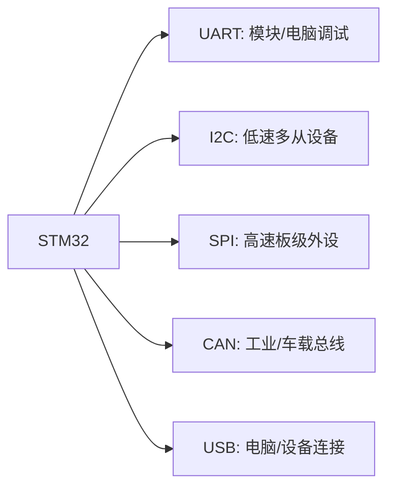
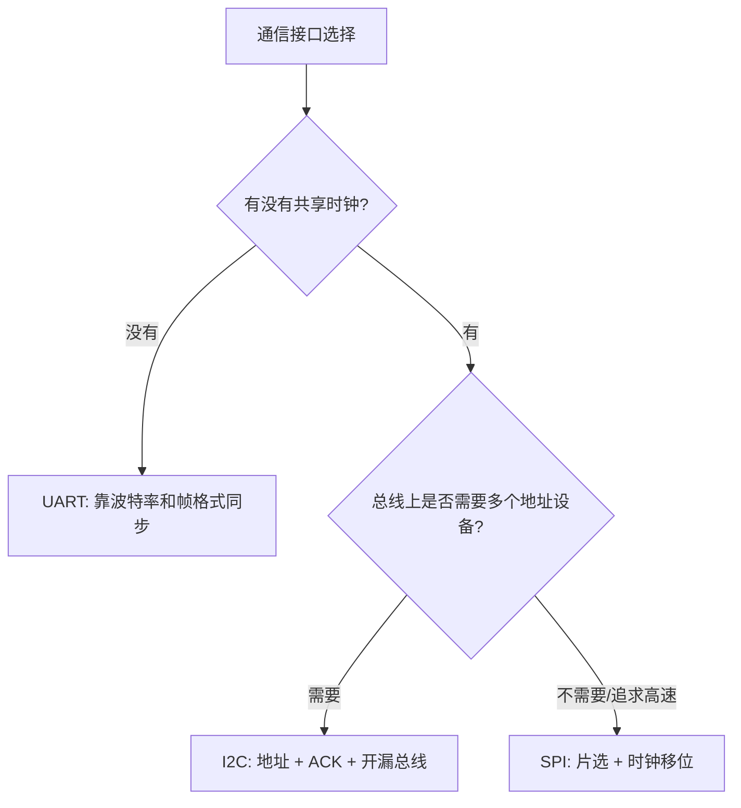
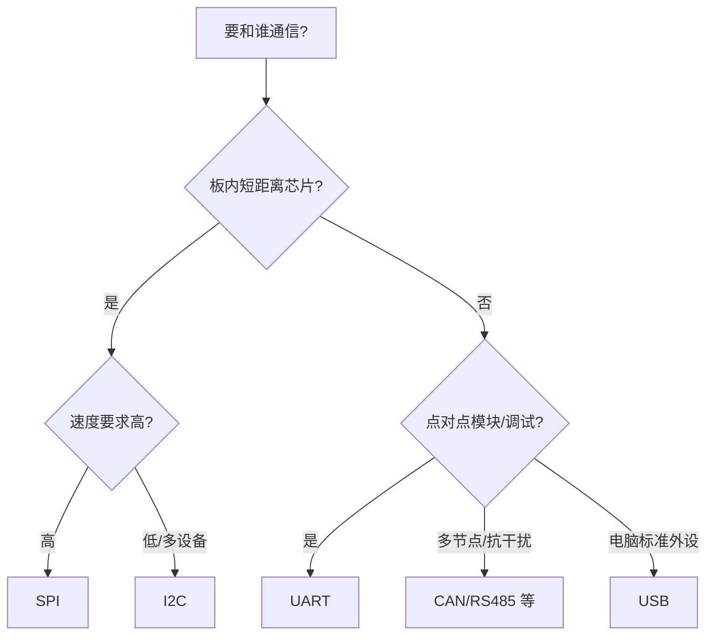

# 通信接口总览

## 简明解释

通信接口解决的是“STM32 怎么和外部芯片、模块、电脑或其他控制器交换数据”。学习通信接口时，不要只按线数记 UART、I2C、SPI 的区别，更要问四个问题：

1. 数据什么时候有效，是靠共享时钟还是靠双方约定速度？
2. 线上有几个设备，谁有资格说话？
3. 一次通信的边界在哪里，靠片选、起止条件还是协议帧？
4. 出错时能不能检测、能不能重试、能不能定位到哪一层？

掌握这四个问题，你就不会把“串口乱码”“I2C 无 ACK”“SPI 读到 0xFF”都混成“通信不通”。

## 它在 STM32 系统中的位置

## 先建立对比模型

| 接口 | 线数 | 同步方式 | 常见用途 | 直觉 |
|---|---:|---|---|---|
| UART | TX/RX/GND | 异步 | 调试串口、蓝牙、4G 模块 | 两个人按约定语速说话 |
| I2C | SCL/SDA/GND | 同步 | EEPROM、传感器、RTC | 一条总线挂多个有地址设备 |
| SPI | SCK/MOSI/MISO/CS | 同步 | Flash、屏幕、ADC、无线芯片 | 主机用时钟推动高速移位 |
| CAN | CANH/CANL | 差分总线 | 车载、工业控制 | 多节点带仲裁的可靠总线 |
| USB | D+/D- | 复杂协议 | 电脑连接、设备枚举 | 功能强但协议栈复杂 |

这张表只是入门。真正做工程选择时，还要看下面这些维度：

| 维度 | UART | I2C | SPI |
|---|---|---|---|
| 时钟来源 | 无时钟线，双方约定波特率 | 主机提供 SCL | 主机提供 SCK |
| 设备数量 | 常见点对点，多设备要额外协议或总线收发器 | 天然多从设备，靠地址区分 | 多从设备靠片选 CS |
| 数据边界 | 协议自己定义，比如换行、长度、帧头帧尾 | Start/Stop 和 ACK 形成事务边界 | CS 通常定义一次事务边界 |
| 硬件复杂度 | 低 | 中，上拉和总线电容重要 | 低到中，线多但协议简单 |
| 速度 | 中低速常见 | 低到中速 | 板级高速常用 |
| 抗干扰和距离 | TTL UART 短距离，RS485 可长距离 | 板内短距离 | 板内短距离，高速更怕布线 |
| 错误处理 | 基础 UART 只有校验/帧错误等 | ACK/NACK 可提示事务失败 | 基础 SPI 几乎不管错误，靠上层协议 |

## 同步和异步的本质

同步通信有时钟线，比如 I2C 的 SCL、SPI 的 SCK。接收方根据时钟边沿采样数据，所以双方不需要各自猜测“下一位什么时候来”。异步通信没有共享时钟线，比如 UART，双方必须提前约定波特率，并靠起始位重新对齐每一帧。

所以 UART 乱码常从波特率、时钟误差、帧格式、电平标准查起；I2C 无 ACK 常从地址、上拉、起始/停止、设备供电查起；SPI 读错常从模式、片选时序、dummy 字节、命令格式查起。

## 选择通信接口可以这样思考

先不要问“哪个接口更高级”，而要问设备和数据本身需要什么：

更具体一点：

| 需求 | 更合适的方向 | 原因 |
|---|---|---|
| 调试日志、AT 模块、简单点对点 | UART | 实现简单，电脑和 USB 转串口工具友好 |
| 多个低速传感器、EEPROM、RTC | I2C | 两根线挂多个有地址设备 |
| 外部 Flash、屏幕、高速 ADC/DAC | SPI | 时钟明确、速度高、协议简单 |
| 多节点、远距离、强干扰工业现场 | CAN/RS485 | 物理层和仲裁/收发器更适合总线环境 |
| 直接连电脑作为标准设备 | USB | 生态强，但协议栈复杂 |

## 通信问题要分层排查

通信调不通时，最怕直接盯着应用协议。更稳的做法是按层往上查：

1. **物理连接**：线有没有接反、是否共地、电平标准是否匹配、上拉/终端电阻是否需要。
2. **引脚和时钟**：GPIO 复用是否正确，外设时钟是否打开，波特率/SCL/SCK 是否真的出来。
3. **外设配置**：UART 帧格式、I2C 地址宽度、SPI CPOL/CPHA、主从方向是否匹配。
4. **事务边界**：一帧从哪里开始到哪里结束，CS/Start/Stop/空闲中断是否符合设备手册。
5. **上层协议**：命令、寄存器地址、长度、CRC、大小端、状态位是否正确。

示波器或逻辑分析仪非常有价值，因为它能告诉你“线上实际发生了什么”，避免只在代码里猜。

## 常见误区

| 误区 | 更好的理解 |
|---|---|
| UART、I2C、SPI 只是线数不同 | 它们的数据同步、寻址、片选、错误处理模型都不同 |
| I2C 线少所以一定更好 | I2C 速度、上拉、电容负载、多设备冲突都要考虑 |
| SPI 一定最稳定 | SPI 快且简单，但片选多、距离短、没有标准高级协议 |
| CAN/USB 也只是普通串行口 | 它们协议层更复杂，学习成本明显更高 |
| 通信失败就是协议代码错 | 物理层、GPIO 复用、时钟、电平和事务边界都可能先出问题 |
| 能收到数据就说明配置都对 | 配置轻微不匹配可能表现为偶发错码、错位或高负载下丢包 |

## 复习问题

1. UART 为什么可以不用时钟线？
2. I2C 为什么适合挂多个低速设备？
3. SPI 为什么常用于外部 Flash 和显示屏？
4. 如果一个外设读不到 ID，你会如何按物理层、外设配置、协议事务分层排查？

