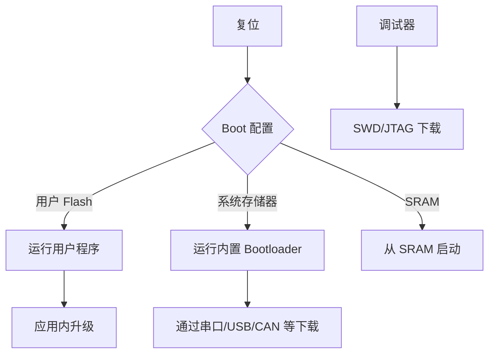
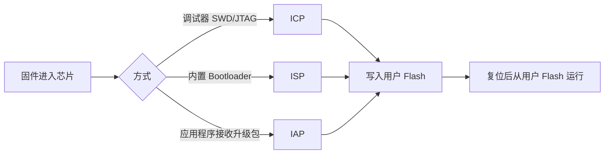

# Boot 与下载方式

## 简明解释

Boot 决定 STM32 复位后从哪里启动。下载方式决定程序怎样进入芯片。常见概念有 ISP、ICP、IAP：它们都是“把程序写进芯片”的方式，但入口和控制者不同。

## 它在 STM32 系统中的位置

## 关键概念

| 概念 | 解释 |
|---|---|
| Boot0/Boot1 | 部分系列用于选择启动区域的引脚或选项配置 |
| 用户 Flash | 正常应用程序所在区域 |
| 系统存储器 | ST 固化的 Bootloader 所在区域 |
| ISP | 通过芯片内置 Bootloader 在线编程 |
| ICP | 通过调试接口，如 SWD/JTAG，在线编程 |
| IAP | 正在运行的应用程序自己接收并写入新固件 |

## 工作过程

## 常见误区

| 误区 | 更好的理解 |
|---|---|
| Bootloader 一定是自己写的 | 系统存储器里通常有 ST 固化 Bootloader，用户也可以写自己的 |
| ISP、IAP 是同一件事 | ISP 依赖内置 Bootloader，IAP 依赖应用程序自身升级逻辑 |
| SWD 下载和 Boot 引脚无关 | 调试器通常能直接访问芯片 Flash，不一定走 Boot 模式 |
| 所有系列 Boot 配置一样 | 新系列可能用选项字节替代或扩展传统 Boot 引脚 |

## 复习问题

1. ISP、ICP、IAP 的控制者分别是谁？
2. 为什么 IAP 常常需要两个 Flash 分区或至少一个安全升级区？
3. Boot 配置错误会导致什么现象？

