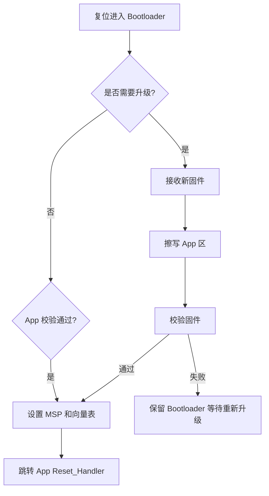

# IAP

## 简明解释

IAP 是 In-Application Programming，也就是应用程序运行时自己更新 Flash 中的程序。常见做法是先运行 Bootloader，再由 Bootloader 接收新固件、写入应用区、校验后跳转。

## 它在 STM32 系统中的位置

```text
Flash:
  Bootloader 区：负责升级、校验、跳转
  App 区：真正业务程序
  参数区：版本号、升级标志、校验值等
```

## 关键概念

| 概念 | 解释 |
|---|---|
| Bootloader | 上电先运行的小程序，负责升级和启动 App |
| App | 业务程序 |
| 向量表偏移 | App 不在 Flash 起始地址时，需要让中断入口指向 App 向量表 |
| MSP | 主栈指针，跳转 App 前要设置为 App 向量表中的初始 SP |
| 固件校验 | CRC/Hash/签名等，确保固件完整可信 |
| 回滚 | 升级失败时恢复旧版本的策略 |

## 工作过程



## 常见误区

| 误区 | 更好的理解 |
|---|---|
| IAP 就是写 Flash | 还包括分区、传输、校验、跳转、异常恢复 |
| 跳转 App 只要函数指针 | 还要设置栈指针、向量表、中断状态等 |
| App 可以覆盖 Bootloader | Bootloader 应受保护，否则升级失败可能无法恢复 |
| 不校验也能跑就行 | 固件损坏时跳转可能直接 HardFault 或行为不可预测 |

## 复习问题

1. Bootloader 跳转 App 前为什么要重新设置 MSP？
2. 向量表偏移在 IAP 中解决什么问题？
3. 一个可靠 IAP 至少应该包含哪些安全检查？

