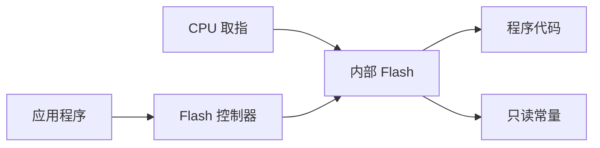
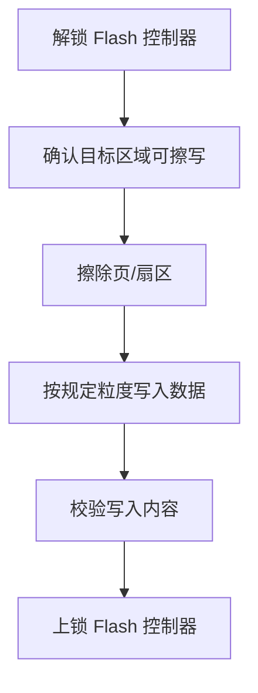

# 内部 Flash

## 简明解释

内部 Flash 是 STM32 存放程序的非易失存储器。它可以读，也可以擦写，但擦写有严格限制：通常必须先按页或扇区擦除，再写入，而且擦写寿命有限。

## 它在 STM32 系统中的位置

## 关键概念

| 概念 | 解释 |
|---|---|
| 页/扇区 | Flash 擦除的最小单位，系列不同名称和大小不同 |
| 擦除 | 把一页/扇区恢复到全 1 状态 |
| 编程 | 把数据写入 Flash，只能按允许粒度写 |
| 读写保护 | 防止外部读出或误写 |
| 选项字节 | 配置启动、保护、看门狗等特殊选项 |

## 工作过程

## 常见误区

| 误区 | 更好的理解 |
|---|---|
| Flash 可以像 RAM 一样随便写 | Flash 写前通常要擦除，且擦除单位较大 |
| 擦除一个变量不会影响旁边数据 | 擦除按页/扇区进行，会影响同一区域所有内容 |
| Flash 寿命无限 | 擦写次数有限，频繁保存参数要考虑磨损 |
| 程序运行时不能操作 Flash | 可以，但要注意运行区域、等待时间、中断和电源风险 |

## 复习问题

1. 为什么 Flash 写入前通常要先擦除？
2. 保存配置参数时，为什么要考虑页/扇区粒度？
3. Flash 擦写过程中掉电可能带来什么问题？

