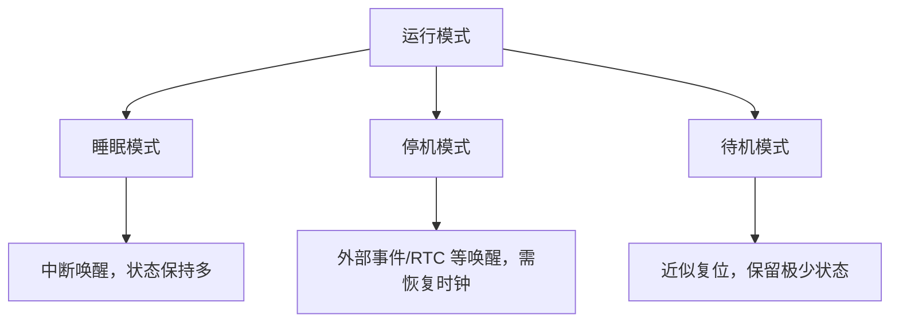

# PWR 与低功耗

## 简明解释

PWR 模块负责电源控制和低功耗模式。低功耗不是简单“让 CPU 慢一点”，而是按不同深度关闭 CPU、时钟、电压调节器和 SRAM 保持能力，以换取更低功耗。

## 它在 STM32 系统中的位置

## 关键概念

| 模式 | 直白理解 | 典型特点 |
|---|---|---|
| Sleep | CPU 睡，外设多半还能跑 | 唤醒快，省电有限 |
| Stop | 大部分高速时钟停 | 功耗低，唤醒后常需重配时钟 |
| Standby | 深度休眠，接近重新上电 | 功耗最低，状态丢失最多 |
| PVD | 电压监测 | 电源下降时预警 |
| Wakeup | 唤醒源 | 引脚、RTC、看门狗等 |

## 工作过程

## 常见误区

| 误区 | 更好的理解 |
|---|---|
| 低功耗只是调用一个函数 | 要同时考虑时钟、外设、GPIO 漏电、唤醒源和状态恢复 |
| 进入 Stop 后外设都还能正常跑 | 很多高速时钟关闭，外设能力受限 |
| 唤醒后一定回到原来状态 | Standby 常近似复位，Stop 后也可能要恢复时钟 |
| GPIO 状态不用管 | 悬空输入、外部上拉下拉、外设连接都可能产生漏电 |

## 复习问题

1. Sleep、Stop、Standby 的核心差异是什么？
2. 为什么 Stop 唤醒后常需要重新配置系统时钟？
3. 低功耗设计为什么必须同时看硬件电路？

