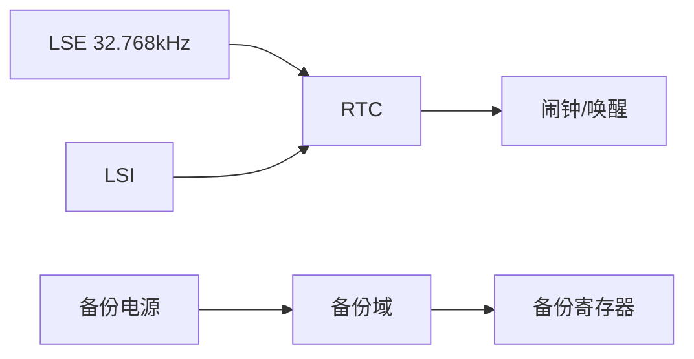
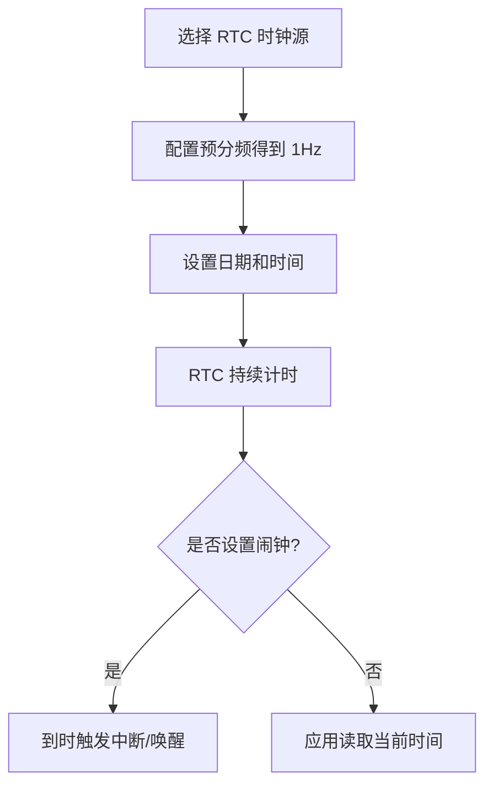

# RTC

## 简明解释

RTC 是实时时钟，用来在系统运行或低功耗状态下保持时间。它通常依赖 32.768kHz 低速晶振 LSE，也可以使用内部低速时钟 LSI，但精度较差。

## 它在 STM32 系统中的位置

## 关键概念

| 概念 | 解释 |
|---|---|
| LSE | 外部低速晶振，常用于 RTC，精度较好 |
| LSI | 内部低速 RC，便宜方便但精度较差 |
| 备份域 | 可由 VBAT 供电保持的区域 |
| 闹钟 | 到指定时间触发中断或唤醒 |
| Unix 时间戳 | 从 1970-01-01 起经过的秒数，适合存储和计算 |

## 工作过程

## 常见误区

| 误区 | 更好的理解 |
|---|---|
| RTC 一定很准 | 精度取决于时钟源、晶振误差、温度和校准 |
| 掉电后 RTC 一定保持 | 需要备份电源和备份域配置正确 |
| LSI 可以替代所有 RTC 场景 | LSI 漂移较大，适合低要求场景 |
| 日期时间适合直接参与计算 | 时间戳更适合比较、存储和计算 |

## 复习问题

1. RTC 为什么常用 32.768kHz 晶振？
2. LSE 和 LSI 的主要差异是什么？
3. RTC 在低功耗系统中除了计时，还常承担什么作用？

