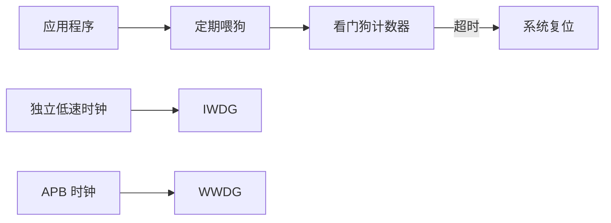
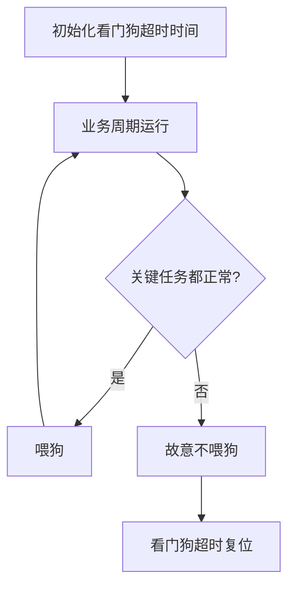

# 看门狗

## 简明解释

看门狗是防止程序跑飞后系统永远卡死的硬件计时器。程序必须定期“喂狗”，如果长时间没有喂，说明系统可能异常，看门狗就复位芯片。

## 它在 STM32 系统中的位置

## 关键概念

| 类型 | 特点 | 适合场景 |
|---|---|---|
| IWDG 独立看门狗 | 使用独立低速时钟，启动后通常不能关闭 | 兜底防死机 |
| WWDG 窗口看门狗 | 必须在指定时间窗口内喂狗 | 检测程序过快或过慢异常 |
| 喂狗 | 重装计数器，表示系统仍正常 |
| 超时复位 | 计数到期未喂狗，触发复位 |

## 工作过程

## 常见误区

| 误区 | 更好的理解 |
|---|---|
| 在定时器中断里无脑喂狗最安全 | 这样可能掩盖主循环或任务卡死 |
| 看门狗能修复 bug | 它只能让系统复位恢复，不能消除根因 |
| 超时时间越短越好 | 太短会误复位，太长又失去保护意义 |
| IWDG 和 WWDG 只是名字不同 | 时钟来源、窗口机制、用途都不同 |

## 复习问题

1. 为什么喂狗应该放在“确认系统关键任务正常”之后？
2. IWDG 和 WWDG 的主要区别是什么？
3. 看门狗复位后，系统应该如何记录和分析复位原因？

