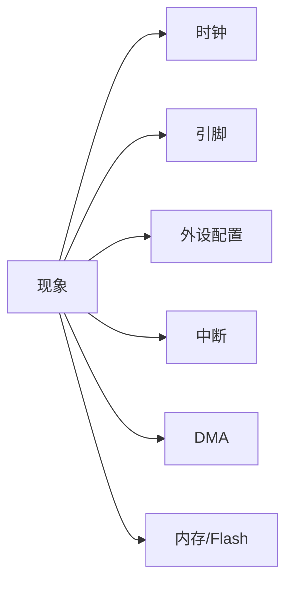
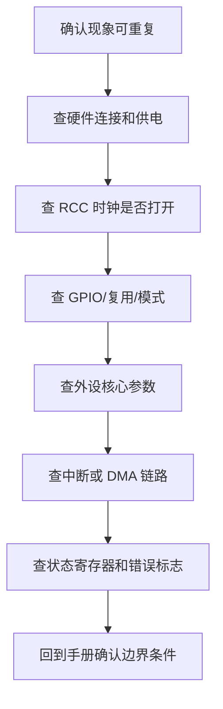

# 易错点索引

## 简明解释

这篇按“现象”反查 STM32 基础知识点。以后遇到问题时，不要只盯着某一行代码，要回到时钟、引脚、外设配置、中断、DMA、存储这些基础链路逐段排查。

## 它在 STM32 系统中的位置

## 关键概念

| 现象 | 优先排查方向 | 相关笔记 |
|---|---|---|
| GPIO 没反应 | 时钟、模式、输出类型、外部电路 | [[../04-基础外设/GPIO\|GPIO]] |
| 串口乱码 | 波特率、时钟、线序、电平、编码 | [[../05-通信接口/UART\|UART]] |
| I2C 无 ACK | 地址、上拉、线序、时序、从设备供电 | [[../05-通信接口/I2C\|I2C]] |
| SPI 读不到数据 | CPOL/CPHA、CS、dummy 字节、线序 | [[../05-通信接口/SPI\|SPI]] |
| 定时周期不对 | SYSCLK、APB 分频、TIM 时钟翻倍、PSC/ARR | [[../03-时钟与中断/时钟系统\|时钟系统]]、[[../04-基础外设/TIM\|TIM]] |
| 中断不进 | 外设时钟、外设中断使能、NVIC、标志位 | [[../03-时钟与中断/中断系统\|中断系统]] |
| 中断一直进 | 标志位未清、触发源持续有效、按键抖动 | [[../03-时钟与中断/EXTI\|EXTI]] |
| ADC 抖动大 | 参考电压、采样时间、源阻抗、滤波、布局 | [[../04-基础外设/ADC\|ADC]] |
| DMA 数据错位 | 数据宽度、地址递增、缓冲区、循环模式 | [[../04-基础外设/DMA\|DMA]] |
| 程序随机崩溃 | 栈溢出、数组越界、DMA 访问错误内存 | [[../02-运行基础/Flash RAM Stack Heap\|Flash RAM Stack Heap]] |
| IAP 跳转 HardFault | MSP、向量表、App 地址、固件校验 | [[../06-存储与升级/IAP\|IAP]] |

## 工作过程

通用排查顺序：

## 常见误区

| 误区 | 更好的理解 |
|---|---|
| 先怀疑库函数 bug | 大多数问题来自配置、时钟、引脚、电路或状态处理 |
| 只看初始化代码 | 运行中错误标志、DMA 状态、中断标志更能说明真实情况 |
| 能跑一次就算稳定 | 嵌入式要看边界、电源、复位、异常恢复和长时间运行 |

## 复习问题

1. 外设不工作时，为什么第一步常常要查 RCC 和 GPIO？
2. 通信接口问题为什么必须同时看软件配置和物理连接？
3. 随机崩溃为什么优先怀疑内存越界、栈溢出和 DMA？

