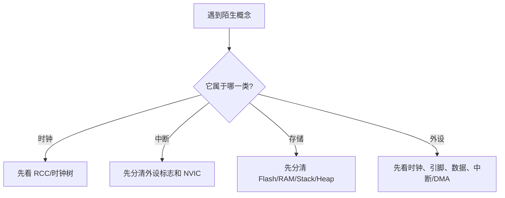

# 概念对照表

## 简明解释

STM32 学习中很多词长得像、用起来也常同时出现。把它们放在一张对照表里，比单独背定义更容易形成判断力。

## 它在 STM32 系统中的位置

这篇是索引型笔记，用于复习和排错时快速区分概念。

## 关键概念

| 容易混淆的概念 | 核心区别 |
|---|---|
| SYSCLK vs SysTick | SYSCLK 是时钟信号，SysTick 是使用时钟计数的内核定时器 |
| HSI vs HSE | HSI 是内部 RC，HSE 是外部高速晶振 |
| LSI vs LSE | LSI 是内部低速 RC，LSE 是外部 32.768kHz 晶振 |
| Flash vs RAM | Flash 掉电不丢，RAM 运行时读写快但掉电丢 |
| Stack vs Heap | Stack 自动分配释放，Heap 手动动态分配 |
| 中断标志 vs NVIC 使能 | 标志表示事件发生，NVIC 使能表示允许 CPU 响应 |
| EXTI vs NVIC | EXTI 负责外部线触发，NVIC 负责中断调度 |
| GPIO 普通输出 vs 复用输出 | 普通输出由软件写 GPIO 控制，复用输出由外设控制 |
| 推挽 vs 开漏 | 推挽能主动高低输出，开漏只能主动拉低 |
| UART vs USART | UART 异步，USART 通常还能支持同步模式 |
| I2C vs SPI | I2C 线少带地址，SPI 速度高靠片选 |
| DMA vs 中断 | DMA 搬数据，中断通知 CPU 处理事件 |
| ISP vs ICP vs IAP | ISP 用内置 Bootloader，ICP 用调试接口，IAP 由应用程序自升级 |

## 工作过程

## 常见误区

| 误区 | 更好的理解 |
|---|---|
| 两个词都和时间有关，就差不多 | 时钟源、定时器、延时函数是不同层级 |
| 看到中断不进就只查 NVIC | 还要查外设时钟、外设中断使能、标志位、优先级 |
| 看到通信失败就只查代码 | 线序、电平、时钟、协议模式、上拉/片选都可能是根因 |

## 复习问题

1. SYSCLK、SysTick、TIM 三者都和时间有关，但层级分别是什么？
2. DMA 和中断为什么经常配合使用？
3. Flash、RAM、寄存器都能用地址访问，它们的硬件含义有什么不同？

