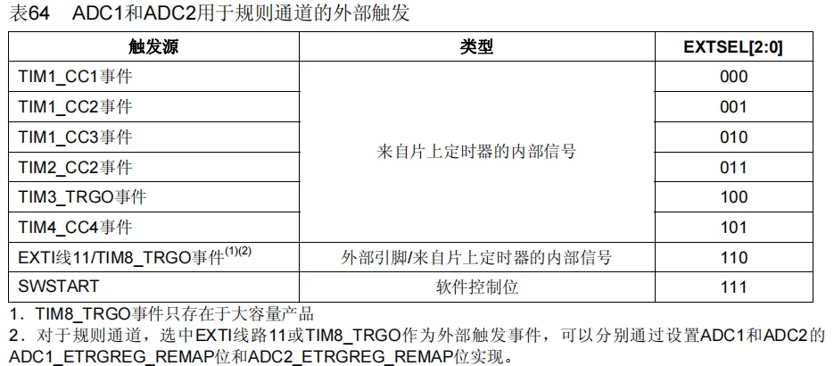

## 简介

- 12位（分辨率）逐次逼近型ADC，1us（1MHz）转换时间  
- 输入电压范围：0~3.3V，对应转换结果范围：0~4095（0~2^12-1）  
- 18个输入通道，可 测量16个外部和2个内部信号源  
- 规则组（常规事件）和注入组（突发事件）两个转换单元  
- 模拟看门狗自动监测输入电压范围  
- STM32F103C8T6 ADC资源：ADC1、ADC2，10个外部输入通道  

## ADC原理结构

### 逐次逼近型ADC

以前单片机性能不强的时候，需要外挂一块ADC芯片才能进行AD转换，下图中的通道选择开关表示一个可以通过模拟信号的数据选择器，有多少ADC的通道数即多少的开关，STM32内部的ADC有18个输入通道。

那么如何知道通道输入的电压是多少呢？通过比较器进行逐次的比较，即从高位到低位依次判断是1还是0的过程。（8位判断8次，12位判断12次）一遍遍的比较至近似相等。  #todo/pf 

VREF参考电压：用于DAC输出电压比较值，也可以说是整个ADC的参考电压。一般情况下ADC的输入范围和供电是一致的。（不一样的，比如音频的ADC）

### ADC框图

内部18个通道：16个IO口+1个温度传感器+VREFINT内部参考电压。

进入到模拟多路开关。

再进入到模数转换器，即逐次比较的过程。  
转换的12位数据结果会放置到16位数据寄存器里，读取即可获得转换值。  

注意转换可以多通道进行，并且分成了规则/注入两个通道组。  

- 触发ADC转换的信号：①软件触发，在程序中调用一条代码，就可以启动转换了。②硬件触发，就是这里的这些触发源（EXTI_11/EXTI15开始连接的两控制器）。  
- 参考电压：芯片的VDDA和VSSA在电路中默认接了VREF，因此没有VREF±引脚。同电源0~3.3V  
- ADCCLK：来源于外设总线预分频器，最大14MHz，因此把时钟源分频时候不能弄超了。  
- 数据寄存器：存数据  
- 模拟看门狗：可以存一个阈值高限和一个阈值低限。启动并指定了看门的通道，一旦数据超过限制范围，就会乱叫，即申请一个中断AWD。  
- 通道组完成信号：转换完成之后，也会有一个信号，EOC是规则组的完成信号，JEOC注入组完成信号。这些信号可以渠道NVIC申请中断

### ADC基本结构

使能ADC：选择输入通道——开关选择——进入转换器（分两组）——接收触发和时钟信号，开始转换，发送转换完成信号，输出数据保存到寄存器（不同组寄存器个数不同）——申请中断——....

手册引脚中只有IN0~9共10个通道，其他地方就没有了。因此芯片只有10个外部输入通道。下图中ADC12_IN0的意思是ADC1和ADC2的IN0都是在PA0上的，即引脚全都是相同的。因此ADC1和ADC2可以同时运行，即双ADC模式。比如可以配合组成同步或者交叉运行（对着一个通道交叉的采样，增大采样的频率）。

### 规则组的四种转换模式

参数：单次/连续、扫描/非扫描

【单次转换，非扫描模式】

|                        |                                                                                                                                                                     |
| ---------------------- | ------------------------------------------------------------------------------------------------------------------------------------------------------------------- |
|  | 在非扫描模式下，**只有序列1的位置有效**，这时候同时选中一组的方式就简化为选中一个的方式。   但这**一个位置可以选择不同的通道**，然后触发转换一次。EOC标志位置1，整个转换过程结束。   如果想再次转换，只能再次触发。如果想换通道，那就触发转换之前将其通道更改。   （**没有用到菜单列表**） |

【连续转换，非扫描模式】

|                        |                                                                                                                  |
| ---------------------- | ---------------------------------------------------------------------------------------------------------------- |
|  | 仍然是非扫描模式，**菜单列表只用第一个**。区别是一次转换完成标志位置1结束后，还会继续触发转换（**不需要等待时间**），一旦开始，一直持续。   想要数据就一直从寄存器去就是了。   （但有可能功耗会上升） |

【单次转换，扫描模式】

|                        |                                                                                                                                              |
| ---------------------- | -------------------------------------------------------------------------------------------------------------------------------------------- |
|  | 扫描模式，每触发一次，转换结束后就会停下来。不过会把菜单列表的通道都转换了。（**列表通道可以任意指定，可以重复指定**）   因此，还需要有一个**通道数目**参数。对指定数目进行一次转换，存放到数据寄存器中（**为了防止数据被覆盖，需要及时使用DMA将数据搬运走**）。 |

【连续转换，扫描模式】

|                        |                                |
| ---------------------- | ------------------------------ |
|  | 同样的，连续扫描模式，一旦开始，不会停止转换，全部通道扫描。 |

## AD转换过程

### 触发控制

通过设置EXTSEL寄存器来选择控制源。

### 数据对齐

数据寄存器是16位的，ADC是12位的，因此存在一个数据对齐的问题，以便正确获取数据。**一般使用右对齐，直接得到转换结果**。

数据对齐常用于控制精度，如果后面的四位不要了，可以左对齐后只取高八位。

### 转换时间

**AD转换的步骤**：采样，保持；量化，编码  
**STM32 ADC的总转换时间为**：TCONV=采样时间 + 12.5个ADC周期  
需要采样保持的原因是，电压是波动的，因此想要在转换过程中，保持稳定。就需要这个采样保持电路。整个过程耗费时间即为**采样时间**（越大越能防止毛刺信号，不过转换时间也会延长）。  
12位的ADC需要12个转换周期，另外0.5个周期不知道干嘛。  
**例如**：当ADCCLK= 14MHz，采样时间为1.5个ADC周期TCONV= 1.5 + 12.5 = 14个ADC周期= 1μs  
这就是最快时间了，再快需要ADCCLK超频。

### 校准  

- ADC有一个内置**自校准模式**。校准可大幅减小因内部电容器组的变化而造成的准精度误差。校准期间，在每个电容器上都会计算出一个误差修正码(数字值)，这个码用于消除在随后的转换中每个电容器上产生的误差  
- 建议在每次上电后执行一次校准  
- 启动校准前，ADC必须处于关电状态超过至少两个ADC时钟周期  
- **校准过程是固定的，只需要注意调用函数即可**。
